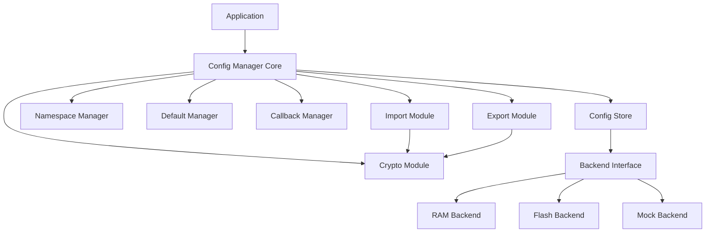

# Design Document: Config Manager Middleware

## Overview

本设计文档描述 Nexus 嵌入式平台配置管理中间件的技术架构和实现方案。Config Manager 模块提供键值对形式的配置存储和读取功能，支持多种数据类型、命名空间隔离、持久化存储、变更通知、导入/导出和可选加密。

### 设计目标

1. **可移植性**: 通过存储后端抽象支持不同的持久化介质
2. **低资源占用**: 静态内存分配，适合资源受限的嵌入式系统
3. **类型安全**: 支持多种数据类型，防止类型混淆
4. **安全性**: 可选加密保护敏感配置
5. **可扩展性**: 支持命名空间隔离和自定义存储后端

## Architecture

### 整体架构

```
┌─────────────────────────────────────────────────────────────────┐
│                      Application Layer                           │
│  ┌─────────────────────────────────────────────────────────┐    │
│  │              Application Configurations                  │    │
│  │  (WiFi settings, device params, user preferences, etc.) │    │
│  └─────────────────────────────────────────────────────────┘    │
├─────────────────────────────────────────────────────────────────┤
│                      Config Manager Core                         │
│  ┌──────────┐ ┌──────────┐ ┌──────────┐ ┌──────────┐           │
│  │  Config  │ │Namespace │ │ Default  │ │ Callback │           │
│  │  Store   │ │ Manager  │ │ Manager  │ │ Manager  │           │
│  └──────────┘ └──────────┘ └──────────┘ └──────────┘           │
│  ┌──────────┐ ┌──────────┐ ┌──────────┐                        │
│  │  Import  │ │  Export  │ │  Crypto  │                        │
│  │  Module  │ │  Module  │ │  Module  │                        │
│  └──────────┘ └──────────┘ └──────────┘                        │
├─────────────────────────────────────────────────────────────────┤
│                     Backend Interface                            │
│  ┌─────────────────┐ ┌─────────────────┐ ┌─────────────────┐   │
│  │   RAM Backend   │ │  Flash Backend  │ │  Mock Backend   │   │
│  │   (Volatile)    │ │  (Persistent)   │ │   (Testing)     │   │
│  └─────────────────┘ └─────────────────┘ └─────────────────┘   │
└─────────────────────────────────────────────────────────────────┘
```

### 模块依赖关系



## Components and Interfaces

### Config Manager 核心模块

#### 配置结构体

```c
typedef struct {
    uint16_t    max_keys;           // 最大键数量 (32-256)
    uint8_t     max_key_len;        // 最大键长度 (16-64)
    uint16_t    max_value_size;     // 最大值大小 (64-1024)
    uint8_t     max_namespaces;     // 最大命名空间数 (8)
    uint8_t     max_callbacks;      // 最大回调数 (16)
    bool        auto_commit;        // 自动提交模式
} config_manager_config_t;

// 核心 API
config_status_t config_init(const config_manager_config_t* config);
config_status_t config_deinit(void);
config_status_t config_commit(void);
config_status_t config_load(void);
config_status_t config_set_backend(const config_backend_t* backend);
```

### 基本数据类型 API

```c
// 整数类型
config_status_t config_set_i32(const char* key, int32_t value);
config_status_t config_get_i32(const char* key, int32_t* value, int32_t default_val);

config_status_t config_set_u32(const char* key, uint32_t value);
config_status_t config_get_u32(const char* key, uint32_t* value, uint32_t default_val);

config_status_t config_set_i64(const char* key, int64_t value);
config_status_t config_get_i64(const char* key, int64_t* value, int64_t default_val);

// 浮点类型
config_status_t config_set_float(const char* key, float value);
config_status_t config_get_float(const char* key, float* value, float default_val);

// 布尔类型
config_status_t config_set_bool(const char* key, bool value);
config_status_t config_get_bool(const char* key, bool* value, bool default_val);

// 字符串类型
config_status_t config_set_str(const char* key, const char* value);
config_status_t config_get_str(const char* key, char* buffer, size_t buf_size);
config_status_t config_get_str_len(const char* key, size_t* len);

// 二进制数据
config_status_t config_set_blob(const char* key, const void* data, size_t size);
config_status_t config_get_blob(const char* key, void* buffer, size_t buf_size, size_t* actual_size);
config_status_t config_get_blob_len(const char* key, size_t* len);
```

### 命名空间模块

```c
typedef struct config_namespace* config_ns_handle_t;

// 命名空间 API
config_status_t config_open_namespace(const char* name, config_ns_handle_t* handle);
config_status_t config_close_namespace(config_ns_handle_t handle);
config_status_t config_erase_namespace(const char* name);

// 带命名空间的操作
config_status_t config_ns_set_i32(config_ns_handle_t ns, const char* key, int32_t value);
config_status_t config_ns_get_i32(config_ns_handle_t ns, const char* key, int32_t* value, int32_t default_val);
// ... 其他类型类似
```

### 默认值管理模块

```c
typedef struct {
    const char*     key;
    config_type_t   type;
    union {
        int32_t     i32_val;
        uint32_t    u32_val;
        int64_t     i64_val;
        float       float_val;
        bool        bool_val;
        const char* str_val;
    } value;
} config_default_t;

// 默认值 API
config_status_t config_set_default_i32(const char* key, int32_t value);
config_status_t config_set_default_str(const char* key, const char* value);
config_status_t config_reset_to_default(const char* key);
config_status_t config_reset_all_to_defaults(void);
config_status_t config_register_defaults(const config_default_t* defaults, size_t count);
```

### 回调通知模块

```c
typedef void (*config_change_cb_t)(const char* key, 
                                    config_type_t type,
                                    const void* old_value,
                                    const void* new_value,
                                    void* user_data);

typedef struct config_callback* config_cb_handle_t;

// 回调 API
config_status_t config_register_callback(const char* key, 
                                          config_change_cb_t callback,
                                          void* user_data,
                                          config_cb_handle_t* handle);
config_status_t config_register_wildcard_callback(config_change_cb_t callback,
                                                   void* user_data,
                                                   config_cb_handle_t* handle);
config_status_t config_unregister_callback(config_cb_handle_t handle);
```

### 查询和枚举模块

```c
typedef struct {
    char            key[CONFIG_MAX_KEY_LEN];
    config_type_t   type;
    uint16_t        value_size;
    uint8_t         flags;          // CONFIG_FLAG_ENCRYPTED, etc.
} config_entry_info_t;

typedef bool (*config_iterate_cb_t)(const config_entry_info_t* info, void* user_data);

// 查询 API
config_status_t config_exists(const char* key, bool* exists);
config_status_t config_get_type(const char* key, config_type_t* type);
config_status_t config_delete(const char* key);
config_status_t config_get_count(size_t* count);
config_status_t config_iterate(config_iterate_cb_t callback, void* user_data);
config_status_t config_ns_iterate(config_ns_handle_t ns, config_iterate_cb_t callback, void* user_data);
```

### 导入/导出模块

```c
typedef enum {
    CONFIG_FORMAT_JSON      = 0,    // JSON 格式
    CONFIG_FORMAT_BINARY    = 1,    // 紧凑二进制格式
} config_format_t;

typedef enum {
    CONFIG_EXPORT_FLAG_NONE         = 0,
    CONFIG_EXPORT_FLAG_DECRYPT      = (1 << 0),  // 导出时解密
    CONFIG_EXPORT_FLAG_PRETTY       = (1 << 1),  // JSON 美化输出
} config_export_flags_t;

typedef enum {
    CONFIG_IMPORT_FLAG_NONE         = 0,
    CONFIG_IMPORT_FLAG_CLEAR        = (1 << 0),  // 导入前清空
    CONFIG_IMPORT_FLAG_SKIP_ERRORS  = (1 << 1),  // 跳过错误继续
} config_import_flags_t;

// 导出 API
config_status_t config_get_export_size(config_format_t format, 
                                        config_export_flags_t flags,
                                        size_t* size);
config_status_t config_export(config_format_t format,
                               config_export_flags_t flags,
                               void* buffer,
                               size_t buf_size,
                               size_t* actual_size);
config_status_t config_export_namespace(const char* ns_name,
                                         config_format_t format,
                                         config_export_flags_t flags,
                                         void* buffer,
                                         size_t buf_size,
                                         size_t* actual_size);

// 导入 API
config_status_t config_import(config_format_t format,
                               config_import_flags_t flags,
                               const void* data,
                               size_t size);
config_status_t config_import_namespace(const char* ns_name,
                                         config_format_t format,
                                         config_import_flags_t flags,
                                         const void* data,
                                         size_t size);
```

### 加密模块

```c
typedef enum {
    CONFIG_CRYPTO_AES128    = 0,    // AES-128-CBC
    CONFIG_CRYPTO_AES256    = 1,    // AES-256-CBC
} config_crypto_algo_t;

// 加密 API
config_status_t config_set_encryption_key(const uint8_t* key, 
                                           size_t key_len,
                                           config_crypto_algo_t algo);
config_status_t config_clear_encryption_key(void);

// 加密存储 API
config_status_t config_set_str_encrypted(const char* key, const char* value);
config_status_t config_set_blob_encrypted(const char* key, const void* data, size_t size);

// 查询加密状态
config_status_t config_is_encrypted(const char* key, bool* encrypted);
config_status_t config_rotate_encryption_key(const uint8_t* new_key, 
                                              size_t key_len,
                                              config_crypto_algo_t algo);
```

### 存储后端接口

```c
typedef struct {
    // 初始化后端
    config_status_t (*init)(void* ctx);
    // 反初始化后端
    config_status_t (*deinit)(void* ctx);
    // 读取数据
    config_status_t (*read)(void* ctx, const char* key, void* data, size_t* size);
    // 写入数据
    config_status_t (*write)(void* ctx, const char* key, const void* data, size_t size);
    // 删除数据
    config_status_t (*erase)(void* ctx, const char* key);
    // 擦除所有数据
    config_status_t (*erase_all)(void* ctx);
    // 提交更改 (用于批量写入)
    config_status_t (*commit)(void* ctx);
    // 后端上下文
    void* ctx;
} config_backend_t;

// 内置后端
extern const config_backend_t config_ram_backend;
extern const config_backend_t config_flash_backend;
```

## Data Models

### 状态码

```c
typedef enum {
    CONFIG_OK                       = 0,    // 成功
    CONFIG_ERROR                    = 1,    // 通用错误
    CONFIG_ERROR_INVALID_PARAM      = 2,    // 无效参数
    CONFIG_ERROR_NOT_INIT           = 3,    // 未初始化
    CONFIG_ERROR_ALREADY_INIT       = 4,    // 已初始化
    CONFIG_ERROR_NO_MEMORY          = 5,    // 内存不足
    CONFIG_ERROR_NOT_FOUND          = 6,    // 未找到
    CONFIG_ERROR_ALREADY_EXISTS     = 7,    // 已存在
    CONFIG_ERROR_TYPE_MISMATCH      = 8,    // 类型不匹配
    CONFIG_ERROR_KEY_TOO_LONG       = 9,    // 键名过长
    CONFIG_ERROR_VALUE_TOO_LARGE    = 10,   // 值过大
    CONFIG_ERROR_BUFFER_TOO_SMALL   = 11,   // 缓冲区太小
    CONFIG_ERROR_NO_SPACE           = 12,   // 存储空间不足
    CONFIG_ERROR_NVS_READ           = 13,   // NVS 读取失败
    CONFIG_ERROR_NVS_WRITE          = 14,   // NVS 写入失败
    CONFIG_ERROR_INVALID_FORMAT     = 15,   // 无效格式
    CONFIG_ERROR_NO_ENCRYPTION_KEY  = 16,   // 未设置加密密钥
    CONFIG_ERROR_CRYPTO_FAILED      = 17,   // 加密/解密失败
    CONFIG_ERROR_NO_BACKEND         = 18,   // 未设置后端
} config_status_t;
```

### 数据类型

```c
typedef enum {
    CONFIG_TYPE_I32     = 0,
    CONFIG_TYPE_U32     = 1,
    CONFIG_TYPE_I64     = 2,
    CONFIG_TYPE_FLOAT   = 3,
    CONFIG_TYPE_BOOL    = 4,
    CONFIG_TYPE_STRING  = 5,
    CONFIG_TYPE_BLOB    = 6,
} config_type_t;
```

### 配置条目标志

```c
typedef enum {
    CONFIG_FLAG_NONE        = 0,
    CONFIG_FLAG_ENCRYPTED   = (1 << 0),     // 值已加密
    CONFIG_FLAG_READONLY    = (1 << 1),     // 只读配置
    CONFIG_FLAG_PERSISTENT  = (1 << 2),     // 需要持久化
} config_flags_t;
```

### 配置条目内部结构

```c
typedef struct {
    char            key[CONFIG_MAX_KEY_LEN];
    config_type_t   type;
    uint8_t         flags;
    uint16_t        value_size;
    uint8_t         namespace_id;
    uint8_t         value[];        // 柔性数组成员
} config_entry_t;
```

### Config Manager 上下文

```c
typedef struct {
    bool                        initialized;
    config_manager_config_t     config;
    const config_backend_t*     backend;
    
    // 配置存储
    config_entry_t*             entries[CONFIG_MAX_KEYS];
    size_t                      entry_count;
    
    // 命名空间
    struct {
        char    name[CONFIG_MAX_NS_NAME];
        bool    active;
    } namespaces[CONFIG_MAX_NAMESPACES];
    uint8_t                     namespace_count;
    
    // 默认值
    config_default_t*           defaults[CONFIG_MAX_DEFAULTS];
    size_t                      default_count;
    
    // 回调
    struct {
        char                key[CONFIG_MAX_KEY_LEN];
        config_change_cb_t  callback;
        void*               user_data;
        bool                wildcard;
    } callbacks[CONFIG_MAX_CALLBACKS];
    size_t                      callback_count;
    
    // 加密
    bool                        encryption_enabled;
    config_crypto_algo_t        crypto_algo;
    uint8_t                     encryption_key[32];
    
    // 状态
    config_status_t             last_error;
    bool                        dirty;          // 有未提交的更改
} config_manager_ctx_t;
```

## Correctness Properties

### Property 1: Init/Deinit Round-Trip

*For any* valid config manager configuration, initializing and then deinitializing SHALL return CONFIG_OK for both operations, and the manager SHALL be in uninitialized state after deinit.

**Validates: Requirements 1.1, 1.7**

### Property 2: Set/Get Value Consistency

*For any* valid key and value of supported type, setting a value and then getting it SHALL return the exact same value.

**Validates: Requirements 2.1-2.10, 3.1-3.6**

### Property 3: Namespace Isolation

*For any* two different namespaces, setting a key in one namespace SHALL NOT affect the same key in another namespace.

**Validates: Requirements 5.1, 5.2**

### Property 4: Default Value Fallback

*For any* key with registered default value, getting a non-existent key SHALL return the default value without error.

**Validates: Requirements 4.1, 4.2, 4.4**

### Property 5: Callback Invocation

*For any* registered callback on a key, changing that key's value SHALL invoke the callback with correct old and new values.

**Validates: Requirements 7.1, 7.2**

### Property 6: Export/Import Round-Trip

*For any* set of configurations, exporting to JSON/binary and then importing SHALL restore the exact same configuration state.

**Validates: Requirements 11.1-11.6**

### Property 7: Encryption Transparency

*For any* encrypted key, getting the value with correct encryption key SHALL return the original plaintext value.

**Validates: Requirements 12.1, 12.2**

### Property 8: Persistence Round-Trip

*For any* configuration with persistent backend, committing changes and then loading SHALL restore the exact same configuration state.

**Validates: Requirements 6.1, 6.2**

## Error Handling

### 错误处理策略

1. **参数验证**: 所有公共 API 入口检查参数有效性
2. **状态检查**: 操作前检查模块是否已初始化
3. **类型检查**: 读取时验证类型匹配
4. **错误传播**: 使用 CONFIG_RETURN_IF_ERROR 宏传播错误
5. **错误恢复**: 操作失败时保持原有状态

```c
#define CONFIG_RETURN_IF_ERROR(expr) \
    do { \
        config_status_t _status = (expr); \
        if (_status != CONFIG_OK) return _status; \
    } while (0)

config_status_t config_set_i32(const char* key, int32_t value) {
    // 参数验证
    if (key == NULL) {
        return CONFIG_ERROR_INVALID_PARAM;
    }
    
    // 状态检查
    if (!g_config_ctx.initialized) {
        return CONFIG_ERROR_NOT_INIT;
    }
    
    // 键长度检查
    if (strlen(key) >= g_config_ctx.config.max_key_len) {
        return CONFIG_ERROR_KEY_TOO_LONG;
    }
    
    // 存储值
    return config_store_value(key, CONFIG_TYPE_I32, &value, sizeof(int32_t), 0);
}
```

## Testing Strategy

### 测试框架

- **单元测试**: Google Test (C++)
- **属性测试**: 使用 RapidCheck 进行属性测试
- **覆盖率**: lcov 生成覆盖率报告
- **CI/CD**: GitHub Actions 自动运行测试

### 测试层次

```
┌─────────────────────────────────────────┐
│         Integration Tests                │
│    (Config + Flash backend)             │
├─────────────────────────────────────────┤
│           Unit Tests                     │
│    (Individual module tests)            │
├─────────────────────────────────────────┤
│         Property Tests                   │
│    (Correctness properties)             │
└─────────────────────────────────────────┘
```

### 单元测试示例

```cpp
// test_config.cpp
TEST(ConfigTest, InitWithValidConfig) {
    config_manager_config_t config = {
        .max_keys = 64,
        .max_key_len = 32,
        .max_value_size = 256,
        .max_namespaces = 8,
        .max_callbacks = 16,
        .auto_commit = false
    };
    
    EXPECT_EQ(CONFIG_OK, config_init(&config));
    EXPECT_EQ(CONFIG_OK, config_deinit());
}

TEST(ConfigTest, SetGetI32) {
    int32_t value = 0;
    EXPECT_EQ(CONFIG_OK, config_set_i32("test.value", 12345));
    EXPECT_EQ(CONFIG_OK, config_get_i32("test.value", &value, 0));
    EXPECT_EQ(12345, value);
}

TEST(ConfigTest, GetWithDefault) {
    int32_t value = 0;
    EXPECT_EQ(CONFIG_OK, config_get_i32("nonexistent", &value, 42));
    EXPECT_EQ(42, value);
}
```

### 属性测试示例

```cpp
// test_config_properties.cpp
// Feature: config-manager, Property 2: Set/Get Value Consistency
TEST(ConfigPropertyTest, SetGetConsistency) {
    rc::check([](int32_t test_value) {
        config_status_t status = config_set_i32("prop.test", test_value);
        RC_ASSERT(status == CONFIG_OK);
        
        int32_t retrieved = 0;
        status = config_get_i32("prop.test", &retrieved, 0);
        RC_ASSERT(status == CONFIG_OK);
        RC_ASSERT(retrieved == test_value);
    });
}

// Feature: config-manager, Property 6: Export/Import Round-Trip
TEST(ConfigPropertyTest, ExportImportRoundTrip) {
    rc::check([](const std::map<std::string, int32_t>& configs) {
        // 设置配置
        for (const auto& [key, value] : configs) {
            config_set_i32(key.c_str(), value);
        }
        
        // 导出
        size_t size = 0;
        config_get_export_size(CONFIG_FORMAT_JSON, 0, &size);
        std::vector<char> buffer(size);
        config_export(CONFIG_FORMAT_JSON, 0, buffer.data(), size, &size);
        
        // 清空并导入
        config_deinit();
        config_init(NULL);
        config_import(CONFIG_FORMAT_JSON, 0, buffer.data(), size);
        
        // 验证
        for (const auto& [key, value] : configs) {
            int32_t retrieved = 0;
            config_get_i32(key.c_str(), &retrieved, 0);
            RC_ASSERT(retrieved == value);
        }
    });
}
```

### 测试配置

- 每个属性测试运行至少 100 次迭代
- 覆盖率目标: ≥ 80%
- 所有测试在 Native 平台运行
- 使用 RAM Backend 进行隔离测试
