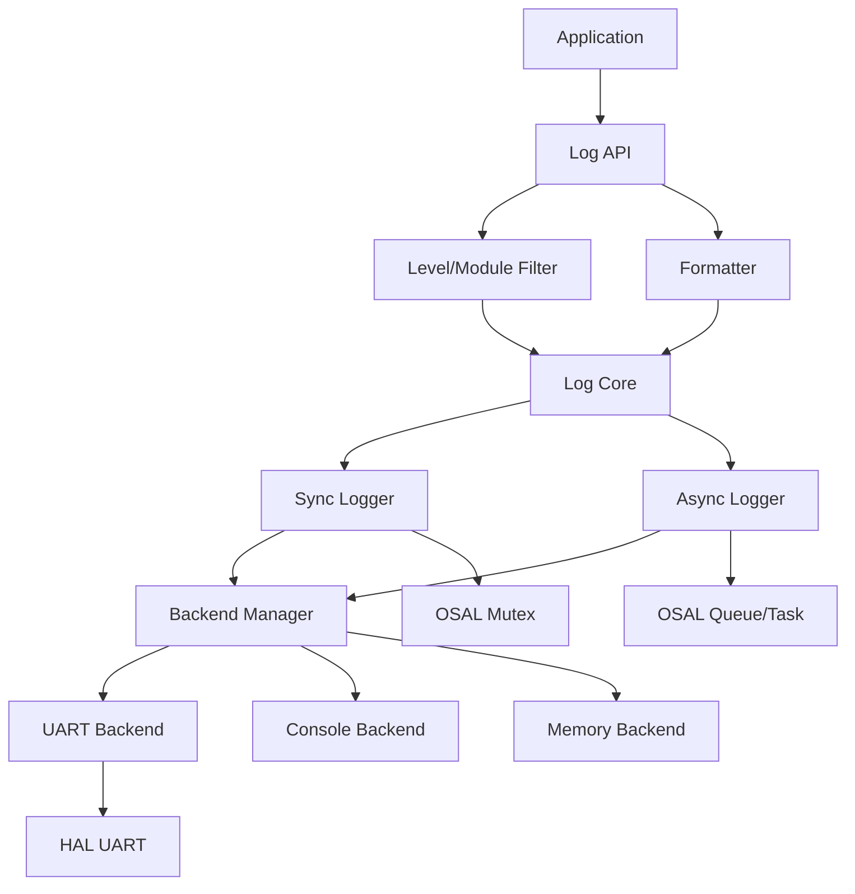

# Design Document: Logging Middleware

## Overview

本设计文档描述 Nexus 嵌入式平台日志系统组件的技术架构和实现方案。根据 PRD V3.0 的分层架构，日志系统属于 **FRAMEWORK LAYER**（框架层），与事件框架、状态机、命令行、配置管理等组件并列，为应用程序和其他模块提供统一的日志记录能力。

日志系统代码位于 `framework/log/` 目录下。

### 设计目标

1. **低开销**: 日志调用开销 < 50 cycles（禁用级别时为 0）
2. **灵活性**: 支持多后端、多级别、模块过滤
3. **线程安全**: 多任务环境下安全使用
4. **可配置**: 编译时和运行时可配置
5. **可移植**: 依赖 OSAL 和 HAL，跨平台运行

## Architecture

### 整体架构

```
┌─────────────────────────────────────────────────────────────────┐
│                    Application Layer                             │
│  LOG_INFO("msg"), LOG_DEBUG("msg"), log_printf(...)             │
├─────────────────────────────────────────────────────────────────┤
│                    Log API Layer                                 │
│  ┌─────────────┐ ┌─────────────┐ ┌─────────────┐               │
│  │ Level Filter│ │Module Filter│ │  Formatter  │               │
│  └─────────────┘ └─────────────┘ └─────────────┘               │
├─────────────────────────────────────────────────────────────────┤
│                    Log Core                                      │
│  ┌─────────────┐ ┌─────────────┐ ┌─────────────┐               │
│  │ Sync Logger │ │Async Logger │ │Backend Mgr  │               │
│  └─────────────┘ └─────────────┘ └─────────────┘               │
├─────────────────────────────────────────────────────────────────┤
│                    Backend Layer                                 │
│  ┌──────────┐ ┌──────────┐ ┌──────────┐ ┌──────────┐          │
│  │  UART    │ │ Console  │ │  Memory  │ │  Custom  │          │
│  │ Backend  │ │ Backend  │ │ Backend  │ │ Backend  │          │
│  └──────────┘ └──────────┘ └──────────┘ └──────────┘          │
├─────────────────────────────────────────────────────────────────┤
│                    Platform Layer                                │
│  ┌─────────────────┐ ┌─────────────────┐                       │
│  │      OSAL       │ │       HAL       │                       │
│  │ (Mutex, Queue)  │ │    (UART)       │                       │
│  └─────────────────┘ └─────────────────┘                       │
└─────────────────────────────────────────────────────────────────┘
```

### 模块依赖关系



## Components and Interfaces

### Log Level 定义

```c
typedef enum {
    LOG_LEVEL_TRACE = 0,    // 最详细的跟踪信息
    LOG_LEVEL_DEBUG = 1,    // 调试信息
    LOG_LEVEL_INFO  = 2,    // 一般信息
    LOG_LEVEL_WARN  = 3,    // 警告信息
    LOG_LEVEL_ERROR = 4,    // 错误信息
    LOG_LEVEL_FATAL = 5,    // 致命错误
    LOG_LEVEL_NONE  = 6,    // 禁用所有日志
} log_level_t;
```

### Log Configuration

```c
typedef struct {
    log_level_t     level;          // 全局日志级别
    const char*     format;         // 格式化模式
    bool            async_mode;     // 是否启用异步模式
    size_t          buffer_size;    // 异步缓冲区大小
    size_t          max_msg_len;    // 最大消息长度
    bool            color_enabled;  // 是否启用颜色输出
} log_config_t;
```

### Log Backend Interface

```c
typedef struct log_backend {
    const char*     name;           // 后端名称
    log_status_t    (*init)(void* ctx);
    log_status_t    (*write)(void* ctx, const char* msg, size_t len);
    log_status_t    (*flush)(void* ctx);
    log_status_t    (*deinit)(void* ctx);
    void*           ctx;            // 后端上下文
    log_level_t     min_level;      // 后端最小级别
    bool            enabled;        // 是否启用
} log_backend_t;
```

### Core API

```c
// 初始化和配置
log_status_t log_init(const log_config_t* config);
log_status_t log_deinit(void);
bool         log_is_initialized(void);

// 级别管理
log_status_t log_set_level(log_level_t level);
log_level_t  log_get_level(void);
log_status_t log_module_set_level(const char* module, log_level_t level);
log_level_t  log_module_get_level(const char* module);

// 后端管理
log_status_t log_backend_register(log_backend_t* backend);
log_status_t log_backend_unregister(const char* name);
log_status_t log_backend_enable(const char* name, bool enable);

// 日志输出
log_status_t log_write(log_level_t level, const char* module,
                       const char* file, int line, const char* func,
                       const char* fmt, ...);
log_status_t log_write_raw(const char* msg, size_t len);

// 异步控制
log_status_t log_async_flush(void);
size_t       log_async_pending(void);

// 格式化
log_status_t log_set_format(const char* pattern);
```

### Convenience Macros

```c
// 带模块标签的日志宏
#define LOG_TRACE(fmt, ...) \
    log_write(LOG_LEVEL_TRACE, LOG_MODULE, __FILE__, __LINE__, __func__, fmt, ##__VA_ARGS__)

#define LOG_DEBUG(fmt, ...) \
    log_write(LOG_LEVEL_DEBUG, LOG_MODULE, __FILE__, __LINE__, __func__, fmt, ##__VA_ARGS__)

#define LOG_INFO(fmt, ...) \
    log_write(LOG_LEVEL_INFO, LOG_MODULE, __FILE__, __LINE__, __func__, fmt, ##__VA_ARGS__)

#define LOG_WARN(fmt, ...) \
    log_write(LOG_LEVEL_WARN, LOG_MODULE, __FILE__, __LINE__, __func__, fmt, ##__VA_ARGS__)

#define LOG_ERROR(fmt, ...) \
    log_write(LOG_LEVEL_ERROR, LOG_MODULE, __FILE__, __LINE__, __func__, fmt, ##__VA_ARGS__)

#define LOG_FATAL(fmt, ...) \
    log_write(LOG_LEVEL_FATAL, LOG_MODULE, __FILE__, __LINE__, __func__, fmt, ##__VA_ARGS__)

// 编译时禁用支持
#if LOG_COMPILE_LEVEL > LOG_LEVEL_TRACE
#undef LOG_TRACE
#define LOG_TRACE(fmt, ...) ((void)0)
#endif
```

### UART Backend Implementation

```c
typedef struct {
    hal_uart_instance_t uart;
    bool                initialized;
} uart_backend_ctx_t;

static log_status_t uart_backend_init(void* ctx);
static log_status_t uart_backend_write(void* ctx, const char* msg, size_t len);
static log_status_t uart_backend_flush(void* ctx);
static log_status_t uart_backend_deinit(void* ctx);

log_backend_t* log_backend_uart_create(hal_uart_instance_t uart);
```

### Console Backend Implementation

```c
// 使用标准输出 (Native 平台)
static log_status_t console_backend_write(void* ctx, const char* msg, size_t len) {
    fwrite(msg, 1, len, stdout);
    return LOG_OK;
}

log_backend_t* log_backend_console_create(void);
```

### Memory Backend Implementation

```c
typedef struct {
    char*   buffer;
    size_t  size;
    size_t  head;
    size_t  tail;
    bool    overflow;
} mem_backend_ctx_t;

log_backend_t* log_backend_memory_create(size_t size);
size_t         log_backend_memory_read(log_backend_t* backend, char* buf, size_t len);
void           log_backend_memory_clear(log_backend_t* backend);
```

## Data Models

### Log Status Codes

```c
typedef enum {
    LOG_OK                  = 0,    // 成功
    LOG_ERROR               = 1,    // 通用错误
    LOG_ERROR_INVALID_PARAM = 2,    // 无效参数
    LOG_ERROR_NOT_INIT      = 3,    // 未初始化
    LOG_ERROR_NO_MEMORY     = 4,    // 内存不足
    LOG_ERROR_FULL          = 5,    // 缓冲区满
    LOG_ERROR_BACKEND       = 6,    // 后端错误
} log_status_t;
```

### Internal Log Entry (Async Mode)

```c
typedef struct {
    log_level_t level;
    uint32_t    timestamp;
    char        module[16];
    char        message[LOG_MAX_MSG_LEN];
} log_entry_t;
```

### Module Filter Entry

```c
typedef struct {
    char        pattern[32];    // 模块名或通配符模式
    log_level_t level;          // 该模块的日志级别
} log_module_filter_t;

#define LOG_MAX_MODULE_FILTERS 16
```

### Format Pattern Tokens

| Token | Description | Example |
|-------|-------------|---------|
| %T | Timestamp (ms) | 12345678 |
| %t | Time (HH:MM:SS) | 12:34:56 |
| %L | Level (full) | INFO |
| %l | Level (short) | I |
| %M | Module name | hal.gpio |
| %F | File name | main.c |
| %f | Function name | app_init |
| %n | Line number | 42 |
| %m | Message | Hello world |
| %c | Color code | \033[32m |
| %C | Color reset | \033[0m |

## Correctness Properties

*A property is a characteristic or behavior that should hold true across all valid executions of a system-essentially, a formal statement about what the system should do. Properties serve as the bridge between human-readable specifications and machine-verifiable correctness guarantees.*


### Property 1: Log Level Ordering

*For any* two log levels A and B, if A < B numerically, then A represents a more verbose level than B.

**Validates: Requirements 1.1**

### Property 2: Level Filtering Consistency

*For any* log level L set as the global filter, all messages at levels < L SHALL be discarded, and all messages at levels >= L SHALL be passed to backends.

**Validates: Requirements 1.2, 1.3**

### Property 3: Level Get/Set Round Trip

*For any* valid log level L, calling log_set_level(L) followed by log_get_level() SHALL return L.

**Validates: Requirements 1.5**

### Property 4: Printf Format Correctness

*For any* printf-style format string and matching arguments, the formatted output SHALL match the expected printf behavior.

**Validates: Requirements 2.1**

### Property 5: Format Pattern Substitution

*For any* format pattern containing tokens (%T, %L, %M, %m, etc.), the formatted output SHALL contain the correct substituted values for each token.

**Validates: Requirements 2.2, 2.3, 2.4**

### Property 6: Message Truncation

*For any* message longer than the configured maximum length, the output SHALL be truncated to max_length - 3 characters followed by "...".

**Validates: Requirements 2.5**

### Property 7: Multi-Backend Delivery

*For any* set of N registered backends, when a log message is output, all N backends SHALL receive the message.

**Validates: Requirements 3.1, 3.2, 3.4**

### Property 8: Backend Registration/Unregistration

*For any* backend B, after log_backend_unregister(B) is called, B SHALL NOT receive any subsequent log messages.

**Validates: Requirements 3.3**

### Property 9: Backend Failure Isolation

*For any* set of backends where one fails, the remaining backends SHALL still receive log messages.

**Validates: Requirements 3.6**

### Property 10: Module Level Filtering

*For any* module M with a configured level L_M, messages from M at levels < L_M SHALL be discarded, regardless of the global level.

**Validates: Requirements 4.1, 4.2, 4.3**

### Property 11: Module Level Fallback

*For any* module M without a configured level, messages from M SHALL be filtered using the global log level.

**Validates: Requirements 4.4**

### Property 12: Wildcard Pattern Matching

*For any* wildcard pattern P (e.g., "hal.*"), all modules matching P SHALL use the configured level for P.

**Validates: Requirements 4.5**

### Property 13: Async FIFO Order

*For any* sequence of N messages logged in async mode, the output order SHALL match the input order (FIFO).

**Validates: Requirements 5.1, 5.5**

### Property 14: Async Non-Blocking

*For any* log call in async mode, the call SHALL return before the message is written to backends.

**Validates: Requirements 5.3**

### Property 15: Async Flush Completeness

*For any* pending messages in the async queue, after log_async_flush() returns, all messages SHALL have been processed.

**Validates: Requirements 5.6**

### Property 16: Thread Safety - Message Integrity

*For any* concurrent log calls from multiple tasks, each output message SHALL be complete and not interleaved with other messages.

**Validates: Requirements 6.1, 6.2**

### Property 17: Max Message Length Enforcement

*For any* configured max_msg_len value, no output message SHALL exceed that length.

**Validates: Requirements 7.1**

### Property 18: Init/Deinit Lifecycle

*For any* sequence of log_init() and log_deinit() calls, log_is_initialized() SHALL correctly reflect the current state.

**Validates: Requirements 8.1, 8.4, 8.5**

### Property 19: Runtime Reconfiguration

*For any* configuration change made via log_set_level() or log_set_format(), subsequent log messages SHALL reflect the new configuration.

**Validates: Requirements 8.3**

## Error Handling

### 错误处理策略

1. **参数验证**: 所有 API 入口检查参数有效性
2. **状态检查**: 操作前检查模块是否已初始化
3. **后端错误隔离**: 单个后端失败不影响其他后端
4. **缓冲区溢出处理**: 异步模式下缓冲区满时根据配置丢弃或阻塞

```c
log_status_t log_write(log_level_t level, const char* module,
                       const char* file, int line, const char* func,
                       const char* fmt, ...) {
    // 初始化检查
    if (!s_log_initialized) {
        return LOG_ERROR_NOT_INIT;
    }
    
    // 级别过滤
    if (level < log_get_effective_level(module)) {
        return LOG_OK;  // 静默丢弃
    }
    
    // 格式化消息
    char buffer[LOG_MAX_MSG_LEN];
    int len = log_format_message(buffer, sizeof(buffer), level, module, 
                                  file, line, func, fmt, args);
    
    // 输出到后端
    return log_output_to_backends(buffer, len);
}
```

## Testing Strategy

### 测试框架

- **单元测试**: Google Test (C++)
- **属性测试**: 使用 RapidCheck 进行属性测试
- **并发测试**: 多线程测试验证线程安全
- **覆盖率**: lcov 生成覆盖率报告

### 测试层次

```
┌─────────────────────────────────────────┐
│         Integration Tests                │
│    (Log + OSAL + HAL combined)          │
├─────────────────────────────────────────┤
│           Unit Tests                     │
│    (Individual component tests)         │
├─────────────────────────────────────────┤
│         Property Tests                   │
│    (Correctness properties)             │
└─────────────────────────────────────────┘
```

### 单元测试示例

```cpp
// test_log.cpp
TEST(LogTest, InitWithValidConfig) {
    log_config_t config = {
        .level = LOG_LEVEL_INFO,
        .format = "[%L] %m",
        .async_mode = false,
        .max_msg_len = 128
    };
    
    EXPECT_EQ(LOG_OK, log_init(&config));
    EXPECT_TRUE(log_is_initialized());
    EXPECT_EQ(LOG_OK, log_deinit());
}

TEST(LogTest, LevelFiltering) {
    log_init(NULL);
    log_set_level(LOG_LEVEL_WARN);
    
    // Create memory backend to capture output
    log_backend_t* mem = log_backend_memory_create(1024);
    log_backend_register(mem);
    
    LOG_DEBUG("This should be filtered");
    LOG_WARN("This should pass");
    
    char buf[256];
    size_t len = log_backend_memory_read(mem, buf, sizeof(buf));
    
    EXPECT_TRUE(strstr(buf, "filtered") == NULL);
    EXPECT_TRUE(strstr(buf, "pass") != NULL);
    
    log_deinit();
}
```

### 属性测试示例

```cpp
// test_log_properties.cpp
// Feature: logging-middleware, Property 2: Level Filtering Consistency
TEST(LogPropertyTest, LevelFilteringConsistency) {
    rc::check([](log_level_t filter_level, log_level_t msg_level) {
        RC_PRE(filter_level <= LOG_LEVEL_NONE);
        RC_PRE(msg_level <= LOG_LEVEL_FATAL);
        
        log_init(NULL);
        log_set_level(filter_level);
        
        log_backend_t* mem = log_backend_memory_create(1024);
        log_backend_register(mem);
        
        log_write(msg_level, "test", __FILE__, __LINE__, __func__, "test message");
        
        char buf[256];
        size_t len = log_backend_memory_read(mem, buf, sizeof(buf));
        
        if (msg_level >= filter_level) {
            RC_ASSERT(len > 0);  // Message should pass
        } else {
            RC_ASSERT(len == 0);  // Message should be filtered
        }
        
        log_deinit();
    });
}
```

### 测试配置

- 每个属性测试运行至少 100 次迭代
- 覆盖率目标: ≥ 80%
- 所有测试在 Native 平台运行
- 并发测试使用多线程验证线程安全

