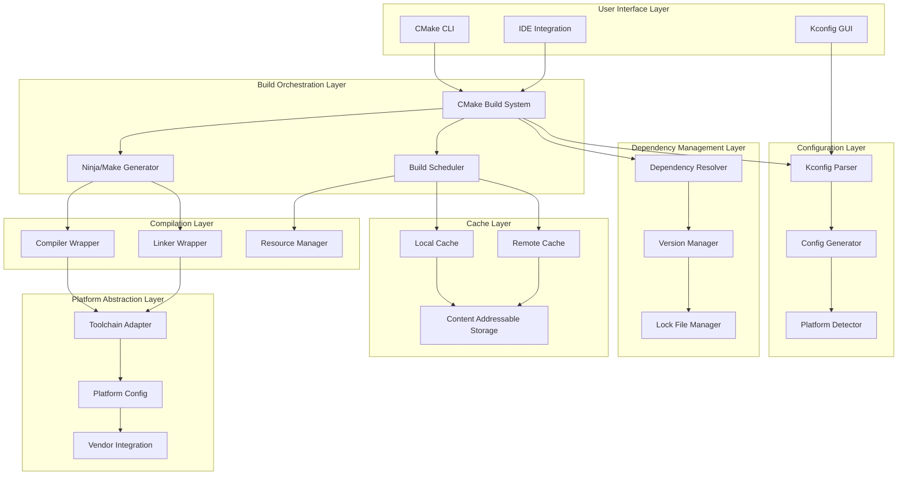

# Design Document: Nexus Build System Redesign

## Overview

本设计文档描述了 Nexus 嵌入式平台构建系统的重新设计方案。该构建系统基于 CMake 3.20+，采用现代构建系统的最佳实践，提供世界级的构建性能、完美的可重现性和卓越的开发体验。

### 设计目标

1. **极致性能**：增量构建 < 5 秒，全量构建充分利用多核 CPU
2. **完美可重现**：相同输入产生字节级相同的输出
3. **智能依赖**：自动解析依赖，精确追踪变更
4. **跨平台支持**：Windows/Linux/macOS + 多种嵌入式平台
5. **灵活配置**：Kconfig 驱动的编译时配置
6. **卓越体验**：清晰错误、IDE 集成、实时进度
7. **高级缓存**：本地/远程缓存，内容寻址
8. **安全隔离**：沙箱构建，资源限制
9. **测试集成**：单元测试、属性测试、覆盖率
10. **可扩展性**：插件系统，自定义构建步骤

### 核心架构原则

1. **分层设计**：清晰的抽象层次，模块间低耦合
2. **配置驱动**：通过 Kconfig 和 CMake 变量驱动构建
3. **内容寻址**：使用文件内容哈希而非时间戳
4. **增量优先**：默认增量构建，精确依赖追踪
5. **缓存优先**：优先使用缓存，避免重复编译
6. **并行优化**：充分利用多核 CPU 和分布式资源
7. **错误友好**：清晰的错误信息和修复建议
8. **工具集成**：无缝集成 IDE、CI/CD 和开发工具

## Architecture

### 系统架构图




### 构建流程架构

```
用户配置 (Kconfig)
   ↓
配置解析和验证
   ↓
生成配置头文件 (nexus_config.h)
   ↓
CMake 配置阶段
   ├─ 平台检测
   ├─ 工具链选择
   ├─ 依赖解析
   └─ 生成构建文件
   ↓
构建调度
   ├─ 检查缓存
   ├─ 计算依赖图
   └─ 分配编译任务
   ↓
并行编译
   ├─ 预编译头文件
   ├─ 编译源文件
   └─ 生成目标文件
   ↓
链接
   ├─ 静态库
   ├─ 共享库
   └─ 可执行文件
   ↓
后处理
   ├─ 生成二进制文件
   ├─ 生成符号文件
   └─ 生成构建报告
```

### 分层架构详解

#### 1. User Interface Layer（用户界面层）

- **CMake CLI**: 命令行接口，支持标准 CMake 命令
- **Kconfig GUI**: 图形化配置界面（menuconfig/guiconfig）
- **IDE Integration**: VS Code、CLion、Eclipse 集成

#### 2. Build Orchestration Layer（构建编排层）

- **CMake Build System**: 核心构建系统，管理构建流程
- **Ninja/Make Generator**: 生成底层构建文件
- **Build Scheduler**: 智能调度编译任务，优化并行度

#### 3. Configuration Layer（配置层）

- **Kconfig Parser**: 解析 Kconfig 文件
- **Config Generator**: 生成配置头文件和 CMake 变量
- **Platform Detector**: 检测主机平台和目标平台

#### 4. Dependency Management Layer（依赖管理层）

- **Dependency Resolver**: 解析模块依赖关系
- **Version Manager**: 管理依赖版本
- **Lock File Manager**: 管理依赖锁定文件

#### 5. Cache Layer（缓存层）

- **Local Cache**: 本地构建缓存
- **Remote Cache**: 远程共享缓存
- **Content Addressable Storage**: 内容寻址存储

#### 6. Compilation Layer（编译层）

- **Compiler Wrapper**: 编译器包装器，统一接口
- **Linker Wrapper**: 链接器包装器，统一接口
- **Resource Manager**: 资源管理器，限制资源使用

#### 7. Platform Abstraction Layer（平台抽象层）

- **Toolchain Adapter**: 工具链适配器，屏蔽工具链差异
- **Platform Config**: 平台配置，定义平台特性
- **Vendor Integration**: 第三方代码集成（CMSIS、HAL、FreeRTOS）

## Components and Interfaces

### 1. CMake 模块系统

#### 1.1 NexusBuild.cmake - 核心构建模块

**职责**：提供核心构建函数和宏

**接口**：

```cmake
# 添加 Nexus 库
nexus_add_library(
    TARGET <target_name>
    SOURCES <source_files>
    INCLUDES <include_dirs>
    DEPS <dependencies>
    [PRIVATE_INCLUDES <private_includes>]
    [COMPILE_OPTIONS <options>]
    [LINK_OPTIONS <options>]
)

# 添加 Nexus 可执行文件
nexus_add_executable(
    TARGET <target_name>
    SOURCES <source_files>
    DEPS <dependencies>
    [LINKER_SCRIPT <script_path>]
    [COMPILE_OPTIONS <options>]
    [LINK_OPTIONS <options>]
)

# 添加 Nexus 测试
nexus_add_test(
    TARGET <target_name>
    SOURCES <source_files>
    DEPS <dependencies>
    [LABELS <test_labels>]
    [TIMEOUT <seconds>]
)

# 添加预编译头文件
nexus_add_precompiled_header(
    TARGET <target_name>
    HEADER <header_file>
)
```


#### 1.2 NexusCache.cmake - 缓存管理模块

**职责**：管理本地和远程构建缓存

**接口**：

```cmake
# 启用构建缓存
nexus_enable_cache(
    [LOCAL_DIR <cache_dir>]
    [REMOTE_URL <cache_url>]
    [MAX_SIZE <size_in_mb>]
)

# 配置缓存策略
nexus_configure_cache(
    [COMPRESSION <level>]
    [ENCRYPTION <enabled>]
    [TTL <seconds>]
)

# 清理缓存
nexus_clean_cache(
    [OLDER_THAN <days>]
    [SIZE_LIMIT <mb>]
)
```

**实现原理**：
- 使用 ccache/sccache 作为编译器缓存
- 使用内容哈希（SHA-256）作为缓存键
- 支持 HTTP/S3/GCS 作为远程缓存后端
- 自动压缩和加密缓存内容

#### 1.3 NexusDependency.cmake - 依赖管理模块

**职责**：管理模块依赖和第三方库

**接口**：

```cmake
# 声明依赖
nexus_declare_dependency(
    NAME <dep_name>
    VERSION <version_spec>
    [REQUIRED]
    [COMPONENTS <components>]
)

# 添加第三方库
nexus_add_vendor_library(
    NAME <lib_name>
    SOURCE_DIR <vendor_dir>
    [INTERFACE_ONLY]
    [COMPILE_DEFINITIONS <defs>]
)

# 生成依赖锁定文件
nexus_generate_lockfile(
    OUTPUT <lockfile_path>
)
```

#### 1.4 NexusPlatform.cmake - 平台配置模块

**职责**：检测和配置目标平台

**接口**：

```cmake
# 配置目标平台
nexus_configure_platform(
    PLATFORM <platform_name>
    [TOOLCHAIN <toolchain_name>]
    [CHIP <chip_variant>]
)

# 添加平台特定源文件
nexus_add_platform_sources(
    TARGET <target_name>
    PLATFORM <platform_name>
    SOURCES <source_files>
)

# 配置工具链
nexus_configure_toolchain(
    TOOLCHAIN <toolchain_name>
    [C_COMPILER <path>]
    [CXX_COMPILER <path>]
    [LINKER <path>]
)
```

#### 1.5 NexusKconfig.cmake - Kconfig 集成模块

**职责**：集成 Kconfig 配置系统

**接口**：

```cmake
# 加载 Kconfig 配置
nexus_load_kconfig(
    KCONFIG_FILE <kconfig_path>
    CONFIG_FILE <config_path>
    OUTPUT_HEADER <header_path>
)

# 添加 Kconfig 依赖
nexus_add_kconfig_dependency(
    TARGET <target_name>
    CONFIG_OPTIONS <options>
)

# 验证 Kconfig 配置
nexus_validate_kconfig(
    CONFIG_FILE <config_path>
)
```

### 2. 构建缓存系统

#### 2.1 缓存架构

```
┌─────────────────────────────────────────────────┐
│         Compiler Invocation                     │
├─────────────────────────────────────────────────┤
│         Compiler Wrapper (ccache/sccache)       │
├─────────────────────────────────────────────────┤
│         Cache Key Generator                     │
│  (Hash: source + headers + flags + compiler)    │
├─────────────────────────────────────────────────┤
│         Local Cache                             │
│  (~/.nexus/cache/)                              │
├─────────────────────────────────────────────────┤
│         Remote Cache (Optional)                 │
│  (HTTP/S3/GCS)                                  │
└─────────────────────────────────────────────────┘
```

#### 2.2 缓存键计算

缓存键由以下内容的哈希值组成：
1. 源文件内容（SHA-256）
2. 所有包含的头文件内容（递归）
3. 编译器标志（-D、-I、-O 等）
4. 编译器版本和路径
5. 工具链版本
6. Kconfig 配置选项

#### 2.3 缓存存储格式

```
cache_dir/
├── objects/
│   ├── ab/
│   │   └── cd1234...  # 目标文件（压缩）
│   └── ef/
│       └── gh5678...  # 目标文件（压缩）
├── manifests/
│   └── build_manifest.json  # 构建清单
└── metadata/
    └── cache_stats.json  # 缓存统计
```

### 3. 依赖管理系统

#### 3.1 依赖解析流程

```
读取 CMakeLists.txt
   ↓
解析 nexus_declare_dependency()
   ↓
检查 nexus.lock 文件
   ↓
解析版本约束（SemVer）
   ↓
解析依赖图
   ├─ 检测循环依赖
   ├─ 解决版本冲突
   └─ 计算拓扑排序
   ↓
下载缺失的依赖
   ↓
生成 CMake 导入目标
```

#### 3.2 依赖锁定文件格式

**nexus.lock**:

```json
{
  "version": "1.0",
  "generated": "2026-01-29T10:00:00Z",
  "dependencies": {
    "freertos": {
      "version": "10.5.1",
      "source": "git",
      "url": "https://github.com/FreeRTOS/FreeRTOS-Kernel.git",
      "commit": "abc123...",
      "hash": "sha256:def456..."
    },
    "cmsis": {
      "version": "5.9.0",
      "source": "vendor",
      "path": "vendors/arm/CMSIS_5",
      "hash": "sha256:789abc..."
    }
  }
}
```


### 4. 增量构建系统

#### 4.1 依赖追踪机制

**编译器生成的依赖文件（.d）**:

```makefile
# example.o.d
example.o: example.c \
  include/nexus.h \
  include/hal/nx_hal.h \
  nexus_config.h \
  /usr/include/stdint.h
```

**CMake 依赖追踪**:

```cmake
# 自动生成依赖文件
set_target_properties(${TARGET} PROPERTIES
    C_INCLUDE_WHAT_YOU_USE ON
    C_DEPENDENCY_FILE_GENERATION ON
)

# 添加配置文件依赖
set_property(SOURCE ${SOURCES} APPEND PROPERTY
    OBJECT_DEPENDS ${NEXUS_CONFIG_HEADER}
)
```

#### 4.2 变更检测算法

```python
def should_rebuild(source_file, object_file, dep_file):
    """
    判断是否需要重新编译
    
    Returns:
        True if rebuild needed, False otherwise
    """
    # 1. 目标文件不存在
    if not exists(object_file):
        return True
    
    # 2. 源文件内容变更（使用哈希）
    if content_hash(source_file) != cached_hash(source_file):
        return True
    
    # 3. 任何头文件内容变更
    for header in parse_dependencies(dep_file):
        if content_hash(header) != cached_hash(header):
            return True
    
    # 4. 编译标志变更
    if compile_flags_changed(source_file):
        return True
    
    # 5. 编译器版本变更
    if compiler_version_changed():
        return True
    
    return False
```

### 5. 平台抽象层

#### 5.1 工具链适配器

**Toolchain Adapter Interface**:

```cmake
# cmake/toolchains/ToolchainAdapter.cmake

# 工具链基类
macro(nexus_toolchain_init TOOLCHAIN_NAME)
    set(NEXUS_TOOLCHAIN_NAME ${TOOLCHAIN_NAME})
    
    # 设置编译器路径
    nexus_toolchain_set_compilers()
    
    # 设置编译标志
    nexus_toolchain_set_flags()
    
    # 设置链接标志
    nexus_toolchain_set_linker_flags()
endmacro()

# ARM GCC 工具链
# cmake/toolchains/arm-none-eabi-gcc.cmake
nexus_toolchain_init("arm-none-eabi-gcc")

set(CMAKE_C_COMPILER arm-none-eabi-gcc)
set(CMAKE_CXX_COMPILER arm-none-eabi-g++)
set(CMAKE_ASM_COMPILER arm-none-eabi-gcc)

set(COMMON_FLAGS
    -mcpu=cortex-m4
    -mthumb
    -mfloat-abi=hard
    -mfpu=fpv4-sp-d16
)

# ARM Clang 工具链
# cmake/toolchains/arm-none-eabi-clang.cmake
nexus_toolchain_init("arm-none-eabi-clang")

set(CMAKE_C_COMPILER armclang)
set(CMAKE_CXX_COMPILER armclang)
set(CMAKE_ASM_COMPILER armasm)

set(COMMON_FLAGS
    --target=arm-arm-none-eabi
    -mcpu=cortex-m4
    -mfloat-abi=hard
)
```

#### 5.2 平台配置

**Platform Configuration**:

```cmake
# platforms/stm32/stm32f4.cmake

set(NEXUS_PLATFORM_NAME "STM32F4")
set(NEXUS_PLATFORM_ARCH "ARM Cortex-M4")
set(NEXUS_PLATFORM_VENDOR "STMicroelectronics")

# 平台特性
set(NEXUS_PLATFORM_HAS_FPU TRUE)
set(NEXUS_PLATFORM_HAS_DSP TRUE)
set(NEXUS_PLATFORM_HAS_MPU TRUE)

# 内存配置
set(NEXUS_PLATFORM_FLASH_SIZE "1024K")
set(NEXUS_PLATFORM_RAM_SIZE "192K")
set(NEXUS_PLATFORM_CCMRAM_SIZE "64K")

# 支持的工具链
set(NEXUS_PLATFORM_SUPPORTED_TOOLCHAINS
    arm-none-eabi-gcc
    arm-none-eabi-clang
    iar-arm
    armcc
)

# 平台特定的编译定义
add_compile_definitions(
    STM32F407xx
    USE_HAL_DRIVER
    ARM_MATH_CM4
)

# 链接脚本
set(NEXUS_PLATFORM_LINKER_SCRIPT
    ${CMAKE_CURRENT_LIST_DIR}/linker/stm32f407vg.ld
)
```

## Data Models

### 1. 构建配置数据结构

```cmake
# Build Configuration
set(NEXUS_BUILD_CONFIG
    platform: "stm32f4"
    toolchain: "arm-none-eabi-gcc"
    build_type: "Release"
    optimization: "O2"
    lto: true
    cache_enabled: true
    parallel_jobs: 8
)
```

### 2. 依赖图数据结构

```json
{
  "modules": {
    "hal": {
      "type": "library",
      "sources": ["hal/src/*.c"],
      "includes": ["hal/include"],
      "dependencies": []
    },
    "osal": {
      "type": "library",
      "sources": ["osal/src/*.c"],
      "includes": ["osal/include"],
      "dependencies": ["hal"]
    },
    "framework": {
      "type": "library",
      "sources": ["framework/*/src/*.c"],
      "includes": ["framework/*/include"],
      "dependencies": ["hal", "osal"]
    },
    "app": {
      "type": "executable",
      "sources": ["applications/blinky/*.c"],
      "dependencies": ["framework", "hal", "osal"]
    }
  }
}
```

### 3. 缓存元数据

```json
{
  "cache_key": "sha256:abc123...",
  "source_file": "hal/src/nx_hal.c",
  "object_file": "hal/src/nx_hal.c.o",
  "dependencies": [
    "hal/include/hal/nx_hal.h",
    "nexus_config.h"
  ],
  "compile_flags": ["-O2", "-Wall", "-DSTM32F407xx"],
  "compiler_version": "arm-none-eabi-gcc 10.3.1",
  "timestamp": "2026-01-29T10:00:00Z",
  "size": 12345,
  "compressed_size": 4567
}
```

### 4. 构建清单

```json
{
  "version": "1.0",
  "build_id": "20260129-100000-abc123",
  "platform": "stm32f4",
  "toolchain": "arm-none-eabi-gcc 10.3.1",
  "build_type": "Release",
  "config_hash": "sha256:def456...",
  "source_hash": "sha256:789abc...",
  "artifacts": [
    {
      "type": "executable",
      "name": "blinky.elf",
      "size": 123456,
      "hash": "sha256:111222..."
    },
    {
      "type": "binary",
      "name": "blinky.bin",
      "size": 98765,
      "hash": "sha256:333444..."
    }
  ],
  "build_time": 45.6,
  "cache_hits": 234,
  "cache_misses": 12
}
```


## Correctness Properties

*属性是一个特征或行为，应该在系统的所有有效执行中保持为真——本质上是关于系统应该做什么的形式化陈述。属性作为人类可读规范和机器可验证正确性保证之间的桥梁。*

### Property 1: 增量构建性能

*For any* 单文件变更，增量构建的总时间（编译 + 链接）应该小于 5 秒

**Validates: Requirements 1.1**

### Property 2: 并行编译效率

*For any* 全量构建，当系统有 N 个 CPU 核心时，应该有至少 N-1 个编译进程同时运行（保留一个核心给系统）

**Validates: Requirements 1.2**

### Property 3: 缓存命中正确性

*For any* 未变更的源文件，第二次编译时应该从缓存中读取结果，编译时间应该接近 0

**Validates: Requirements 1.3, 7.3**

### Property 4: 增量构建正确性

*For any* 文件变更，只有直接或间接依赖该文件的源文件应该被重新编译

**Validates: Requirements 1.4, 9.2**

### Property 5: 可重现性

*For any* 相同的源代码、配置和工具链版本，在不同机器上构建应该产生字节级相同的二进制文件（SHA-256 哈希相同）

**Validates: Requirements 2.1, 2.6**

### Property 6: 构建清单完整性

*For any* 构建，生成的构建清单应该包含所有构建输入的精确版本信息（源代码哈希、工具链版本、配置选项）

**Validates: Requirements 2.2, 2.3**

### Property 7: 哈希验证正确性

*For any* 构建产物，其 SHA-256 哈希值应该与构建清单中记录的哈希值一致

**Validates: Requirements 2.7**

### Property 8: 依赖图正确性

*For any* 模块集合，构建系统生成的依赖图应该是无环的，且包含所有直接和间接依赖关系

**Validates: Requirements 3.1, 3.7**

### Property 9: 版本解析正确性

*For any* 依赖版本约束（SemVer），构建系统选择的版本应该满足所有约束条件

**Validates: Requirements 3.3**

### Property 10: 依赖锁定一致性

*For any* 锁定文件，使用该锁定文件的所有构建应该使用完全相同的依赖版本

**Validates: Requirements 3.5**

### Property 11: 条件依赖正确性

*For any* 配置选项变更，只有受该选项影响的依赖应该被包含或排除

**Validates: Requirements 3.8**

### Property 12: 平台切换正确性

*For any* 目标平台，构建系统应该自动选择该平台对应的工具链和链接脚本

**Validates: Requirements 4.4**

### Property 13: API 一致性

*For any* 平台和工具链组合，相同的 CMake 函数调用应该产生正确的构建结果

**Validates: Requirements 4.6**

### Property 14: 配置重新生成正确性

*For any* Kconfig 配置变更，配置头文件应该被重新生成，且只有受影响的源文件应该被重新编译

**Validates: Requirements 5.2, 9.3**

### Property 15: 配置验证正确性

*For any* 无效的配置组合（违反依赖关系或互斥关系），构建系统应该拒绝该配置并报告错误

**Validates: Requirements 5.6**

### Property 16: 配置映射正确性

*For any* Kconfig 选项，该选项应该被正确映射为对应的 CMake 变量和 C 宏定义

**Validates: Requirements 5.8**

### Property 17: 错误信息完整性

*For any* 构建错误，错误信息应该包含文件名、行号和错误原因

**Validates: Requirements 6.1**

### Property 18: compile_commands.json 正确性

*For any* 源文件，compile_commands.json 应该包含该文件的编译命令和标志

**Validates: Requirements 6.2**

### Property 19: 构建进度准确性

*For any* 构建过程，显示的进度百分比应该与实际完成的任务数成正比（误差 < 5%）

**Validates: Requirements 6.3**

### Property 20: 构建统计正确性

*For any* 构建，统计信息（编译时间、文件数量）应该与实际值一致（误差 < 1%）

**Validates: Requirements 6.8**

### Property 21: 缓存键唯一性

*For any* 两个不同的编译任务（源文件、标志、编译器版本任一不同），它们的缓存键应该不同

**Validates: Requirements 7.4**

### Property 22: 缓存清理正确性

*For any* 缓存清理操作，清理后的缓存大小应该不超过配置的最大值

**Validates: Requirements 7.5**

### Property 23: 缓存统计准确性

*For any* 构建，缓存命中率应该等于（缓存命中数 / 总编译任务数）

**Validates: Requirements 7.6**

### Property 24: 构建隔离性

*For any* 构建，构建过程不应该受到系统环境变量的影响（除了明确声明的变量）

**Validates: Requirements 8.1**

### Property 25: 文件系统隔离性

*For any* 构建，构建过程只应该访问源代码目录、构建目录和工具链目录

**Validates: Requirements 8.2**

### Property 26: 资源限制有效性

*For any* 构建任务，其 CPU 和内存使用应该不超过配置的限制

**Validates: Requirements 8.4, 14.5**

### Property 27: 审计日志完整性

*For any* 构建，审计日志应该记录所有文件访问和网络请求

**Validates: Requirements 8.7**

### Property 28: 变更检测正确性

*For any* 文件，使用内容哈希判断变更应该比使用时间戳更准确（不受时钟偏移影响）

**Validates: Requirements 9.4**

### Property 29: 间接依赖追踪正确性

*For any* 链接库更新，所有链接该库的可执行文件应该被重新链接

**Validates: Requirements 9.6**

### Property 30: 增量链接正确性

*For any* 目标文件变更，只有包含该目标文件的可执行文件应该被重新链接

**Validates: Requirements 9.7**

### Property 31: 构建恢复正确性

*For any* 构建失败，修复错误后重新构建应该从失败点继续，而不是从头开始

**Validates: Requirements 9.8**

### Property 32: 测试并行执行正确性

*For any* 测试套件，并行执行的测试结果应该与串行执行的结果一致

**Validates: Requirements 10.3**

### Property 33: 测试报告完整性

*For any* 测试执行，测试报告应该包含所有测试的结果（通过/失败）和执行时间

**Validates: Requirements 10.4**

### Property 34: 覆盖率报告准确性

*For any* 测试执行，覆盖率报告应该准确反映被测试代码的行覆盖率和分支覆盖率

**Validates: Requirements 10.5**

### Property 35: 测试过滤正确性

*For any* 测试过滤条件，只有满足条件的测试应该被执行

**Validates: Requirements 10.7**

### Property 36: 插件钩子调用正确性

*For any* 插件钩子，该钩子应该在正确的构建阶段被调用（构建前、构建后、清理等）

**Validates: Requirements 11.3**

### Property 37: 插件配置传递正确性

*For any* 插件配置参数，该参数应该被正确传递给插件

**Validates: Requirements 11.4**

### Property 38: 插件版本管理正确性

*For any* 插件依赖，构建系统应该使用满足版本约束的插件版本

**Validates: Requirements 11.8**

### Property 39: 分布式负载均衡正确性

*For any* 分布式构建，各构建机器的任务数应该大致相等（方差 < 20%）

**Validates: Requirements 12.3**

### Property 40: 分布式结果收集完整性

*For any* 分布式构建，所有远程机器的构建结果应该被正确收集和合并

**Validates: Requirements 12.4**

### Property 41: 分布式失败重试正确性

*For any* 分布式构建失败，失败的任务应该被自动重试，且重试次数不超过配置的最大值

**Validates: Requirements 12.5**

### Property 42: 分布式统计准确性

*For any* 分布式构建，统计信息应该包含所有机器的构建时间和任务数

**Validates: Requirements 12.7**

### Property 43: 依赖文件生成正确性

*For any* 源文件，生成的 .d 文件应该包含该源文件的所有直接头文件依赖

**Validates: Requirements 13.1**

### Property 44: 间接依赖追踪完整性

*For any* 头文件，该头文件包含的所有头文件（递归）都应该被追踪为依赖

**Validates: Requirements 13.2**

### Property 45: 配置依赖追踪正确性

*For any* Kconfig 选项，所有受该选项影响的源文件都应该被标记为依赖该选项

**Validates: Requirements 13.3**

### Property 46: 生成文件依赖正确性

*For any* 代码生成器，生成器的输入文件变更应该触发输出文件的重新生成

**Validates: Requirements 13.4**

### Property 47: 依赖变更检测正确性

*For any* 依赖关系变更（头文件添加/删除），构建系统应该检测到变更并更新依赖图

**Validates: Requirements 13.5**

### Property 48: 缺失依赖检测正确性

*For any* 未声明的头文件包含，构建系统应该检测到并报告警告或错误

**Validates: Requirements 13.7**

### Property 49: 自适应并行度正确性

*For any* 系统资源变化，构建系统应该自动调整并行任务数以匹配可用资源

**Validates: Requirements 14.1**

### Property 50: 内存监控准确性

*For any* 构建过程，监控的内存使用应该与实际内存使用一致（误差 < 10%）

**Validates: Requirements 14.2**

### Property 51: 优先级调度正确性

*For any* 构建任务集合，高优先级任务应该在低优先级任务之前开始执行

**Validates: Requirements 14.3**

### Property 52: 临时文件清理完整性

*For any* 构建完成，所有临时文件应该被清理，只保留最终的构建产物

**Validates: Requirements 14.7**

### Property 53: 资源使用报告准确性

*For any* 构建，资源使用报告应该准确反映 CPU、内存和磁盘的使用情况（误差 < 5%）

**Validates: Requirements 14.8**

### Property 54: 日志完整性

*For any* 构建步骤，该步骤的命令、输出和错误都应该被记录到日志中

**Validates: Requirements 15.1**

### Property 55: 日志级别过滤正确性

*For any* 日志级别设置，只有该级别及以上的日志消息应该被输出

**Validates: Requirements 15.2, 15.4**

### Property 56: 结构化日志格式正确性

*For any* 日志消息，该消息应该是有效的 JSON 格式，包含时间戳、级别、消息等字段

**Validates: Requirements 15.3**

### Property 57: 构建报告完整性

*For any* 构建，构建报告应该包含构建时间、文件数量、成功/失败状态和错误统计

**Validates: Requirements 15.5**

### Property 58: 错误上下文完整性

*For any* 构建错误，错误消息应该包含错误上下文（相关代码片段）和修复建议

**Validates: Requirements 15.8**


## Error Handling

### 错误分类和处理策略

| 错误类型 | 检测方法 | 处理策略 | 恢复可能性 |
|---------|---------|---------|-----------|
| 配置错误 | Kconfig 验证 | 报告错误，拒绝构建 | 可恢复（修复配置） |
| 依赖缺失 | 依赖解析失败 | 报告缺失依赖，提供安装指南 | 可恢复（安装依赖） |
| 依赖冲突 | 版本解析失败 | 报告冲突，提供解决建议 | 可恢复（调整版本） |
| 编译错误 | 编译器返回非零 | 报告错误，保留日志 | 可恢复（修复代码） |
| 链接错误 | 链接器返回非零 | 报告错误，显示未定义符号 | 可恢复（修复链接） |
| 缓存损坏 | 哈希验证失败 | 清除损坏缓存，重新编译 | 自动恢复 |
| 资源耗尽 | 内存/磁盘监控 | 减少并行度，清理临时文件 | 自动恢复 |
| 工具链缺失 | 编译器查找失败 | 报告错误，提供安装指南 | 可恢复（安装工具链） |
| 网络错误 | 依赖下载失败 | 重试，使用镜像源 | 自动恢复 |
| 权限错误 | 文件访问失败 | 报告错误，检查权限 | 可恢复（修复权限） |

### 错误处理实现

#### 1. 配置错误处理

```cmake
function(nexus_validate_config)
    # 检查必需的配置选项
    if(NOT DEFINED CONFIG_PLATFORM)
        message(FATAL_ERROR "Platform not configured. Please run 'make menuconfig'")
    endif()
    
    # 检查配置冲突
    if(CONFIG_FEATURE_A AND CONFIG_FEATURE_B)
        message(FATAL_ERROR "CONFIG_FEATURE_A and CONFIG_FEATURE_B are mutually exclusive")
    endif()
    
    # 检查依赖关系
    if(CONFIG_FEATURE_C AND NOT CONFIG_FEATURE_D)
        message(FATAL_ERROR "CONFIG_FEATURE_C requires CONFIG_FEATURE_D to be enabled")
    endif()
endfunction()
```

#### 2. 依赖错误处理

```cmake
function(nexus_resolve_dependency DEP_NAME VERSION_SPEC)
    # 尝试查找依赖
    find_package(${DEP_NAME} ${VERSION_SPEC})
    
    if(NOT ${DEP_NAME}_FOUND)
        message(FATAL_ERROR 
            "Dependency '${DEP_NAME}' (${VERSION_SPEC}) not found.\n"
            "Please install it using:\n"
            "  - Ubuntu/Debian: sudo apt install lib${DEP_NAME}-dev\n"
            "  - macOS: brew install ${DEP_NAME}\n"
            "  - Windows: vcpkg install ${DEP_NAME}\n"
            "Or add it to nexus.lock file."
        )
    endif()
endfunction()
```

#### 3. 编译错误处理

```cmake
# 编译器包装器，捕获和格式化错误
function(nexus_compile_source SOURCE OUTPUT)
    execute_process(
        COMMAND ${CMAKE_C_COMPILER} ${COMPILE_FLAGS} -c ${SOURCE} -o ${OUTPUT}
        RESULT_VARIABLE RESULT
        OUTPUT_VARIABLE STDOUT
        ERROR_VARIABLE STDERR
    )
    
    if(NOT RESULT EQUAL 0)
        # 解析错误信息
        string(REGEX MATCH "([^:]+):([0-9]+):([0-9]+): error: (.*)" 
               ERROR_MATCH "${STDERR}")
        
        if(ERROR_MATCH)
            set(FILE ${CMAKE_MATCH_1})
            set(LINE ${CMAKE_MATCH_2})
            set(COL ${CMAKE_MATCH_3})
            set(MSG ${CMAKE_MATCH_4})
            
            # 格式化错误信息
            message(FATAL_ERROR
                "\n"
                "Compilation failed:\n"
                "  File: ${FILE}\n"
                "  Line: ${LINE}:${COL}\n"
                "  Error: ${MSG}\n"
                "\n"
                "Context:\n"
                "${CODE_CONTEXT}\n"
                "\n"
                "Suggestion: ${ERROR_SUGGESTION}\n"
            )
        else()
            message(FATAL_ERROR "Compilation failed:\n${STDERR}")
        endif()
    endif()
endfunction()
```

#### 4. 缓存错误处理

```cmake
function(nexus_verify_cache_entry CACHE_KEY CACHE_FILE)
    # 计算文件哈希
    file(SHA256 ${CACHE_FILE} FILE_HASH)
    
    # 读取缓存元数据
    file(READ ${CACHE_DIR}/metadata/${CACHE_KEY}.json METADATA)
    string(JSON EXPECTED_HASH GET ${METADATA} "hash")
    
    # 验证哈希
    if(NOT FILE_HASH STREQUAL EXPECTED_HASH)
        message(WARNING 
            "Cache entry corrupted: ${CACHE_KEY}\n"
            "Expected: ${EXPECTED_HASH}\n"
            "Got: ${FILE_HASH}\n"
            "Removing corrupted cache entry..."
        )
        
        # 删除损坏的缓存
        file(REMOVE ${CACHE_FILE})
        file(REMOVE ${CACHE_DIR}/metadata/${CACHE_KEY}.json)
        
        return(FALSE)
    endif()
    
    return(TRUE)
endfunction()
```

#### 5. 资源耗尽处理

```cmake
function(nexus_monitor_resources)
    # 检查可用内存
    cmake_host_system_information(RESULT AVAILABLE_MEMORY 
                                   QUERY AVAILABLE_PHYSICAL_MEMORY)
    
    if(AVAILABLE_MEMORY LESS 1024)  # < 1GB
        message(WARNING 
            "Low memory detected (${AVAILABLE_MEMORY} MB available)\n"
            "Reducing parallel jobs to conserve memory..."
        )
        
        # 减少并行度
        math(EXPR NEW_JOBS "${CMAKE_BUILD_PARALLEL_LEVEL} / 2")
        set(CMAKE_BUILD_PARALLEL_LEVEL ${NEW_JOBS} PARENT_SCOPE)
        
        # 清理临时文件
        nexus_clean_temp_files()
    endif()
    
    # 检查可用磁盘空间
    cmake_host_system_information(RESULT AVAILABLE_DISK 
                                   QUERY AVAILABLE_DISK_SPACE)
    
    if(AVAILABLE_DISK LESS 1024)  # < 1GB
        message(WARNING 
            "Low disk space detected (${AVAILABLE_DISK} MB available)\n"
            "Cleaning build cache..."
        )
        
        # 清理缓存
        nexus_clean_cache(SIZE_LIMIT 512)
    endif()
endfunction()
```

### 错误恢复机制

#### 1. 自动重试

```cmake
function(nexus_execute_with_retry COMMAND MAX_RETRIES)
    set(RETRY_COUNT 0)
    
    while(RETRY_COUNT LESS MAX_RETRIES)
        execute_process(
            COMMAND ${COMMAND}
            RESULT_VARIABLE RESULT
            OUTPUT_VARIABLE OUTPUT
            ERROR_VARIABLE ERROR
        )
        
        if(RESULT EQUAL 0)
            return()
        endif()
        
        math(EXPR RETRY_COUNT "${RETRY_COUNT} + 1")
        message(STATUS "Command failed, retrying (${RETRY_COUNT}/${MAX_RETRIES})...")
        
        # 指数退避
        math(EXPR DELAY "2 ** ${RETRY_COUNT}")
        execute_process(COMMAND ${CMAKE_COMMAND} -E sleep ${DELAY})
    endwhile()
    
    message(FATAL_ERROR "Command failed after ${MAX_RETRIES} retries:\n${ERROR}")
endfunction()
```

#### 2. 构建恢复

```cmake
function(nexus_resume_build)
    # 读取构建状态
    if(EXISTS ${CMAKE_BINARY_DIR}/.build_state.json)
        file(READ ${CMAKE_BINARY_DIR}/.build_state.json BUILD_STATE)
        string(JSON LAST_TARGET GET ${BUILD_STATE} "last_target")
        string(JSON FAILED_SOURCES GET ${BUILD_STATE} "failed_sources")
        
        message(STATUS "Resuming build from ${LAST_TARGET}...")
        
        # 只重新编译失败的源文件
        foreach(SOURCE ${FAILED_SOURCES})
            nexus_compile_source(${SOURCE})
        endforeach()
    endif()
endfunction()
```

## Testing Strategy

### 测试方法

本构建系统采用双重测试策略：

1. **单元测试**：验证特定功能、边界条件和错误处理
2. **属性测试**：验证通用属性在所有输入下的正确性

### 单元测试覆盖

| 测试类别 | 测试用例 | 验证内容 |
|---------|---------|---------|
| CMake 模块 | test_nexus_add_library | nexus_add_library 函数正确创建库 |
| CMake 模块 | test_nexus_add_executable | nexus_add_executable 函数正确创建可执行文件 |
| CMake 模块 | test_nexus_add_test | nexus_add_test 函数正确创建测试 |
| 缓存系统 | test_cache_key_generation | 缓存键正确生成 |
| 缓存系统 | test_cache_hit | 缓存命中正确返回结果 |
| 缓存系统 | test_cache_miss | 缓存未命中正确编译 |
| 缓存系统 | test_cache_corruption | 损坏的缓存被检测和清除 |
| 依赖管理 | test_dependency_resolution | 依赖正确解析 |
| 依赖管理 | test_version_conflict | 版本冲突被检测 |
| 依赖管理 | test_circular_dependency | 循环依赖被检测 |
| 依赖管理 | test_lock_file_generation | 锁定文件正确生成 |
| 增量构建 | test_single_file_change | 单文件变更只重新编译该文件 |
| 增量构建 | test_header_change | 头文件变更重新编译所有包含它的文件 |
| 增量构建 | test_config_change | 配置变更重新编译受影响的文件 |
| 平台支持 | test_platform_detection | 平台正确检测 |
| 平台支持 | test_toolchain_selection | 工具链正确选择 |
| 平台支持 | test_cross_compilation | 交叉编译正确工作 |
| Kconfig | test_kconfig_parsing | Kconfig 文件正确解析 |
| Kconfig | test_config_generation | 配置头文件正确生成 |
| Kconfig | test_config_validation | 无效配置被拒绝 |
| 错误处理 | test_compilation_error | 编译错误正确报告 |
| 错误处理 | test_link_error | 链接错误正确报告 |
| 错误处理 | test_missing_dependency | 缺失依赖正确报告 |

### 属性测试配置

每个属性测试应该：
- 运行至少 100 次迭代
- 使用随机生成的输入
- 标记为 `Feature: nexus-build-system-redesign, Property X: <property_text>`

**属性测试框架**：使用 Hypothesis (Python) 或 QuickCheck (C++) 进行属性测试

**示例属性测试**：

```python
from hypothesis import given, strategies as st
import pytest
import subprocess
import hashlib

@given(
    source_files=st.lists(st.text(min_size=1), min_size=1, max_size=10),
    config_options=st.dictionaries(st.text(), st.booleans())
)
def test_reproducible_build(source_files, config_options):
    """
    Feature: nexus-build-system-redesign, Property 5: 可重现性
    
    For any source code and configuration, building on different machines
    should produce byte-identical binaries.
    """
    # 创建临时项目
    project_dir = create_temp_project(source_files, config_options)
    
    # 在机器 A 上构建
    binary_a = build_project(project_dir, machine="A")
    hash_a = hashlib.sha256(binary_a).hexdigest()
    
    # 在机器 B 上构建（模拟不同环境）
    binary_b = build_project(project_dir, machine="B")
    hash_b = hashlib.sha256(binary_b).hexdigest()
    
    # 验证二进制文件相同
    assert hash_a == hash_b, f"Binaries differ: {hash_a} != {hash_b}"

@given(
    dependency_graph=st.dictionaries(
        st.text(min_size=1),
        st.lists(st.text(min_size=1))
    )
)
def test_dependency_graph_acyclic(dependency_graph):
    """
    Feature: nexus-build-system-redesign, Property 8: 依赖图正确性
    
    For any module set, the dependency graph should be acyclic.
    """
    # 检测循环依赖
    def has_cycle(graph, node, visited, rec_stack):
        visited.add(node)
        rec_stack.add(node)
        
        for neighbor in graph.get(node, []):
            if neighbor not in visited:
                if has_cycle(graph, neighbor, visited, rec_stack):
                    return True
            elif neighbor in rec_stack:
                return True
        
        rec_stack.remove(node)
        return False
    
    visited = set()
    rec_stack = set()
    
    for node in dependency_graph:
        if node not in visited:
            assert not has_cycle(dependency_graph, node, visited, rec_stack), \
                f"Cycle detected in dependency graph"

@given(
    source_file=st.text(min_size=1),
    compile_flags=st.lists(st.text()),
    compiler_version=st.text()
)
def test_cache_key_uniqueness(source_file, compile_flags, compiler_version):
    """
    Feature: nexus-build-system-redesign, Property 21: 缓存键唯一性
    
    For any two different compilation tasks, their cache keys should be different.
    """
    # 生成缓存键 1
    key1 = generate_cache_key(source_file, compile_flags, compiler_version)
    
    # 修改任一参数
    modified_source = source_file + " "
    key2 = generate_cache_key(modified_source, compile_flags, compiler_version)
    
    # 验证缓存键不同
    assert key1 != key2, "Cache keys should be different for different inputs"
```

### 集成测试

在真实项目上进行集成测试：

1. **Nexus 平台自身**：使用新构建系统构建 Nexus 平台
2. **示例应用**：构建所有示例应用（blinky、shell_demo 等）
3. **多平台测试**：在 Windows、Linux、macOS 上测试
4. **多工具链测试**：使用 GCC、Clang、MSVC 测试
5. **性能测试**：测量构建时间、缓存命中率等

### 性能基准测试

| 测试场景 | 目标性能 | 测量方法 |
|---------|---------|---------|
| 全量构建 | < 2 分钟 | 时间测量 |
| 增量构建（单文件） | < 5 秒 | 时间测量 |
| 缓存命中率 | > 90% | 统计分析 |
| 并行效率 | > 80% | CPU 利用率 |
| 内存使用 | < 4GB | 内存监控 |
| 磁盘使用 | < 10GB | 磁盘空间 |

### CI/CD 集成

构建系统应该在以下 CI/CD 环境中测试：

- **GitHub Actions**: Linux、Windows、macOS
- **GitLab CI**: Docker 容器
- **Jenkins**: 企业环境
- **Azure Pipelines**: 多平台

## Implementation Notes

### 实施优先级

#### Phase 1: 核心功能（1-2 个月）
1. CMake 模块系统重构
2. Kconfig 集成优化
3. 基本缓存系统
4. 增量构建优化
5. 平台抽象层

#### Phase 2: 高级功能（2-3 个月）
1. 远程缓存支持
2. 依赖管理系统
3. 构建隔离和安全
4. 性能监控和诊断
5. 错误处理优化

#### Phase 3: 扩展功能（1-2 个月）
1. 插件系统
2. 分布式构建
3. IDE 集成增强
4. 文档和示例

### 技术选型

| 组件 | 技术选择 | 理由 |
|------|---------|------|
| 构建生成器 | Ninja | 比 Make 快，支持增量构建 |
| 缓存后端 | ccache/sccache | 成熟的编译器缓存方案 |
| 依赖管理 | 自定义 + CMake FetchContent | 灵活性和集成度 |
| 配置系统 | Kconfig | 已有基础，功能强大 |
| 测试框架 | Google Test + Hypothesis | 单元测试 + 属性测试 |
| 日志格式 | JSON | 结构化，易于解析 |
| 容器化 | Docker | 标准化，跨平台 |

### 兼容性考虑

1. **向后兼容**：保持现有 CMakeLists.txt 的兼容性
2. **渐进式迁移**：允许逐步迁移到新的构建系统
3. **工具链支持**：支持旧版本的工具链
4. **平台支持**：确保在所有支持的平台上工作

### 文档要求

1. **用户文档**：如何使用新构建系统
2. **开发者文档**：如何扩展和定制
3. **迁移指南**：从旧系统迁移到新系统
4. **最佳实践**：构建系统使用的最佳实践
5. **故障排除**：常见问题和解决方案

## References

1. **CMake Documentation**: https://cmake.org/documentation/
2. **Ninja Build System**: https://ninja-build.org/
3. **ccache**: https://ccache.dev/
4. **sccache**: https://github.com/mozilla/sccache
5. **Bazel Build System**: https://bazel.build/ (参考设计)
6. **Buck2 Build System**: https://buck2.build/ (参考设计)
7. **Kconfig Language**: https://www.kernel.org/doc/html/latest/kbuild/kconfig-language.html
8. **Reproducible Builds**: https://reproducible-builds.org/
9. **Property-Based Testing**: https://hypothesis.readthedocs.io/
10. **CMake Best Practices**: https://cliutils.gitlab.io/modern-cmake/
