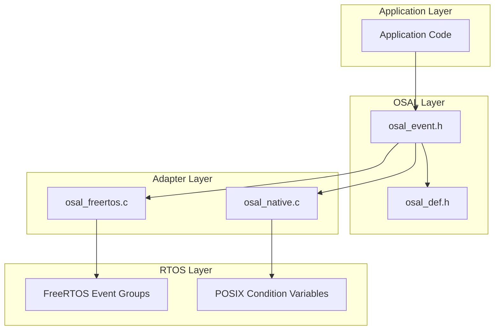

# Design Document: OSAL Event Flags Module

## Overview

This document describes the design for adding Event Flags functionality to the OSAL (Operating System Abstraction Layer). Event flags (also known as event groups) provide a synchronization mechanism that allows tasks to wait for multiple event conditions using AND/OR logic.

The Event Flags module wraps FreeRTOS event groups (xEventGroupCreate, etc.) to provide flexible multi-condition synchronization. Each event flags object contains a set of binary event bits (minimum 24 bits) that can be set, cleared, and waited upon atomically.

## Architecture



## Components and Interfaces

### Event Flags Module (osal_event.h)

#### Types

```c
/**
 * \brief Event flags handle type
 */
typedef void* osal_event_handle_t;

/**
 * \brief Event bits type (at least 24 bits)
 */
typedef uint32_t osal_event_bits_t;

/**
 * \brief Event wait mode enumeration
 */
typedef enum {
    OSAL_EVENT_WAIT_ANY = 0,  /**< Wait for any of the specified bits */
    OSAL_EVENT_WAIT_ALL = 1   /**< Wait for all of the specified bits */
} osal_event_wait_mode_t;

/**
 * \brief Event wait options structure
 */
typedef struct {
    osal_event_wait_mode_t mode;  /**< Wait mode (ANY or ALL) */
    bool auto_clear;              /**< Auto-clear matched bits after wait */
    uint32_t timeout_ms;          /**< Timeout in milliseconds */
} osal_event_wait_options_t;
```

#### Functions

```c
/**
 * \brief Create event flags
 * \param[out] handle Pointer to store event flags handle
 * \return OSAL_OK on success, error code otherwise
 */
osal_status_t osal_event_create(osal_event_handle_t* handle);

/**
 * \brief Delete event flags
 * \param[in] handle Event flags handle
 * \return OSAL_OK on success, error code otherwise
 */
osal_status_t osal_event_delete(osal_event_handle_t handle);

/**
 * \brief Set event bits
 * \param[in] handle Event flags handle
 * \param[in] bits Bits to set
 * \return OSAL_OK on success, error code otherwise
 */
osal_status_t osal_event_set(osal_event_handle_t handle,
                             osal_event_bits_t bits);

/**
 * \brief Clear event bits
 * \param[in] handle Event flags handle
 * \param[in] bits Bits to clear
 * \return OSAL_OK on success, error code otherwise
 */
osal_status_t osal_event_clear(osal_event_handle_t handle,
                               osal_event_bits_t bits);

/**
 * \brief Wait for event bits
 * \param[in] handle Event flags handle
 * \param[in] bits Bits to wait for
 * \param[in] options Wait options (mode, auto-clear, timeout)
 * \param[out] bits_out Pointer to store actual bits that satisfied condition (optional)
 * \return OSAL_OK on success, error code otherwise
 */
osal_status_t osal_event_wait(osal_event_handle_t handle,
                              osal_event_bits_t bits,
                              const osal_event_wait_options_t* options,
                              osal_event_bits_t* bits_out);

/**
 * \brief Get current event bits (non-blocking)
 * \param[in] handle Event flags handle
 * \return Current event bits value (0 if handle is NULL)
 */
osal_event_bits_t osal_event_get(osal_event_handle_t handle);

/**
 * \brief Set event bits from ISR context
 * \param[in] handle Event flags handle
 * \param[in] bits Bits to set
 * \return OSAL_OK on success, error code otherwise
 */
osal_status_t osal_event_set_from_isr(osal_event_handle_t handle,
                                      osal_event_bits_t bits);
```

## Data Models

### Event Flags Internal Structure (FreeRTOS Adapter)

The FreeRTOS adapter uses `EventGroupHandle_t` directly:

```c
// FreeRTOS event groups provide 24 bits (bits 0-23)
// Bits 24-31 are reserved for internal use by FreeRTOS
#define OSAL_EVENT_BITS_MASK 0x00FFFFFF
```

### Event Flags Internal Structure (Native Adapter)

For the native adapter (testing purposes), event flags are implemented using condition variables:

```c
/**
 * \brief Native event flags structure
 */
typedef struct {
    pthread_mutex_t mutex;      /**< Mutex for protecting bits */
    pthread_cond_t cond;        /**< Condition variable for waiting */
    osal_event_bits_t bits;     /**< Current event bits */
} osal_native_event_t;
```

## Correctness Properties

*A property is a characteristic or behavior that should hold true across all valid executions of a system—essentially, a formal statement about what the system should do. Properties serve as the bridge between human-readable specifications and machine-verifiable correctness guarantees.*

### Property 1: Event Flags Creation Success

*For any* event flags creation request, the operation SHALL succeed and return a valid handle with OSAL_OK status.

**Validates: Requirements 1.1**

### Property 2: Set Bits Atomically Updates State

*For any* valid event flags handle and non-zero bits mask, setting bits SHALL atomically update the event flags state such that all specified bits become set.

**Validates: Requirements 2.1, 2.5**

### Property 3: Set Bits Wakes Waiting Tasks

*For any* task waiting for event bits, setting those bits SHALL cause the waiting task to unblock.

**Validates: Requirements 2.4**

### Property 4: Clear Bits Atomically Updates Only Specified Bits

*For any* valid event flags handle and non-zero bits mask, clearing bits SHALL atomically clear only the specified bits while leaving all other bits unchanged.

**Validates: Requirements 3.1, 3.4, 3.5**

### Property 5: Wait All Mode Requires All Bits

*For any* WAIT_ALL wait operation with bits mask B, the wait SHALL unblock if and only if all bits in B are set in the event flags.

**Validates: Requirements 4.4**

### Property 6: Wait Any Mode Requires Any Bit

*For any* WAIT_ANY wait operation with bits mask B, the wait SHALL unblock if any bit in B is set in the event flags.

**Validates: Requirements 4.5**

### Property 7: Auto-Clear Clears Matched Bits

*For any* wait operation with auto-clear enabled, the bits that satisfied the wait condition SHALL be automatically cleared after the wait unblocks.

**Validates: Requirements 4.6**

### Property 8: Non-Auto-Clear Preserves Bits

*For any* wait operation with auto-clear disabled, the event bits SHALL remain unchanged after the wait unblocks.

**Validates: Requirements 4.7**

### Property 9: Wait Timeout Returns Error

*For any* wait operation with timeout T, if the wait condition is not satisfied within T milliseconds, the operation SHALL return OSAL_ERROR_TIMEOUT.

**Validates: Requirements 4.8**

### Property 10: Wait Immediate Return When Satisfied

*For any* wait operation where the wait condition is already satisfied, the operation SHALL return immediately with OSAL_OK without blocking.

**Validates: Requirements 4.9**

### Property 11: Get Returns Current Value Without Modification

*For any* event flags state, the get operation SHALL return the current bits value and SHALL not modify the event flags state.

**Validates: Requirements 5.1, 5.3**

### Property 12: Set Operation Atomicity

*For any* concurrent set, clear, and wait operations on the same event flags, the set operation SHALL execute atomically such that all specified bits are set together without intermediate states visible to other operations.

**Validates: Requirements 7.1**

### Property 13: Clear Operation Atomicity

*For any* concurrent set, clear, and wait operations on the same event flags, the clear operation SHALL execute atomically such that all specified bits are cleared together without intermediate states visible to other operations.

**Validates: Requirements 7.2**

### Property 14: Wait Check-and-Clear Atomicity

*For any* wait operation with auto-clear enabled, the check of wait condition and clearing of matched bits SHALL execute atomically without race conditions.

**Validates: Requirements 7.3**

### Property 15: Broadcast Wake All Waiting Tasks

*For any* event flags with multiple tasks waiting for the same bits, setting those bits SHALL wake all waiting tasks whose conditions are satisfied.

**Validates: Requirements 7.4**

### Property 16: NULL Pointer Error Handling

*For any* function that requires a non-NULL pointer parameter, passing NULL SHALL return OSAL_ERROR_NULL_POINTER.

**Validates: Requirements 8.2**

### Property 17: Invalid Parameter Error Handling

*For any* function with parameter constraints (e.g., non-zero bits mask), violating those constraints SHALL return OSAL_ERROR_INVALID_PARAM.

**Validates: Requirements 8.3**

## Error Handling

### Event Flags Error Handling

| Condition | Error Code |
|-----------|------------|
| NULL handle pointer in create | OSAL_ERROR_NULL_POINTER |
| NULL handle in operations | OSAL_ERROR_NULL_POINTER |
| Zero bits mask in set/clear/wait | OSAL_ERROR_INVALID_PARAM |
| Memory allocation failure | OSAL_ERROR_NO_MEMORY |
| Wait timeout expired | OSAL_ERROR_TIMEOUT |
| Wait called from ISR | OSAL_ERROR_ISR |
| FreeRTOS operation failure | OSAL_ERROR |

## Testing Strategy

### Unit Tests

Unit tests will cover:
- Event flags creation and deletion
- Setting and clearing bits
- Waiting with different modes (WAIT_ALL, WAIT_ANY)
- Auto-clear behavior
- Timeout behavior
- Get operation
- Error conditions (NULL pointers, invalid parameters)
- Edge cases (zero mask, all bits set)

### Property-Based Tests

Property-based tests will use the Catch2 framework with custom generators:

1. **Bits Mask Generator**: Generates random bit patterns within the valid range (0x000001 - 0xFFFFFF for 24-bit support).

2. **Wait Mode Generator**: Generates random wait modes (WAIT_ALL or WAIT_ANY).

3. **Auto-Clear Generator**: Generates random boolean values for auto-clear option.

4. **Timeout Generator**: Generates random timeout values (0, 100, 1000, OSAL_WAIT_FOREVER).

Each property test will run a minimum of 100 iterations to ensure comprehensive coverage.

**Test File Organization:**
- `tests/osal/test_osal_event.cpp` - Event flags unit tests
- `tests/osal/test_osal_event_properties.cpp` - Event flags property tests

**Property Test Annotation Format:**
```cpp
// Feature: osal-event-flags, Property 1: Event Flags Creation Success
// Validates: Requirements 1.1
TEST_CASE("Property 1: Event flags creation success", "[osal][event][property]") {
    // Property-based test implementation
}
```

### Concurrency Testing

Special attention will be given to testing concurrent operations:
- Multiple tasks setting different bits simultaneously
- Multiple tasks waiting for overlapping bit patterns
- Set/clear operations racing with wait operations
- ISR setting bits while tasks are waiting

These tests will use multiple threads in the native adapter to verify atomicity guarantees.
