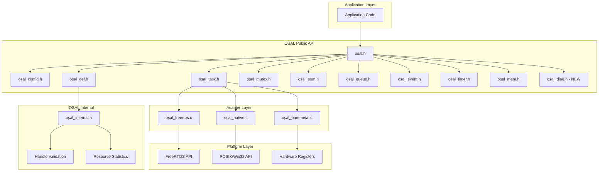

# Design Document: OSAL Refactor

## Overview

本文档描述 OSAL（操作系统抽象层）重构优化的设计方案。重构目标是在保持现有 API 兼容性的基础上，增强功能、提升代码质量、优化性能，并完善 Baremetal 适配器实现。

OSAL 当前已实现的模块包括：
- Task（任务管理）
- Mutex（互斥锁）
- Semaphore（信号量）
- Queue（消息队列）
- Event（事件标志）
- Timer（软件定时器）
- Memory（内存管理）

本次重构将在这些模块基础上添加增强功能，并统一代码风格和错误处理模式。

## Architecture



## Components and Interfaces

### 1. 配置模块 (osal_config.h) - NEW

```c
/**
 * \file            osal_config.h
 * \brief           OSAL Configuration Options
 */

#ifndef OSAL_CONFIG_H
#define OSAL_CONFIG_H

/*---------------------------------------------------------------------------*/
/* Module Enable/Disable                                                     */
/*---------------------------------------------------------------------------*/

#ifndef OSAL_USE_TASK
#define OSAL_USE_TASK           1
#endif

#ifndef OSAL_USE_MUTEX
#define OSAL_USE_MUTEX          1
#endif

#ifndef OSAL_USE_SEM
#define OSAL_USE_SEM            1
#endif

#ifndef OSAL_USE_QUEUE
#define OSAL_USE_QUEUE          1
#endif

#ifndef OSAL_USE_EVENT
#define OSAL_USE_EVENT          1
#endif

#ifndef OSAL_USE_TIMER
#define OSAL_USE_TIMER          1
#endif

#ifndef OSAL_USE_MEM
#define OSAL_USE_MEM            1
#endif

/*---------------------------------------------------------------------------*/
/* Resource Limits                                                           */
/*---------------------------------------------------------------------------*/

#ifndef OSAL_MAX_TASKS
#define OSAL_MAX_TASKS          16
#endif

#ifndef OSAL_MAX_MUTEXES
#define OSAL_MAX_MUTEXES        16
#endif

#ifndef OSAL_MAX_SEMS
#define OSAL_MAX_SEMS           16
#endif

#ifndef OSAL_MAX_QUEUES
#define OSAL_MAX_QUEUES         8
#endif

#ifndef OSAL_MAX_EVENTS
#define OSAL_MAX_EVENTS         8
#endif

#ifndef OSAL_MAX_TIMERS
#define OSAL_MAX_TIMERS         8
#endif

/*---------------------------------------------------------------------------*/
/* Debug Options                                                             */
/*---------------------------------------------------------------------------*/

#ifndef OSAL_DEBUG
#define OSAL_DEBUG              0
#endif

#ifndef OSAL_MEM_DEBUG
#define OSAL_MEM_DEBUG          0
#endif

#ifndef OSAL_STATS_ENABLE
#define OSAL_STATS_ENABLE       1
#endif

/*---------------------------------------------------------------------------*/
/* Handle Validation                                                         */
/*---------------------------------------------------------------------------*/

#ifndef OSAL_HANDLE_MAGIC
#define OSAL_HANDLE_MAGIC       0x4F53414C  /* "OSAL" */
#endif

#endif /* OSAL_CONFIG_H */
```

### 2. 诊断模块 (osal_diag.h) - NEW

```c
/**
 * \file            osal_diag.h
 * \brief           OSAL Diagnostics Interface
 */

#ifndef OSAL_DIAG_H
#define OSAL_DIAG_H

#include "osal_def.h"

#ifdef __cplusplus
extern "C" {
#endif

/**
 * \brief           OSAL resource statistics structure
 */
typedef struct {
    /* Current counts */
    uint16_t task_count;        /**< Active task count */
    uint16_t mutex_count;       /**< Active mutex count */
    uint16_t sem_count;         /**< Active semaphore count */
    uint16_t queue_count;       /**< Active queue count */
    uint16_t event_count;       /**< Active event flags count */
    uint16_t timer_count;       /**< Active timer count */
    
    /* Watermarks (peak usage) */
    uint16_t task_watermark;    /**< Peak task count */
    uint16_t mutex_watermark;   /**< Peak mutex count */
    uint16_t sem_watermark;     /**< Peak semaphore count */
    uint16_t queue_watermark;   /**< Peak queue count */
    uint16_t event_watermark;   /**< Peak event flags count */
    uint16_t timer_watermark;   /**< Peak timer count */
} osal_stats_t;

/**
 * \brief           Error callback function type
 * \param[in]       error: Error code
 * \param[in]       file: Source file name
 * \param[in]       line: Source line number
 */
typedef void (*osal_error_callback_t)(osal_status_t error, 
                                      const char* file, 
                                      uint32_t line);

/**
 * \brief           Get OSAL resource statistics
 * \param[out]      stats: Pointer to store statistics
 * \return          OSAL_OK on success, error code otherwise
 */
osal_status_t osal_get_stats(osal_stats_t* stats);

/**
 * \brief           Reset OSAL statistics watermarks
 * \return          OSAL_OK on success
 */
osal_status_t osal_reset_stats(void);

/**
 * \brief           Register error callback
 * \param[in]       callback: Error callback function
 * \return          OSAL_OK on success
 */
osal_status_t osal_set_error_callback(osal_error_callback_t callback);

#ifdef __cplusplus
}
#endif

#endif /* OSAL_DIAG_H */
```

### 3. 增强的任务接口 (osal_task.h additions)

```c
/**
 * \brief           Task state enumeration
 */
typedef enum {
    OSAL_TASK_STATE_READY = 0,      /**< Task is ready to run */
    OSAL_TASK_STATE_RUNNING = 1,    /**< Task is currently running */
    OSAL_TASK_STATE_BLOCKED = 2,    /**< Task is blocked */
    OSAL_TASK_STATE_SUSPENDED = 3,  /**< Task is suspended */
    OSAL_TASK_STATE_DELETED = 4     /**< Task has been deleted */
} osal_task_state_t;

/**
 * \brief           Get task priority
 * \param[in]       handle: Task handle
 * \return          Task priority (0-31), or 0 if handle is invalid
 */
uint8_t osal_task_get_priority(osal_task_handle_t handle);

/**
 * \brief           Set task priority
 * \param[in]       handle: Task handle
 * \param[in]       priority: New priority (0-31)
 * \return          OSAL_OK on success, error code otherwise
 */
osal_status_t osal_task_set_priority(osal_task_handle_t handle, 
                                     uint8_t priority);

/**
 * \brief           Get task stack high watermark
 * \param[in]       handle: Task handle
 * \return          Minimum free stack space in bytes, or 0 if invalid
 */
size_t osal_task_get_stack_watermark(osal_task_handle_t handle);

/**
 * \brief           Get task state
 * \param[in]       handle: Task handle
 * \return          Task state enumeration value
 */
osal_task_state_t osal_task_get_state(osal_task_handle_t handle);
```

### 4. 增强的互斥锁接口 (osal_mutex.h additions)

```c
/**
 * \brief           Get mutex owner task
 * \param[in]       handle: Mutex handle
 * \return          Owner task handle, or NULL if not locked
 */
osal_task_handle_t osal_mutex_get_owner(osal_mutex_handle_t handle);

/**
 * \brief           Check if mutex is locked
 * \param[in]       handle: Mutex handle
 * \return          true if locked, false otherwise
 */
bool osal_mutex_is_locked(osal_mutex_handle_t handle);
```

### 5. 增强的信号量接口 (osal_sem.h additions)

```c
/**
 * \brief           Get semaphore current count
 * \param[in]       handle: Semaphore handle
 * \return          Current count, or 0 if handle is invalid
 */
uint32_t osal_sem_get_count(osal_sem_handle_t handle);

/**
 * \brief           Reset semaphore to initial count
 * \param[in]       handle: Semaphore handle
 * \param[in]       count: New count value
 * \return          OSAL_OK on success, error code otherwise
 */
osal_status_t osal_sem_reset(osal_sem_handle_t handle, uint32_t count);
```

### 6. 增强的队列接口 (osal_queue.h additions)

```c
/**
 * \brief           Queue mode enumeration
 */
typedef enum {
    OSAL_QUEUE_MODE_NORMAL = 0,     /**< Normal mode - block when full */
    OSAL_QUEUE_MODE_OVERWRITE = 1   /**< Overwrite mode - overwrite oldest */
} osal_queue_mode_t;

/**
 * \brief           Get available space in queue
 * \param[in]       handle: Queue handle
 * \return          Number of free slots, or 0 if handle is invalid
 */
size_t osal_queue_get_available_space(osal_queue_handle_t handle);

/**
 * \brief           Reset queue (clear all items)
 * \param[in]       handle: Queue handle
 * \return          OSAL_OK on success, error code otherwise
 */
osal_status_t osal_queue_reset(osal_queue_handle_t handle);

/**
 * \brief           Set queue mode
 * \param[in]       handle: Queue handle
 * \param[in]       mode: Queue mode
 * \return          OSAL_OK on success, error code otherwise
 */
osal_status_t osal_queue_set_mode(osal_queue_handle_t handle, 
                                  osal_queue_mode_t mode);

/**
 * \brief           Peek item from queue in ISR context
 * \param[in]       handle: Queue handle
 * \param[out]      item: Pointer to store item
 * \return          OSAL_OK on success, error code otherwise
 */
osal_status_t osal_queue_peek_from_isr(osal_queue_handle_t handle, 
                                       void* item);
```

### 7. 增强的事件标志接口 (osal_event.h additions)

```c
/**
 * \brief           Clear event bits from ISR context
 * \param[in]       handle: Event flags handle
 * \param[in]       bits: Bits to clear
 * \return          OSAL_OK on success, error code otherwise
 */
osal_status_t osal_event_clear_from_isr(osal_event_handle_t handle,
                                        osal_event_bits_t bits);

/**
 * \brief           Synchronous set and wait operation
 * \param[in]       handle: Event flags handle
 * \param[in]       set_bits: Bits to set
 * \param[in]       wait_bits: Bits to wait for
 * \param[in]       options: Wait options
 * \param[out]      bits_out: Pointer to store result bits
 * \return          OSAL_OK on success, error code otherwise
 */
osal_status_t osal_event_sync(osal_event_handle_t handle,
                              osal_event_bits_t set_bits,
                              osal_event_bits_t wait_bits,
                              const osal_event_wait_options_t* options,
                              osal_event_bits_t* bits_out);
```

### 8. 增强的定时器接口 (osal_timer.h additions)

```c
/**
 * \brief           Get timer remaining time
 * \param[in]       handle: Timer handle
 * \return          Remaining time in milliseconds, or 0 if not active
 */
uint32_t osal_timer_get_remaining(osal_timer_handle_t handle);

/**
 * \brief           Get timer configured period
 * \param[in]       handle: Timer handle
 * \return          Period in milliseconds, or 0 if handle is invalid
 */
uint32_t osal_timer_get_period(osal_timer_handle_t handle);

/**
 * \brief           Set timer callback
 * \param[in]       handle: Timer handle
 * \param[in]       callback: New callback function
 * \param[in]       arg: New callback argument
 * \return          OSAL_OK on success, error code otherwise
 */
osal_status_t osal_timer_set_callback(osal_timer_handle_t handle,
                                      osal_timer_callback_t callback,
                                      void* arg);
```

### 9. 增强的内存接口 (osal_mem.h additions)

```c
/**
 * \brief           Get active allocation count
 * \return          Number of active allocations
 */
size_t osal_mem_get_allocation_count(void);

/**
 * \brief           Check heap integrity
 * \return          OSAL_OK if heap is valid, OSAL_ERROR if corrupted
 */
osal_status_t osal_mem_check_integrity(void);

/**
 * \brief           Free aligned memory
 * \param[in]       ptr: Pointer to aligned memory
 */
void osal_mem_free_aligned(void* ptr);
```

## Data Models

### Handle Validation Structure

```c
/**
 * \brief           Internal handle header for validation
 */
typedef struct {
    uint32_t magic;         /**< Magic number for validation */
    uint16_t type;          /**< Resource type identifier */
    uint16_t flags;         /**< Status flags */
} osal_handle_header_t;

/**
 * \brief           Resource type identifiers
 */
typedef enum {
    OSAL_TYPE_TASK = 0x0001,
    OSAL_TYPE_MUTEX = 0x0002,
    OSAL_TYPE_SEM = 0x0003,
    OSAL_TYPE_QUEUE = 0x0004,
    OSAL_TYPE_EVENT = 0x0005,
    OSAL_TYPE_TIMER = 0x0006
} osal_resource_type_t;
```

### Statistics Tracking Structure

```c
/**
 * \brief           Internal statistics tracking
 */
typedef struct {
    volatile uint16_t count;        /**< Current count */
    volatile uint16_t watermark;    /**< Peak count */
} osal_resource_stats_t;

/**
 * \brief           Global statistics context
 */
typedef struct {
    osal_resource_stats_t tasks;
    osal_resource_stats_t mutexes;
    osal_resource_stats_t sems;
    osal_resource_stats_t queues;
    osal_resource_stats_t events;
    osal_resource_stats_t timers;
} osal_global_stats_t;
```

## Correctness Properties

*A property is a characteristic or behavior that should hold true across all valid executions of a system—essentially, a formal statement about what the system should do. Properties serve as the bridge between human-readable specifications and machine-verifiable correctness guarantees.*


### Property 1: NULL Pointer Error Handling

*For any* OSAL function that accepts a pointer parameter marked as required, passing NULL SHALL return OSAL_ERROR_NULL_POINTER.

**Validates: Requirements 1.2, 2.4**

### Property 2: Invalid Parameter Error Handling

*For any* OSAL function with parameter constraints (e.g., priority range 0-31, non-zero size), violating those constraints SHALL return OSAL_ERROR_INVALID_PARAM.

**Validates: Requirements 1.3**

### Property 3: Resource Statistics Accuracy

*For any* sequence of resource creation and deletion operations, the resource count in osal_get_stats() SHALL equal the number of active (created but not deleted) resources.

**Validates: Requirements 2.2**

### Property 4: Resource Watermark Tracking

*For any* sequence of resource creation and deletion operations, the watermark value SHALL be greater than or equal to the current count and SHALL never decrease.

**Validates: Requirements 2.3**

### Property 5: Handle Lifecycle Validation

*For any* resource handle that has been deleted, subsequent operations using that handle SHALL return OSAL_ERROR_INVALID_PARAM.

**Validates: Requirements 3.1, 3.2**

### Property 6: Timer Period Query Consistency

*For any* timer created with period P, osal_timer_get_period() SHALL return P until the period is changed.

**Validates: Requirements 5.2**

### Property 7: Timer Remaining Time Validity

*For any* active timer with period P, osal_timer_get_remaining() SHALL return a value in the range [0, P].

**Validates: Requirements 5.1**

### Property 8: Memory Allocation Count Tracking

*For any* sequence of osal_mem_alloc() and osal_mem_free() operations, osal_mem_get_allocation_count() SHALL equal the number of allocations minus the number of frees.

**Validates: Requirements 6.1**

### Property 9: Memory Heap Integrity

*For any* valid sequence of memory allocation and deallocation operations, osal_mem_check_integrity() SHALL return OSAL_OK.

**Validates: Requirements 6.3**

### Property 10: Aligned Memory Round-Trip

*For any* aligned memory allocation with alignment A, the returned pointer SHALL be divisible by A, and osal_mem_free_aligned() SHALL successfully free the memory.

**Validates: Requirements 6.4**

### Property 11: Event Clear From ISR

*For any* event flags object with bits B set, calling osal_event_clear_from_isr() with mask M SHALL result in bits (B & ~M) being set.

**Validates: Requirements 7.2**

### Property 12: Queue Space Invariant

*For any* queue with capacity C, osal_queue_get_available_space() + osal_queue_get_count() SHALL equal C.

**Validates: Requirements 8.1**

### Property 13: Queue Reset Clears All

*For any* queue with items, after calling osal_queue_reset(), osal_queue_get_count() SHALL return 0 and osal_queue_is_empty() SHALL return true.

**Validates: Requirements 8.2**

### Property 14: Queue Overwrite Mode Behavior

*For any* queue in overwrite mode, osal_queue_send() SHALL always succeed (return OSAL_OK) regardless of queue fullness.

**Validates: Requirements 8.3, 8.4**

### Property 15: Queue Peek From ISR

*For any* non-empty queue, osal_queue_peek_from_isr() SHALL return the front item without removing it, and subsequent peek SHALL return the same item.

**Validates: Requirements 8.5**

### Property 16: Task Priority Round-Trip

*For any* task, after calling osal_task_set_priority(handle, P), osal_task_get_priority(handle) SHALL return P.

**Validates: Requirements 9.1, 9.2**

### Property 17: Task State Consistency

*For any* suspended task, osal_task_get_state() SHALL return OSAL_TASK_STATE_SUSPENDED.

**Validates: Requirements 9.4**

### Property 18: Task Stack Watermark Validity

*For any* task with stack size S, osal_task_get_stack_watermark() SHALL return a value in the range [0, S].

**Validates: Requirements 9.3**

### Property 19: Mutex Lock State Consistency

*For any* mutex, after osal_mutex_lock() succeeds, osal_mutex_is_locked() SHALL return true and osal_mutex_get_owner() SHALL return the locking task. After osal_mutex_unlock(), osal_mutex_is_locked() SHALL return false.

**Validates: Requirements 10.1, 10.2**

### Property 20: Semaphore Count Tracking

*For any* semaphore with initial count C, after N successful take operations and M give operations, osal_sem_get_count() SHALL return C - N + M (clamped to [0, max_count]).

**Validates: Requirements 10.3**

### Property 21: Semaphore Reset

*For any* semaphore, after calling osal_sem_reset(handle, N), osal_sem_get_count() SHALL return N.

**Validates: Requirements 10.4**

## Error Handling

### Unified Error Handling Macros

所有适配器应使用统一的错误处理宏：

```c
/**
 * \brief           Validate pointer is not NULL
 */
#define OSAL_VALIDATE_PTR(ptr)                                      \
    do {                                                            \
        if ((ptr) == NULL) {                                        \
            return OSAL_ERROR_NULL_POINTER;                         \
        }                                                           \
    } while (0)

/**
 * \brief           Validate condition or return error
 */
#define OSAL_VALIDATE_PARAM(cond, err)                              \
    do {                                                            \
        if (!(cond)) {                                              \
            return (err);                                           \
        }                                                           \
    } while (0)

/**
 * \brief           Check not in ISR context
 */
#define OSAL_CHECK_NOT_ISR()                                        \
    do {                                                            \
        if (osal_is_isr()) {                                        \
            return OSAL_ERROR_ISR;                                  \
        }                                                           \
    } while (0)

/**
 * \brief           Validate handle with magic number (debug builds)
 */
#if OSAL_DEBUG
#define OSAL_VALIDATE_HANDLE(handle, type)                          \
    do {                                                            \
        if ((handle) == NULL) {                                     \
            return OSAL_ERROR_NULL_POINTER;                         \
        }                                                           \
        osal_handle_header_t* hdr = (osal_handle_header_t*)(handle);\
        if (hdr->magic != OSAL_HANDLE_MAGIC ||                      \
            hdr->type != (type)) {                                  \
            return OSAL_ERROR_INVALID_PARAM;                        \
        }                                                           \
    } while (0)
#else
#define OSAL_VALIDATE_HANDLE(handle, type)                          \
    OSAL_VALIDATE_PTR(handle)
#endif
```

### Error Code Summary

| Condition | Error Code |
|-----------|------------|
| NULL pointer parameter | OSAL_ERROR_NULL_POINTER |
| Invalid parameter value | OSAL_ERROR_INVALID_PARAM |
| Invalid/freed handle | OSAL_ERROR_INVALID_PARAM |
| Memory allocation failure | OSAL_ERROR_NO_MEMORY |
| Operation timeout | OSAL_ERROR_TIMEOUT |
| Called from ISR (not allowed) | OSAL_ERROR_ISR |
| Queue full | OSAL_ERROR_FULL |
| Queue empty | OSAL_ERROR_EMPTY |
| Resource busy | OSAL_ERROR_BUSY |
| Not initialized | OSAL_ERROR_NOT_INIT |

## Testing Strategy

### Unit Tests

单元测试将覆盖：
- 所有新增 API 的基本功能
- 错误条件处理（NULL 指针、无效参数）
- 边界条件（零值、最大值）
- 资源生命周期（创建、使用、删除）

### Property-Based Tests

属性测试将使用 Catch2 框架和自定义生成器：

1. **Resource Generator**: 生成随机资源创建/删除序列
2. **Parameter Generator**: 生成有效和无效参数组合
3. **Handle Generator**: 生成有效和无效句柄
4. **Timeout Generator**: 生成各种超时值

每个属性测试运行至少 100 次迭代。

**测试文件组织:**
- `tests/osal/test_osal_diag.cpp` - 诊断模块单元测试
- `tests/osal/test_osal_diag_properties.cpp` - 诊断模块属性测试
- `tests/osal/test_osal_enhanced_*.cpp` - 增强功能测试

**属性测试标注格式:**
```cpp
// Feature: osal-refactor, Property 1: NULL Pointer Error Handling
// Validates: Requirements 1.2, 2.4
TEST_CASE("Property 1: NULL pointer error handling", "[osal][property]") {
    // Property-based test implementation
}
```

### Integration Tests

集成测试将验证：
- 多模块协同工作
- 资源统计准确性
- 跨适配器一致性

