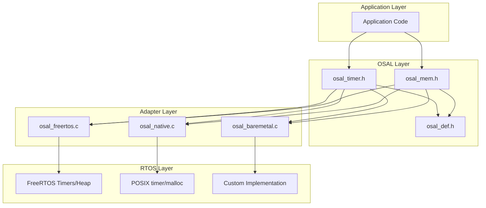

# Design Document: OSAL Timer and Memory Module

## Overview

This document describes the design for extending the OSAL (Operating System Abstraction Layer) with Timer and Memory management modules. These modules follow the established OSAL patterns and provide portable interfaces for software timers and dynamic memory allocation.

The Timer module wraps FreeRTOS software timers (xTimerCreate, etc.) to provide one-shot and periodic timer functionality. The Memory module wraps FreeRTOS heap management (pvPortMalloc, vPortFree) to provide thread-safe dynamic memory allocation.

## Architecture



## Components and Interfaces

### Timer Module (osal_timer.h)

#### Types

```c
/**
 * \brief Timer handle type
 */
typedef void* osal_timer_handle_t;

/**
 * \brief Timer callback function type
 * \param[in] arg User-provided argument
 */
typedef void (*osal_timer_callback_t)(void* arg);

/**
 * \brief Timer mode enumeration
 */
typedef enum {
    OSAL_TIMER_ONE_SHOT = 0,  /**< Timer fires once */
    OSAL_TIMER_PERIODIC = 1   /**< Timer fires repeatedly */
} osal_timer_mode_t;

/**
 * \brief Timer configuration structure
 */
typedef struct {
    const char* name;              /**< Timer name (optional) */
    uint32_t period_ms;            /**< Timer period in milliseconds */
    osal_timer_mode_t mode;        /**< Timer mode (one-shot or periodic) */
    osal_timer_callback_t callback; /**< Callback function */
    void* arg;                     /**< Callback argument */
} osal_timer_config_t;
```

#### Functions

```c
/**
 * \brief Create a timer
 * \param[in] config Timer configuration
 * \param[out] handle Pointer to store timer handle
 * \return OSAL_OK on success, error code otherwise
 */
osal_status_t osal_timer_create(const osal_timer_config_t* config,
                                osal_timer_handle_t* handle);

/**
 * \brief Delete a timer
 * \param[in] handle Timer handle
 * \return OSAL_OK on success, error code otherwise
 */
osal_status_t osal_timer_delete(osal_timer_handle_t handle);

/**
 * \brief Start a timer
 * \param[in] handle Timer handle
 * \return OSAL_OK on success, error code otherwise
 */
osal_status_t osal_timer_start(osal_timer_handle_t handle);

/**
 * \brief Stop a timer
 * \param[in] handle Timer handle
 * \return OSAL_OK on success, error code otherwise
 */
osal_status_t osal_timer_stop(osal_timer_handle_t handle);

/**
 * \brief Reset a timer (restart countdown)
 * \param[in] handle Timer handle
 * \return OSAL_OK on success, error code otherwise
 */
osal_status_t osal_timer_reset(osal_timer_handle_t handle);

/**
 * \brief Change timer period
 * \param[in] handle Timer handle
 * \param[in] period_ms New period in milliseconds
 * \return OSAL_OK on success, error code otherwise
 */
osal_status_t osal_timer_set_period(osal_timer_handle_t handle,
                                    uint32_t period_ms);

/**
 * \brief Check if timer is active
 * \param[in] handle Timer handle
 * \return true if active, false otherwise
 */
bool osal_timer_is_active(osal_timer_handle_t handle);

/**
 * \brief Start timer from ISR context
 * \param[in] handle Timer handle
 * \return OSAL_OK on success, error code otherwise
 */
osal_status_t osal_timer_start_from_isr(osal_timer_handle_t handle);

/**
 * \brief Stop timer from ISR context
 * \param[in] handle Timer handle
 * \return OSAL_OK on success, error code otherwise
 */
osal_status_t osal_timer_stop_from_isr(osal_timer_handle_t handle);

/**
 * \brief Reset timer from ISR context
 * \param[in] handle Timer handle
 * \return OSAL_OK on success, error code otherwise
 */
osal_status_t osal_timer_reset_from_isr(osal_timer_handle_t handle);
```

### Memory Module (osal_mem.h)

#### Types

```c
/**
 * \brief Memory statistics structure
 */
typedef struct {
    size_t total_size;      /**< Total heap size in bytes */
    size_t free_size;       /**< Current free heap size in bytes */
    size_t min_free_size;   /**< Minimum ever free heap size (watermark) */
} osal_mem_stats_t;
```

#### Functions

```c
/**
 * \brief Allocate memory
 * \param[in] size Size in bytes to allocate
 * \return Pointer to allocated memory, NULL on failure
 */
void* osal_mem_alloc(size_t size);

/**
 * \brief Free memory
 * \param[in] ptr Pointer to memory to free
 */
void osal_mem_free(void* ptr);

/**
 * \brief Allocate and zero-initialize memory
 * \param[in] count Number of elements
 * \param[in] size Size of each element
 * \return Pointer to allocated memory, NULL on failure
 */
void* osal_mem_calloc(size_t count, size_t size);

/**
 * \brief Reallocate memory
 * \param[in] ptr Pointer to existing memory (or NULL)
 * \param[in] size New size in bytes
 * \return Pointer to reallocated memory, NULL on failure
 */
void* osal_mem_realloc(void* ptr, size_t size);

/**
 * \brief Allocate aligned memory
 * \param[in] alignment Alignment requirement (must be power of 2)
 * \param[in] size Size in bytes to allocate
 * \return Pointer to aligned memory, NULL on failure
 */
void* osal_mem_alloc_aligned(size_t alignment, size_t size);

/**
 * \brief Get memory statistics
 * \param[out] stats Pointer to store statistics
 * \return OSAL_OK on success, error code otherwise
 */
osal_status_t osal_mem_get_stats(osal_mem_stats_t* stats);

/**
 * \brief Get free heap size
 * \return Free heap size in bytes
 */
size_t osal_mem_get_free_size(void);

/**
 * \brief Get minimum ever free heap size
 * \return Minimum free heap size in bytes
 */
size_t osal_mem_get_min_free_size(void);
```

## Data Models

### Timer Internal Structure (FreeRTOS Adapter)

```c
/**
 * \brief Internal timer context for callback argument passing
 */
typedef struct {
    osal_timer_callback_t user_callback;  /**< User callback function */
    void* user_arg;                       /**< User callback argument */
} osal_timer_context_t;
```

The FreeRTOS adapter uses `TimerHandle_t` internally and stores the user callback context in the timer's ID field using `pvTimerGetTimerID()` and `vTimerSetTimerID()`.

### Memory Allocation Tracking

For the native adapter (testing purposes), memory allocation can be tracked:

```c
/**
 * \brief Memory allocation header for tracking (native adapter only)
 */
typedef struct {
    size_t size;        /**< Allocated size */
    size_t alignment;   /**< Alignment used */
} osal_mem_header_t;
```

## Correctness Properties

*A property is a characteristic or behavior that should hold true across all valid executions of a system—essentially, a formal statement about what the system should do. Properties serve as the bridge between human-readable specifications and machine-verifiable correctness guarantees.*

### Property 1: Timer Creation and Callback Invocation

*For any* valid timer configuration (non-NULL callback, positive period), creating and starting the timer SHALL result in the callback being invoked with the correct user argument after the specified period elapses.

**Validates: Requirements 1.1, 2.1, 3.1**

### Property 2: Timer Stop Prevents Callback

*For any* running timer, calling stop SHALL prevent subsequent callback invocations until the timer is started again.

**Validates: Requirements 2.2**

### Property 3: Timer Reset Restarts Countdown

*For any* running timer, calling reset SHALL restart the countdown from the full period, delaying the next callback invocation.

**Validates: Requirements 2.3**

### Property 4: Periodic Timer Auto-Restart

*For any* periodic timer that has been started, the callback SHALL be invoked multiple times at the configured interval until the timer is stopped.

**Validates: Requirements 2.6**

### Property 5: One-Shot Timer Single Execution

*For any* one-shot timer that has been started, the callback SHALL be invoked exactly once, and the timer SHALL become inactive after firing.

**Validates: Requirements 2.7**

### Property 6: Timer Active State Consistency

*For any* timer, the `osal_timer_is_active()` function SHALL return true if and only if the timer is currently running (started and not stopped/expired for one-shot).

**Validates: Requirements 3.4**

### Property 7: Timer Period Change Effect

*For any* timer with a changed period, the new period SHALL take effect on the next timer cycle (after reset or next periodic firing).

**Validates: Requirements 3.3**

### Property 8: Memory Allocation Round-Trip

*For any* valid allocation size, allocating memory and then freeing it SHALL not cause memory leaks or corruption (free heap size should return to approximately the same level).

**Validates: Requirements 5.1, 5.4**

### Property 9: Calloc Zero-Initialization

*For any* calloc allocation, all bytes in the returned memory block SHALL be initialized to zero.

**Validates: Requirements 6.1**

### Property 10: Realloc Data Preservation

*For any* realloc operation that increases size, the original data in the memory block SHALL be preserved in the new allocation.

**Validates: Requirements 6.2**

### Property 11: Aligned Allocation Alignment

*For any* aligned allocation with alignment A, the returned pointer SHALL be divisible by A (i.e., `(uintptr_t)ptr % alignment == 0`).

**Validates: Requirements 6.3**

### Property 12: Memory Statistics Consistency

*For any* sequence of allocations and frees, the free heap size reported by `osal_mem_get_free_size()` SHALL decrease after allocations and increase after frees, and the minimum free size SHALL never increase.

**Validates: Requirements 7.2, 7.3**

### Property 13: NULL Pointer Error Handling

*For any* function that requires a non-NULL pointer parameter, passing NULL SHALL return OSAL_ERROR_NULL_POINTER.

**Validates: Requirements 8.2**

### Property 14: Invalid Parameter Error Handling

*For any* function with parameter constraints (e.g., non-zero period, valid alignment), violating those constraints SHALL return OSAL_ERROR_INVALID_PARAM.

**Validates: Requirements 8.3**

## Error Handling

### Timer Error Handling

| Condition | Error Code |
|-----------|------------|
| NULL handle pointer in create | OSAL_ERROR_NULL_POINTER |
| NULL callback in config | OSAL_ERROR_INVALID_PARAM |
| Zero period in config | OSAL_ERROR_INVALID_PARAM |
| NULL timer handle in operations | OSAL_ERROR_NULL_POINTER |
| Memory allocation failure | OSAL_ERROR_NO_MEMORY |
| FreeRTOS timer command failure | OSAL_ERROR |

### Memory Error Handling

| Condition | Return Value |
|-----------|--------------|
| Zero size allocation | NULL |
| Insufficient memory | NULL |
| Invalid alignment (not power of 2) | NULL |
| NULL pointer to free | Safe no-op |
| NULL stats pointer | OSAL_ERROR_NULL_POINTER |

## Testing Strategy

### Unit Tests

Unit tests will cover:
- Timer creation with various configurations
- Timer lifecycle operations (start, stop, reset, delete)
- Memory allocation and deallocation
- Error conditions (NULL pointers, invalid parameters)
- Edge cases (zero size, NULL free)

### Property-Based Tests

Property-based tests will use the Catch2 framework with custom generators:

1. **Timer Generator**: Generates random timer configurations with valid periods (1-10000ms), random modes, and callback arguments.

2. **Memory Size Generator**: Generates random allocation sizes within reasonable bounds (1-65536 bytes).

3. **Alignment Generator**: Generates valid alignment values (powers of 2: 1, 2, 4, 8, 16, 32, 64).

Each property test will run a minimum of 100 iterations to ensure comprehensive coverage.

**Test File Organization:**
- `tests/osal/test_osal_timer.cpp` - Timer unit tests
- `tests/osal/test_osal_timer_properties.cpp` - Timer property tests
- `tests/osal/test_osal_mem.cpp` - Memory unit tests  
- `tests/osal/test_osal_mem_properties.cpp` - Memory property tests

**Property Test Annotation Format:**
```cpp
// Feature: osal-timer-memory, Property 1: Timer Creation and Callback Invocation
// Validates: Requirements 1.1, 2.1, 3.1
TEST_CASE("Property 1: Timer creation and callback invocation", "[osal][timer][property]") {
    // Property-based test implementation
}
```
