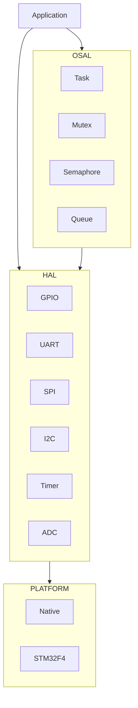

# Design Document: Phase 2 Core Platform

## Overview

本设计文档描述 Nexus 嵌入式平台 Phase 2 核心平台开发的技术架构和实现方案。核心目标是实现完整的 HAL（硬件抽象层）和 OSAL（操作系统抽象层），支持 Native 和 STM32F4 两个平台。

### 设计目标

1. **可移植性**: 应用代码无需修改即可在不同平台运行
2. **可测试性**: 所有模块可在 Native 平台进行单元测试
3. **低开销**: HAL API 调用开销 < 100 cycles
4. **模块化**: 各模块独立，可按需裁剪

## Architecture

### 整体架构

```
┌─────────────────────────────────────────────────────────────┐
│                    Application Layer                         │
├─────────────────────────────────────────────────────────────┤
│                      OSAL Layer                              │
│  ┌─────────┐ ┌─────────┐ ┌─────────┐ ┌─────────┐           │
│  │  Task   │ │  Mutex  │ │Semaphore│ │  Queue  │           │
│  └─────────┘ └─────────┘ └─────────┘ └─────────┘           │
│  ┌─────────────────────────────────────────────────────┐   │
│  │  Adapters: Native | Baremetal | FreeRTOS            │   │
│  └─────────────────────────────────────────────────────┘   │
├─────────────────────────────────────────────────────────────┤
│                       HAL Layer                              │
│  ┌──────┐ ┌──────┐ ┌──────┐ ┌──────┐ ┌──────┐ ┌──────┐    │
│  │ GPIO │ │ UART │ │ SPI  │ │ I2C  │ │Timer │ │ ADC  │    │
│  └──────┘ └──────┘ └──────┘ └──────┘ └──────┘ └──────┘    │
├─────────────────────────────────────────────────────────────┤
│                    Platform Layer                            │
│  ┌─────────────────┐ ┌─────────────────┐                   │
│  │     Native      │ │    STM32F4      │                   │
│  │  (PC Simulation)│ │  (Real Hardware)│                   │
│  └─────────────────┘ └─────────────────┘                   │
└─────────────────────────────────────────────────────────────┘
```

### 模块依赖关系



## Components and Interfaces

### HAL GPIO 模块

#### 接口设计

```c
// 配置结构体
typedef struct {
    hal_gpio_dir_t         direction;   // 方向: INPUT/OUTPUT
    hal_gpio_pull_t        pull;        // 上下拉: NONE/UP/DOWN
    hal_gpio_output_mode_t output_mode; // 输出模式: PP/OD
    hal_gpio_speed_t       speed;       // 速度
    hal_gpio_level_t       init_level;  // 初始电平
} hal_gpio_config_t;

// 核心 API
hal_status_t hal_gpio_init(port, pin, config);
hal_status_t hal_gpio_deinit(port, pin);
hal_status_t hal_gpio_write(port, pin, level);
hal_status_t hal_gpio_read(port, pin, *level);
hal_status_t hal_gpio_toggle(port, pin);
```

#### Native 平台实现

```c
// 使用数组模拟 GPIO 状态
static struct {
    bool initialized;
    hal_gpio_config_t config;
    hal_gpio_level_t level;
} gpio_state[HAL_GPIO_PORT_MAX][16];
```

#### STM32F4 平台实现

```c
// 直接操作 GPIO 寄存器
GPIO_TypeDef* gpio_ports[] = {GPIOA, GPIOB, GPIOC, ...};

hal_status_t hal_gpio_write(port, pin, level) {
    if (level == HAL_GPIO_LEVEL_HIGH) {
        gpio_ports[port]->BSRR = (1 << pin);
    } else {
        gpio_ports[port]->BSRR = (1 << (pin + 16));
    }
    return HAL_OK;
}
```

### HAL UART 模块

#### 接口设计

```c
typedef struct {
    uint32_t             baudrate;  // 波特率
    hal_uart_wordlen_t   wordlen;   // 数据位
    hal_uart_stopbits_t  stopbits;  // 停止位
    hal_uart_parity_t    parity;    // 校验位
    hal_uart_flowctrl_t  flowctrl;  // 流控
} hal_uart_config_t;

// 核心 API
hal_status_t hal_uart_init(instance, config);
hal_status_t hal_uart_transmit(instance, data, len, timeout_ms);
hal_status_t hal_uart_receive(instance, data, len, timeout_ms);
hal_status_t hal_uart_putc(instance, byte);
hal_status_t hal_uart_getc(instance, *byte, timeout_ms);
```

#### Native 平台实现

使用标准 I/O 或环形缓冲区模拟：

```c
typedef struct {
    bool initialized;
    hal_uart_config_t config;
    uint8_t rx_buffer[256];
    uint8_t tx_buffer[256];
    size_t rx_head, rx_tail;
    size_t tx_head, tx_tail;
} uart_state_t;
```

### HAL SPI 模块

#### 接口设计

```c
typedef struct {
    uint32_t              clock_hz;   // 时钟频率
    hal_spi_mode_t        mode;       // SPI 模式 (0-3)
    hal_spi_bit_order_t   bit_order;  // 位序
    hal_spi_data_width_t  data_width; // 数据宽度
    hal_spi_role_t        role;       // 主/从
} hal_spi_config_t;

// 核心 API
hal_status_t hal_spi_init(instance, config);
hal_status_t hal_spi_transfer(instance, tx_data, rx_data, len, timeout_ms);
hal_status_t hal_spi_cs_control(instance, active);
```

### HAL I2C 模块

#### 接口设计

```c
typedef struct {
    hal_i2c_speed_t     speed;      // 速度模式
    hal_i2c_addr_mode_t addr_mode;  // 地址模式
    uint16_t            own_addr;   // 自身地址
} hal_i2c_config_t;

// 核心 API
hal_status_t hal_i2c_init(instance, config);
hal_status_t hal_i2c_master_transmit(instance, dev_addr, data, len, timeout_ms);
hal_status_t hal_i2c_master_receive(instance, dev_addr, data, len, timeout_ms);
hal_status_t hal_i2c_mem_write(instance, dev_addr, mem_addr, mem_addr_size, data, len, timeout_ms);
hal_status_t hal_i2c_mem_read(instance, dev_addr, mem_addr, mem_addr_size, data, len, timeout_ms);
```

### HAL Timer 模块

#### 接口设计

```c
typedef struct {
    uint32_t            period_us;  // 周期 (微秒)
    hal_timer_mode_t    mode;       // 单次/周期
    hal_timer_dir_t     direction;  // 计数方向
} hal_timer_config_t;

typedef struct {
    uint32_t            frequency;  // PWM 频率
    uint16_t            duty_cycle; // 占空比 (0-10000)
} hal_pwm_config_t;

// 核心 API
hal_status_t hal_timer_init(instance, config);
hal_status_t hal_timer_start(instance);
hal_status_t hal_timer_stop(instance);
hal_status_t hal_pwm_init(instance, channel, config);
hal_status_t hal_pwm_set_duty(instance, channel, duty_cycle);
```

### HAL ADC 模块

#### 接口设计

```c
typedef struct {
    hal_adc_resolution_t  resolution;   // 分辨率
    hal_adc_reference_t   reference;    // 参考电压
    hal_adc_sample_time_t sample_time;  // 采样时间
} hal_adc_config_t;

// 核心 API
hal_status_t hal_adc_init(instance, config);
hal_status_t hal_adc_read(instance, channel, *value, timeout_ms);
uint32_t hal_adc_to_millivolts(instance, raw_value, vref_mv);
```

### OSAL Task 模块

#### 接口设计

```c
typedef struct {
    const char*     name;           // 任务名称
    void*           (*entry)(void*);// 入口函数
    void*           arg;            // 参数
    uint32_t        stack_size;     // 栈大小
    uint8_t         priority;       // 优先级 (0-31)
} osal_task_config_t;

typedef void* osal_task_handle_t;

// 核心 API
osal_status_t osal_task_create(config, *handle);
osal_status_t osal_task_delete(handle);
osal_status_t osal_task_suspend(handle);
osal_status_t osal_task_resume(handle);
osal_status_t osal_task_delay(ms);
osal_task_handle_t osal_task_get_current(void);
```

### OSAL Mutex 模块

#### 接口设计

```c
typedef void* osal_mutex_handle_t;

// 核心 API
osal_status_t osal_mutex_create(osal_mutex_handle_t* handle);
osal_status_t osal_mutex_delete(osal_mutex_handle_t handle);
osal_status_t osal_mutex_lock(osal_mutex_handle_t handle, uint32_t timeout_ms);
osal_status_t osal_mutex_unlock(osal_mutex_handle_t handle);
```

### OSAL Semaphore 模块

#### 接口设计

```c
typedef void* osal_sem_handle_t;

// 核心 API
osal_status_t osal_sem_create(uint32_t initial_count, uint32_t max_count, osal_sem_handle_t* handle);
osal_status_t osal_sem_delete(osal_sem_handle_t handle);
osal_status_t osal_sem_take(osal_sem_handle_t handle, uint32_t timeout_ms);
osal_status_t osal_sem_give(osal_sem_handle_t handle);
osal_status_t osal_sem_give_from_isr(osal_sem_handle_t handle);
```

### OSAL Queue 模块

#### 接口设计

```c
typedef void* osal_queue_handle_t;

// 核心 API
osal_status_t osal_queue_create(size_t item_size, size_t length, osal_queue_handle_t* handle);
osal_status_t osal_queue_delete(osal_queue_handle_t handle);
osal_status_t osal_queue_send(osal_queue_handle_t handle, const void* item, uint32_t timeout_ms);
osal_status_t osal_queue_receive(osal_queue_handle_t handle, void* item, uint32_t timeout_ms);
osal_status_t osal_queue_send_from_isr(osal_queue_handle_t handle, const void* item);
```

## Data Models

### HAL 状态码

```c
typedef enum {
    HAL_OK                  = 0,    // 成功
    HAL_ERROR               = 1,    // 通用错误
    HAL_ERROR_INVALID_PARAM = 2,    // 无效参数
    HAL_ERROR_NULL_POINTER  = 3,    // 空指针
    HAL_ERROR_NOT_INIT      = 4,    // 未初始化
    HAL_ERROR_ALREADY_INIT  = 5,    // 已初始化
    HAL_ERROR_NOT_SUPPORTED = 6,    // 不支持
    HAL_ERROR_TIMEOUT       = 200,  // 超时
    HAL_ERROR_BUSY          = 102,  // 忙
} hal_status_t;
```

### OSAL 状态码

```c
typedef enum {
    OSAL_OK                 = 0,    // 成功
    OSAL_ERROR              = 1,    // 通用错误
    OSAL_ERROR_INVALID_PARAM= 2,    // 无效参数
    OSAL_ERROR_NO_MEMORY    = 3,    // 内存不足
    OSAL_ERROR_TIMEOUT      = 4,    // 超时
    OSAL_ERROR_NOT_INIT     = 5,    // 未初始化
} osal_status_t;
```

### GPIO 状态模型 (Native)

```c
typedef struct {
    bool initialized;
    hal_gpio_config_t config;
    hal_gpio_level_t level;
    hal_gpio_irq_mode_t irq_mode;
    hal_gpio_irq_callback_t irq_callback;
    void* irq_context;
} native_gpio_state_t;

static native_gpio_state_t gpio_states[HAL_GPIO_PORT_MAX][16];
```

## Correctness Properties

*A property is a characteristic or behavior that should hold true across all valid executions of a system-essentially, a formal statement about what the system should do. Properties serve as the bridge between human-readable specifications and machine-verifiable correctness guarantees.*

### Property 1: GPIO State Consistency

*For any* GPIO pin that is initialized as output, writing a level and then reading it back SHALL return the same level.

**Validates: Requirements 1.3, 1.4**

### Property 2: GPIO Toggle Inversion

*For any* GPIO output pin, calling toggle SHALL invert the current level (LOW becomes HIGH, HIGH becomes LOW).

**Validates: Requirements 1.5**

### Property 3: GPIO Lifecycle Validity

*For any* GPIO pin, init followed by deinit SHALL return HAL_OK, and operations on uninitialized pins SHALL return HAL_ERROR_NOT_INIT.

**Validates: Requirements 1.1, 1.2, 1.6**

### Property 4: UART Data Integrity

*For any* sequence of bytes transmitted via UART, the same sequence SHALL be receivable without data loss or corruption (in loopback or simulation mode).

**Validates: Requirements 2.3, 2.5, 2.6, 2.7**

### Property 5: UART Baudrate Accuracy

*For any* baudrate between 9600 and 921600, the configured baudrate SHALL have error less than 2% from the requested value.

**Validates: Requirements 2.2**

### Property 6: SPI Mode Configuration

*For any* SPI mode (0-3), the CPOL and CPHA bits SHALL be correctly configured according to the mode definition.

**Validates: Requirements 3.2**

### Property 7: SPI Full-Duplex Transfer

*For any* SPI transfer operation, the number of bytes transmitted SHALL equal the number of bytes received.

**Validates: Requirements 3.5**

### Property 8: SPI CS Control

*For any* CS control operation, active=true SHALL result in CS low, and active=false SHALL result in CS high.

**Validates: Requirements 3.6, 3.7**

### Property 9: I2C Protocol Compliance

*For any* I2C master transmit operation, the sequence SHALL be: START, ADDRESS+W, DATA bytes, STOP.

**Validates: Requirements 4.4**

### Property 10: Timer Periodic Callback

*For any* timer in PERIODIC mode, the callback SHALL be invoked repeatedly at the configured period interval.

**Validates: Requirements 5.4**

### Property 11: Timer Oneshot Callback

*For any* timer in ONESHOT mode, the callback SHALL be invoked exactly once after the configured period.

**Validates: Requirements 5.5**

### Property 12: PWM Duty Cycle Range

*For any* duty cycle value from 0 to 10000, the actual duty cycle SHALL be proportional (0% to 100%).

**Validates: Requirements 5.7**

### Property 13: ADC Voltage Conversion

*For any* raw ADC value, the millivolt conversion SHALL follow: mv = raw * vref_mv / max_value, where max_value depends on resolution.

**Validates: Requirements 6.4**

### Property 14: Mutex Mutual Exclusion

*For any* mutex, only one task SHALL hold the lock at any time. A second lock attempt SHALL block until the first unlocks.

**Validates: Requirements 8.2, 8.3, 8.4**

### Property 15: Semaphore Counting

*For any* semaphore with initial count N, taking N+1 times without giving SHALL block on the (N+1)th take.

**Validates: Requirements 9.2, 9.3, 9.4**

### Property 16: Queue FIFO Order

*For any* sequence of items sent to a queue, receiving them SHALL return items in the same order (FIFO).

**Validates: Requirements 10.2, 10.4**

### Property 17: Queue Capacity

*For any* queue with capacity N, sending N+1 items without receiving SHALL block on the (N+1)th send.

**Validates: Requirements 10.1, 10.3**

## Error Handling

### HAL 层错误处理策略

1. **参数验证**: 所有 API 入口检查参数有效性
2. **状态检查**: 操作前检查模块是否已初始化
3. **超时处理**: 阻塞操作支持超时返回
4. **错误传播**: 使用 HAL_RETURN_IF_ERROR 宏传播错误

```c
hal_status_t hal_gpio_write(hal_gpio_port_t port, hal_gpio_pin_t pin, hal_gpio_level_t level) {
    // 参数验证
    if (port >= HAL_GPIO_PORT_MAX || pin > 15) {
        return HAL_ERROR_INVALID_PARAM;
    }
    
    // 状态检查
    if (!gpio_states[port][pin].initialized) {
        return HAL_ERROR_NOT_INIT;
    }
    
    // 执行操作
    // ...
    
    return HAL_OK;
}
```

### OSAL 层错误处理策略

1. **资源检查**: 创建操作检查内存是否充足
2. **句柄验证**: 所有操作验证句柄有效性
3. **超时处理**: 阻塞操作支持超时
4. **ISR 安全**: ISR 版本 API 不阻塞

## Testing Strategy

### 测试框架

- **单元测试**: Google Test (C++)
- **属性测试**: 使用 RapidCheck 进行属性测试
- **覆盖率**: lcov 生成覆盖率报告
- **CI/CD**: GitHub Actions 自动运行测试

### 测试层次

```
┌─────────────────────────────────────────┐
│           System Tests                   │
│    (End-to-end on real hardware)        │
├─────────────────────────────────────────┤
│         Integration Tests                │
│    (HAL + OSAL combined tests)          │
├─────────────────────────────────────────┤
│           Unit Tests                     │
│    (Individual module tests)            │
├─────────────────────────────────────────┤
│         Property Tests                   │
│    (Correctness properties)             │
└─────────────────────────────────────────┘
```

### 单元测试示例

```cpp
// test_hal_gpio.cpp
TEST(HalGpioTest, InitWithValidConfig) {
    hal_gpio_config_t config = {
        .direction = HAL_GPIO_DIR_OUTPUT,
        .pull = HAL_GPIO_PULL_NONE,
        .output_mode = HAL_GPIO_OUTPUT_PP,
        .speed = HAL_GPIO_SPEED_LOW,
        .init_level = HAL_GPIO_LEVEL_LOW
    };
    
    EXPECT_EQ(HAL_OK, hal_gpio_init(HAL_GPIO_PORT_A, 0, &config));
    EXPECT_EQ(HAL_OK, hal_gpio_deinit(HAL_GPIO_PORT_A, 0));
}
```

### 属性测试示例

```cpp
// test_hal_gpio_properties.cpp
// Feature: phase2-core-platform, Property 1: GPIO State Consistency
TEST(HalGpioPropertyTest, WriteReadConsistency) {
    rc::check([](hal_gpio_level_t level) {
        hal_gpio_config_t config = {
            .direction = HAL_GPIO_DIR_OUTPUT,
            .pull = HAL_GPIO_PULL_NONE,
            .output_mode = HAL_GPIO_OUTPUT_PP,
            .speed = HAL_GPIO_SPEED_LOW,
            .init_level = HAL_GPIO_LEVEL_LOW
        };
        
        hal_gpio_init(HAL_GPIO_PORT_A, 0, &config);
        hal_gpio_write(HAL_GPIO_PORT_A, 0, level);
        
        hal_gpio_level_t read_level;
        hal_gpio_read(HAL_GPIO_PORT_A, 0, &read_level);
        
        RC_ASSERT(read_level == level);
        
        hal_gpio_deinit(HAL_GPIO_PORT_A, 0);
    });
}
```

### 测试配置

- 每个属性测试运行至少 100 次迭代
- 覆盖率目标: HAL 模块 ≥ 80%, OSAL 模块 ≥ 80%
- 所有测试在 Native 平台运行
- 关键测试在 STM32F4 硬件上验证
