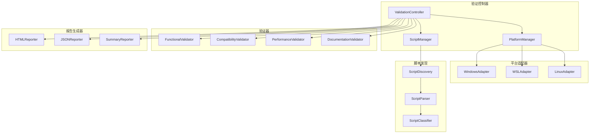

# 设计文档

## 概述

脚本交付验证系统是一个全面的跨平台脚本验证框架，专门为Nexus嵌入式系统项目设计。该系统将自动化验证所有项目脚本在Windows、WSL和Linux环境中的功能性、兼容性和可靠性。

系统采用模块化架构，支持多种脚本类型（.bat、.ps1、.sh、.py），并提供详细的验证报告和兼容性矩阵。

## 架构

### 系统架构图



### 核心组件

1. **ValidationController**: 主控制器，协调整个验证流程
2. **ScriptManager**: 脚本管理器，负责脚本发现、分类和管理
3. **PlatformManager**: 平台管理器，处理不同平台的执行环境
4. **验证器组件**: 专门的验证器处理不同类型的验证
5. **报告生成器**: 生成多种格式的验证报告

## 组件和接口

### ValidationController

```python
class ValidationController:
    """主验证控制器"""
    
    def __init__(self, config: ValidationConfig):
        self.config = config
        self.script_manager = ScriptManager()
        self.platform_manager = PlatformManager()
        self.validators = self._initialize_validators()
        self.reporters = self._initialize_reporters()
    
    def run_validation(self) -> ValidationResult:
        """运行完整的验证流程"""
        pass
    
    def validate_platform(self, platform: Platform) -> PlatformResult:
        """验证特定平台"""
        pass
    
    def validate_script(self, script: Script, platform: Platform) -> ScriptResult:
        """验证特定脚本在特定平台上的执行"""
        pass
```

### ScriptManager

```python
class ScriptManager:
    """脚本管理器"""
    
    def discover_scripts(self, root_path: Path) -> List[Script]:
        """发现项目中的所有脚本"""
        pass
    
    def classify_script(self, script_path: Path) -> ScriptType:
        """分类脚本类型"""
        pass
    
    def parse_script_metadata(self, script: Script) -> ScriptMetadata:
        """解析脚本元数据"""
        pass
    
    def get_script_dependencies(self, script: Script) -> List[str]:
        """获取脚本依赖"""
        pass
```

### PlatformManager

```python
class PlatformManager:
    """平台管理器"""
    
    def detect_current_platform(self) -> Platform:
        """检测当前平台"""
        pass
    
    def get_platform_adapter(self, platform: Platform) -> PlatformAdapter:
        """获取平台适配器"""
        pass
    
    def is_platform_available(self, platform: Platform) -> bool:
        """检查平台是否可用"""
        pass
```

### 验证器接口

```python
class BaseValidator(ABC):
    """验证器基类"""
    
    @abstractmethod
    def validate(self, script: Script, platform: Platform) -> ValidationResult:
        """执行验证"""
        pass
    
    @abstractmethod
    def get_validator_name(self) -> str:
        """获取验证器名称"""
        pass
```

### 平台适配器接口

```python
class PlatformAdapter(ABC):
    """平台适配器基类"""
    
    @abstractmethod
    def execute_script(self, script: Script, args: List[str]) -> ExecutionResult:
        """执行脚本"""
        pass
    
    @abstractmethod
    def check_dependencies(self, dependencies: List[str]) -> DependencyCheck:
        """检查依赖"""
        pass
    
    @abstractmethod
    def get_environment_info(self) -> EnvironmentInfo:
        """获取环境信息"""
        pass
```

## 数据模型

### 核心数据结构

```python
@dataclass
class Script:
    """脚本数据模型"""
    path: Path
    name: str
    type: ScriptType
    platform: Platform
    metadata: ScriptMetadata
    dependencies: List[str]
    
@dataclass
class ScriptMetadata:
    """脚本元数据"""
    description: str
    usage: str
    parameters: List[Parameter]
    examples: List[str]
    author: str
    version: str

@dataclass
class ValidationResult:
    """验证结果"""
    script: Script
    platform: Platform
    validator: str
    status: ValidationStatus
    execution_time: float
    memory_usage: int
    output: str
    error: Optional[str]
    details: Dict[str, Any]

@dataclass
class CompatibilityMatrix:
    """兼容性矩阵"""
    scripts: List[Script]
    platforms: List[Platform]
    results: Dict[Tuple[str, str], ValidationResult]
    
@dataclass
class ValidationReport:
    """验证报告"""
    timestamp: datetime
    environment: EnvironmentInfo
    summary: ValidationSummary
    results: List[ValidationResult]
    compatibility_matrix: CompatibilityMatrix
    recommendations: List[str]
```

### 枚举类型

```python
class ScriptType(Enum):
    """脚本类型"""
    BATCH = "batch"          # .bat
    POWERSHELL = "powershell"  # .ps1
    SHELL = "shell"          # .sh
    PYTHON = "python"        # .py
    
class Platform(Enum):
    """平台类型"""
    WINDOWS = "windows"
    WSL = "wsl"
    LINUX = "linux"
    
class ValidationStatus(Enum):
    """验证状态"""
    PASSED = "passed"
    FAILED = "failed"
    SKIPPED = "skipped"
    ERROR = "error"
    
class ScriptCategory(Enum):
    """脚本分类"""
    BUILD = "build"
    TEST = "test"
    FORMAT = "format"
    CLEAN = "clean"
    DOCS = "docs"
    SETUP = "setup"
    CI = "ci"
    UTILITY = "utility"
```

## 正确性属性

*属性是一个特征或行为，应该在系统的所有有效执行中保持为真——本质上是关于系统应该做什么的正式陈述。属性作为人类可读规范和机器可验证正确性保证之间的桥梁。*

### 属性1：平台脚本执行正确性
*对于任何*脚本在其支持的平台上执行时，应该能够成功运行并验证其基本功能
**验证：需求 1.1, 1.2, 1.3**

### 属性2：跨平台脚本一致性
*对于任何*跨平台Python脚本，在所有支持的平台上执行相同的输入应该产生等效的输出结果
**验证：需求 1.4**

### 属性3：平台特定脚本等效性
*对于任何*功能等效的平台特定脚本组（如build.bat、build.sh、build.py），在各自平台上执行应该产生等效的最终结果
**验证：需求 1.5**

### 属性4：脚本功能完整性
*对于任何*脚本，如果验证通过，则该脚本应该能够成功完成其预期功能（构建、测试、格式化、清理、文档生成、环境设置）而不产生错误
**验证：需求 2.1, 2.2, 2.3, 2.4, 2.5, 2.6**

### 属性5：错误处理一致性
*对于任何*脚本，当遇到错误条件（缺失依赖、无效参数、权限问题、中断、平台限制）时，应该提供清晰的错误消息和适当的退出代码
**验证：需求 3.1, 3.2, 3.3, 3.4, 3.5**

### 属性6：性能和资源管理
*对于任何*脚本执行，验证器应该能够监控和报告执行时间、内存使用、资源利用和临时文件清理情况
**验证：需求 4.1, 4.2, 4.3, 4.4, 4.5**

### 属性7：文档一致性
*对于任何*脚本，其实际支持的参数、行为、示例、依赖和平台支持应该与文档描述完全一致
**验证：需求 5.1, 5.2, 5.3, 5.4, 5.5**

### 属性8：自动化管道集成
*对于任何*验证管道执行，应该能够自动运行所有测试、生成完整报告、处理失败情况、更新状态并提供正确的CI退出代码
**验证：需求 6.1, 6.2, 6.3, 6.4, 6.5**

### 属性9：WSL兼容性
*对于任何*在WSL环境中运行的脚本，应该正确处理文件系统路径、系统命令、行结束符、环境变量和Windows工具互操作
**验证：需求 7.1, 7.2, 7.3, 7.4, 7.5**

### 属性10：验证报告元数据完整性
*对于任何*生成的验证报告，应该包含完整的执行时间戳、环境详细信息、版本信息和可操作的问题解决建议
**验证：需求 8.4, 8.5**

## 错误处理

### 错误分类

1. **脚本执行错误**
   - 脚本不存在
   - 权限不足
   - 依赖缺失
   - 语法错误

2. **平台兼容性错误**
   - 平台不支持
   - 命令不可用
   - 路径格式错误
   - 环境变量问题

3. **验证系统错误**
   - 配置错误
   - 资源不足
   - 网络问题
   - 超时错误

### 错误处理策略

```python
class ErrorHandler:
    """错误处理器"""
    
    def handle_script_error(self, error: ScriptError) -> ErrorResponse:
        """处理脚本执行错误"""
        if isinstance(error, DependencyMissingError):
            return self._suggest_dependency_installation(error)
        elif isinstance(error, PermissionError):
            return self._suggest_permission_fix(error)
        elif isinstance(error, SyntaxError):
            return self._report_syntax_issue(error)
        else:
            return self._generic_error_response(error)
    
    def handle_platform_error(self, error: PlatformError) -> ErrorResponse:
        """处理平台兼容性错误"""
        pass
    
    def handle_validation_error(self, error: ValidationError) -> ErrorResponse:
        """处理验证系统错误"""
        pass
```

## 测试策略

### 双重测试方法

验证系统将采用单元测试和基于属性的测试相结合的方法：

- **单元测试**：验证特定示例、边界情况和错误条件
- **属性测试**：验证所有输入的通用属性
- 两者互补，提供全面覆盖

### 单元测试重点

单元测试将专注于：
- 特定脚本的功能验证示例
- 组件之间的集成点
- 边界情况和错误条件
- 平台特定的行为验证

### 基于属性的测试配置

- 使用Python的`hypothesis`库进行基于属性的测试
- 每个属性测试最少运行100次迭代
- 每个属性测试必须引用其设计文档属性
- 标签格式：**Feature: script-delivery-validation, Property {number}: {property_text}**

### 测试用例示例

```python
# 单元测试示例
def test_windows_build_script_execution():
    """测试Windows构建脚本执行"""
    script = Script(path=Path("scripts/build.bat"), type=ScriptType.BATCH)
    platform = Platform.WINDOWS
    result = validator.validate(script, platform)
    assert result.status == ValidationStatus.PASSED

# 属性测试示例
@given(script=valid_python_scripts(), platform=supported_platforms())
def test_cross_platform_consistency(script, platform):
    """
    Feature: script-delivery-validation, Property 1: 跨平台脚本一致性
    对于任何跨平台Python脚本，在所有支持的平台上执行相同的输入应该产生等效的输出结果
    """
    if script.type == ScriptType.PYTHON:
        results = []
        for p in [Platform.WINDOWS, Platform.WSL, Platform.LINUX]:
            if platform_manager.is_platform_available(p):
                result = validator.validate(script, p)
                results.append(result)
        
        # 验证所有结果等效
        assert all_results_equivalent(results)
```

### 测试环境配置

1. **Windows环境**：原生Windows + PowerShell + Python
2. **WSL环境**：Windows上的WSL2 + Ubuntu + Python
3. **Linux环境**：原生Linux + Bash + Python

### 持续集成集成

验证系统将集成到现有的CI管道中：
- 每次提交时运行基本验证
- 每日运行完整的跨平台验证
- 发布前运行全面的兼容性测试
