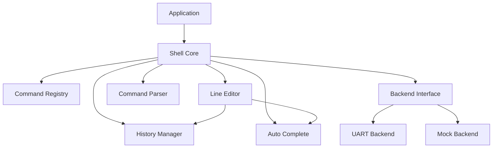

# Design Document: Shell/CLI Middleware

## Overview

本设计文档描述 Nexus 嵌入式平台 Shell/CLI 中间件的技术架构和实现方案。Shell 模块提供交互式命令行接口，支持命令注册、参数解析、历史记录、自动补全和完整的行编辑功能。

### 设计目标

1. **可移植性**: 通过后端抽象支持不同的 I/O 通道
2. **低资源占用**: 静态内存分配，适合资源受限的嵌入式系统
3. **易用性**: 类似 Unix shell 的用户体验
4. **可扩展性**: 支持动态命令注册和自定义补全

## Architecture

### 整体架构

```
┌─────────────────────────────────────────────────────────────┐
│                    Application Layer                         │
│  ┌─────────────────────────────────────────────────────┐   │
│  │              User Commands                           │   │
│  │  (help, version, custom commands, etc.)             │   │
│  └─────────────────────────────────────────────────────┘   │
├─────────────────────────────────────────────────────────────┤
│                     Shell Core                               │
│  ┌──────────┐ ┌──────────┐ ┌──────────┐ ┌──────────┐      │
│  │ Command  │ │  Line    │ │ History  │ │  Auto    │      │
│  │ Registry │ │  Editor  │ │ Manager  │ │ Complete │      │
│  └──────────┘ └──────────┘ └──────────┘ └──────────┘      │
│  ┌─────────────────────────────────────────────────────┐   │
│  │              Command Parser                          │   │
│  └─────────────────────────────────────────────────────┘   │
├─────────────────────────────────────────────────────────────┤
│                   Backend Interface                          │
│  ┌─────────────────┐ ┌─────────────────┐                   │
│  │  UART Backend   │ │  Mock Backend   │                   │
│  │  (Production)   │ │  (Testing)      │                   │
│  └─────────────────┘ └─────────────────┘                   │
└─────────────────────────────────────────────────────────────┘
```

### 模块依赖关系



## Components and Interfaces

### Shell 核心模块

#### 配置结构体

```c
typedef struct {
    const char*     prompt;         // 提示符字符串 (最长16字符)
    uint16_t        cmd_buffer_size;// 命令缓冲区大小 (64-256)
    uint8_t         history_depth;  // 历史记录深度 (4-32)
    uint8_t         max_commands;   // 最大命令数 (默认32)
} shell_config_t;

// 核心 API
shell_status_t shell_init(const shell_config_t* config);
shell_status_t shell_deinit(void);
shell_status_t shell_process(void);
shell_status_t shell_set_backend(const shell_backend_t* backend);
```

### 命令注册模块

#### 命令结构体

```c
typedef int (*shell_cmd_handler_t)(int argc, char* argv[]);
typedef void (*shell_completion_cb_t)(const char* partial, char* completions[], int* count);

typedef struct {
    const char*             name;       // 命令名称
    shell_cmd_handler_t     handler;    // 处理函数
    const char*             help;       // 简短帮助
    const char*             usage;      // 使用说明
    shell_completion_cb_t   completion; // 参数补全回调 (可选)
} shell_command_t;

// 命令注册 API
shell_status_t shell_register_command(const shell_command_t* cmd);
shell_status_t shell_unregister_command(const char* name);
const shell_command_t* shell_get_command(const char* name);
shell_status_t shell_get_commands(const shell_command_t** cmds, int* count);
```

### 行编辑模块

#### 行编辑器状态

```c
typedef struct {
    char*       buffer;         // 输入缓冲区
    uint16_t    buffer_size;    // 缓冲区大小
    uint16_t    length;         // 当前内容长度
    uint16_t    cursor;         // 光标位置
    bool        insert_mode;    // 插入模式
} line_editor_t;

// 行编辑 API (内部使用)
void line_editor_init(line_editor_t* editor, char* buffer, uint16_t size);
void line_editor_insert_char(line_editor_t* editor, char c);
void line_editor_delete_char(line_editor_t* editor);
void line_editor_backspace(line_editor_t* editor);
void line_editor_move_cursor(line_editor_t* editor, int offset);
void line_editor_move_to_start(line_editor_t* editor);
void line_editor_move_to_end(line_editor_t* editor);
void line_editor_delete_to_end(line_editor_t* editor);
void line_editor_delete_to_start(line_editor_t* editor);
void line_editor_delete_word(line_editor_t* editor);
void line_editor_clear(line_editor_t* editor);
```

### 历史记录模块

#### 历史管理器

```c
typedef struct {
    char**      entries;        // 历史条目数组
    uint8_t     capacity;       // 最大容量
    uint8_t     count;          // 当前条目数
    uint8_t     head;           // 头指针
    int8_t      browse_index;   // 浏览索引 (-1 表示当前输入)
} history_manager_t;

// 历史记录 API (内部使用)
void history_init(history_manager_t* hist, uint8_t capacity);
void history_add(history_manager_t* hist, const char* cmd);
const char* history_get_prev(history_manager_t* hist);
const char* history_get_next(history_manager_t* hist);
void history_reset_browse(history_manager_t* hist);
```

### 自动补全模块

```c
typedef struct {
    char        matches[SHELL_MAX_COMPLETIONS][SHELL_MAX_CMD_NAME];
    int         match_count;
    int         common_prefix_len;
} completion_result_t;

// 自动补全 API (内部使用)
void autocomplete_command(const char* partial, completion_result_t* result);
void autocomplete_show_matches(const completion_result_t* result);
```

### 命令解析模块

```c
typedef struct {
    char*       cmd_name;       // 命令名称
    int         argc;           // 参数数量
    char*       argv[SHELL_MAX_ARGS]; // 参数数组
} parsed_command_t;

// 解析 API (内部使用)
shell_status_t parse_command_line(const char* line, parsed_command_t* result);
```

### 后端接口

```c
typedef struct {
    // 非阻塞读取，返回读取的字节数，0表示无数据
    int (*read)(uint8_t* data, int max_len);
    // 阻塞写入
    int (*write)(const uint8_t* data, int len);
} shell_backend_t;

// UART 后端
extern const shell_backend_t shell_uart_backend;
```

## Data Models

### 状态码

```c
typedef enum {
    SHELL_OK                    = 0,    // 成功
    SHELL_ERROR                 = 1,    // 通用错误
    SHELL_ERROR_INVALID_PARAM   = 2,    // 无效参数
    SHELL_ERROR_NOT_INIT        = 3,    // 未初始化
    SHELL_ERROR_ALREADY_INIT    = 4,    // 已初始化
    SHELL_ERROR_NO_MEMORY       = 5,    // 内存不足
    SHELL_ERROR_NOT_FOUND       = 6,    // 未找到
    SHELL_ERROR_ALREADY_EXISTS  = 7,    // 已存在
    SHELL_ERROR_NO_BACKEND      = 8,    // 无后端
    SHELL_ERROR_BUFFER_FULL     = 9,    // 缓冲区满
} shell_status_t;
```

### Shell 上下文

```c
typedef struct {
    bool                initialized;
    shell_config_t      config;
    shell_backend_t*    backend;
    line_editor_t       editor;
    history_manager_t   history;
    shell_command_t*    commands[SHELL_MAX_COMMANDS];
    int                 command_count;
    char                cmd_buffer[SHELL_MAX_CMD_BUFFER];
    shell_status_t      last_error;
    // 转义序列解析状态
    uint8_t             escape_state;
    uint8_t             escape_buffer[8];
    uint8_t             escape_index;
} shell_context_t;
```

### 转义序列状态机

```c
typedef enum {
    ESC_STATE_NORMAL = 0,   // 正常状态
    ESC_STATE_ESC,          // 收到 ESC (0x1B)
    ESC_STATE_CSI,          // 收到 CSI (ESC [)
} escape_state_t;
```

## Correctness Properties

*A property is a characteristic or behavior that should hold true across all valid executions of a system-essentially, a formal statement about what the system should do. Properties serve as the bridge between human-readable specifications and machine-verifiable correctness guarantees.*

### Property 1: Init/Deinit Round-Trip

*For any* valid shell configuration, initializing and then deinitializing the shell SHALL return SHELL_OK for both operations, and the shell SHALL be in uninitialized state after deinit.

**Validates: Requirements 1.1, 1.6**

### Property 2: Command Registration Round-Trip

*For any* valid command with unique name, registering the command, retrieving it by name, and then unregistering it SHALL all succeed, and the retrieved command SHALL match the registered command.

**Validates: Requirements 2.1, 2.5, 2.7**

### Property 3: Command Line Parsing Correctness

*For any* command line with space-separated arguments (including quoted strings), parsing SHALL produce the correct command name and argument array, preserving argument order and content.

**Validates: Requirements 3.1, 3.4, 3.5**

### Property 4: Line Editor Buffer Consistency

*For any* sequence of line editing operations (insert, delete, cursor movement), the buffer content and cursor position SHALL remain consistent, with cursor always within valid range [0, length].

**Validates: Requirements 4.1-4.15**

### Property 5: History FIFO Order

*For any* sequence of executed commands, the history SHALL maintain FIFO order, with the most recent command accessible via single Up arrow press, and oldest command removed when capacity is exceeded.

**Validates: Requirements 5.1, 5.2, 5.3, 5.5**

### Property 6: History Deduplication

*For any* sequence of commands where consecutive commands are identical, the history SHALL contain only one entry for the consecutive duplicates.

**Validates: Requirements 5.6**

### Property 7: Auto-Completion Prefix Match

*For any* partial command input, auto-completion SHALL return only commands whose names start with the partial input, and the common prefix of all matches SHALL be correctly computed.

**Validates: Requirements 6.1, 6.2, 6.4**

### Property 8: Backend I/O Consistency

*For any* data written to the backend, the write operation SHALL transmit all bytes, and the read operation SHALL be non-blocking.

**Validates: Requirements 8.1, 8.4, 8.5**

## Error Handling

### 错误处理策略

1. **参数验证**: 所有公共 API 入口检查参数有效性
2. **状态检查**: 操作前检查模块是否已初始化
3. **错误传播**: 使用 SHELL_RETURN_IF_ERROR 宏传播错误
4. **错误恢复**: 命令执行失败后恢复到正常状态

```c
#define SHELL_RETURN_IF_ERROR(expr) \
    do { \
        shell_status_t _status = (expr); \
        if (_status != SHELL_OK) return _status; \
    } while (0)

shell_status_t shell_register_command(const shell_command_t* cmd) {
    // 参数验证
    if (cmd == NULL || cmd->name == NULL || cmd->handler == NULL) {
        return SHELL_ERROR_INVALID_PARAM;
    }
    
    // 状态检查
    if (!g_shell_ctx.initialized) {
        return SHELL_ERROR_NOT_INIT;
    }
    
    // 重复检查
    if (shell_get_command(cmd->name) != NULL) {
        return SHELL_ERROR_ALREADY_EXISTS;
    }
    
    // 容量检查
    if (g_shell_ctx.command_count >= SHELL_MAX_COMMANDS) {
        return SHELL_ERROR_NO_MEMORY;
    }
    
    // 注册命令
    g_shell_ctx.commands[g_shell_ctx.command_count++] = cmd;
    return SHELL_OK;
}
```

## Testing Strategy

### 测试框架

- **单元测试**: Google Test (C++)
- **属性测试**: 使用 RapidCheck 进行属性测试
- **覆盖率**: lcov 生成覆盖率报告
- **CI/CD**: GitHub Actions 自动运行测试

### 测试层次

```
┌─────────────────────────────────────────┐
│         Integration Tests                │
│    (Shell + UART backend)               │
├─────────────────────────────────────────┤
│           Unit Tests                     │
│    (Individual module tests)            │
├─────────────────────────────────────────┤
│         Property Tests                   │
│    (Correctness properties)             │
└─────────────────────────────────────────┘
```

### 单元测试示例

```cpp
// test_shell.cpp
TEST(ShellTest, InitWithValidConfig) {
    shell_config_t config = {
        .prompt = "nexus> ",
        .cmd_buffer_size = 128,
        .history_depth = 16,
        .max_commands = 32
    };
    
    EXPECT_EQ(SHELL_OK, shell_init(&config));
    EXPECT_EQ(SHELL_OK, shell_deinit());
}

TEST(ShellTest, RegisterCommand) {
    shell_command_t cmd = {
        .name = "test",
        .handler = test_handler,
        .help = "Test command",
        .usage = "test [args]"
    };
    
    EXPECT_EQ(SHELL_OK, shell_register_command(&cmd));
    EXPECT_NE(nullptr, shell_get_command("test"));
}
```

### 属性测试示例

```cpp
// test_shell_properties.cpp
// Feature: shell-cli-middleware, Property 3: Command Line Parsing Correctness
TEST(ShellPropertyTest, CommandLineParsing) {
    rc::check([](const std::string& cmd_name, 
                 const std::vector<std::string>& args) {
        // 构建命令行
        std::string line = cmd_name;
        for (const auto& arg : args) {
            line += " " + arg;
        }
        
        parsed_command_t result;
        shell_status_t status = parse_command_line(line.c_str(), &result);
        
        RC_ASSERT(status == SHELL_OK);
        RC_ASSERT(std::string(result.cmd_name) == cmd_name);
        RC_ASSERT(result.argc == args.size());
        
        for (int i = 0; i < result.argc; i++) {
            RC_ASSERT(std::string(result.argv[i]) == args[i]);
        }
    });
}
```

### 测试配置

- 每个属性测试运行至少 100 次迭代
- 覆盖率目标: ≥ 80%
- 所有测试在 Native 平台运行
- 使用 Mock Backend 进行隔离测试
