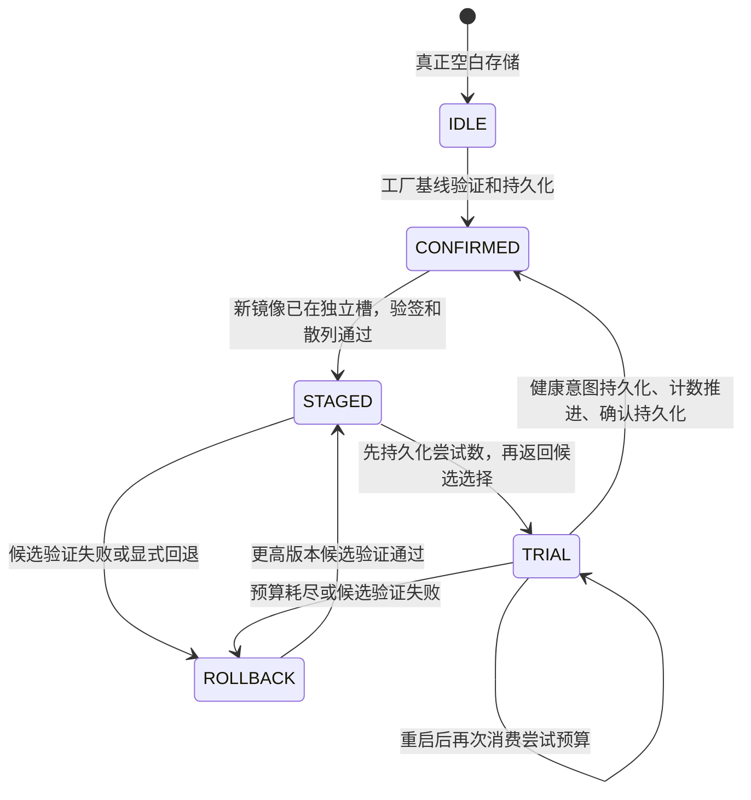

# SEC002：可恢复更新策略

`services/update` 已实现签名清单验证、错板拒绝、完整镜像摘要检查、持久化试运行预算、健康确认、防降级计数和受验证回退。Native 回归使用维护中的 OpenSSL provider 执行 SHA-256 与 Ed25519，签名密钥在每个测试进程中生成，不携带制造密钥。

这是更新**策略核心**。镜像下载、分区写入、启动地址切换、Bootloader、设备硬件计数器、受保护信任库和 Flash 后端都由产品端口承担。返回 `nx_update_choice_t` 表示该时刻允许选择的镜像，不能作为已经刷写、启动或通过硬件健康测试的证据。

## 边界与调用契约

所有公开函数仅用于任务上下文，同步执行，由调用者串行化。核心不分配堆，不保留外部镜像、摘要、签名或记录缓冲区。实例和 `port.user` 必须在调用期间有效；端口完成使用借用缓冲区后才能返回。散列、签名和存储端口可能阻塞，产品必须规定它们的执行预算，并在管理任务或维护窗口运行。控制任务不能直接调用这些操作。

产品必须提供全部端口；缺少端口使初始化失败。摘要、验签、计数或持久化错误不会获得候选镜像的选择成功。端口的关键约束如下：

| 端口 | 必须保证的行为 |
|---|---|
| `load` | 返回恰好 312 字节已验证记录；真正空白返回 `ENOTFOUND`，I/O 或损坏不能当作空白 |
| `save` | 原子替换完整记录；断电或报错后只能恢复完整旧记录或完整新记录 |
| `image_digest` | 校验可信分区边界，散列该槽内恰好 `image_size` 字节；镜像在验证至启动之间不可修改 |
| `verify_signature` | 通过受保护的 pinned/revoked key store 解析 `key_id`，执行 schema 1 的 Ed25519 验证；不得信任包内公钥 |
| `counter_read` | 返回硬件保护、耐断电的安全版本下限，失败必须显式报告 |
| `counter_advance` | 原子 compare-and-advance；不得降级；成功后必须可读回目标值 |

更新状态包括试运行次数和健康确认意图，必须存入受保护分区，或使用受维护密码 provider 认证其完整性和防重放策略。普通双银行 CRC 能检测写入损坏，不能阻止恶意修改、回放试运行次数或伪造健康意图。签名保护清单，不能代替状态记录的保护。

Bootloader 还必须保护代码执行路径、计数器、信任库和镜像槽，并把真实运行镜像身份传给健康确认接口。网络请求或普通参数不能自行宣称当前槽和健康结果。设备不具备这些硬件能力时，应声明其实际威胁模型与限制。

## 清单与持久化格式

Schema 1 的签名输入是以下明确的 72 字节序列，所有整数均为无符号 little-endian。其后附加 64 字节 Ed25519 签名，完整清单 136 字节。禁止直接签名 C 结构体、宿主 padding 或本机 endian。

| 字节偏移 | 长度 | 字段 |
|---|---|---|
| 0 | 4 | ASCII `NXUF` |
| 4 | 4 | schema，固定为 1 |
| 8 | 4 | 精确板型 `board_id` |
| 12 | 4 | 精确板修订 `board_revision` |
| 16 | 4 | 受信任密钥编号 `key_id` |
| 20 | 4 | 非零镜像字节数 `image_size` |
| 24 | 8 | 产品固件序号 `firmware_version` |
| 32 | 8 | 安全版本 `security_version` |
| 40 | 32 | 完整镜像 SHA-256 |
| 72 | 64 | 上述 72 字节的 Ed25519 签名 |

板型和修订必须与端口精确匹配。镜像大小不得超过产品端口预算。候选固件序号必须严格大于最后确认镜像；安全版本不得小于旧镜像或当前计数器。固件序号与安全版本分离，允许普通版本更新共用安全版本；需要吊销旧安全版本时增加安全版本。

312 字节状态记录为：40 字节头、136 字节最后确认清单、136 字节候选清单。头依次编码 `NXUS`、记录 schema 1、阶段、存在/确认意图标志、已消费尝试数、尝试上限、当前槽、候选槽、回退原因及 4 字节全零保留区。不存在的清单和槽字段全零。解码严格拒绝未知阶段、未知标志、不一致槽、非法预算、非法版本关系及未定义保留字段；损坏记录不会自动重置成工厂空白。

本次引入新格式，没有从旧实验性 OTA 元数据静默迁移。产品升级已有部署时必须另行设计和验证明确迁移流程。

## 状态与恢复顺序

`nx_update_provision` 仅用于空白设备，基线的安全版本必须等于已经 provision 的安全计数器。它不会自行建立制造身份或设置硬件计数器。

`nx_update_stage` 验证现有镜像和候选后保存 `STAGED`，保留旧镜像的签名身份。首次以及后续 `nx_update_select` 都重新验签、重新散列候选，先把尝试数持久化，再写出选择结果。保存失败时输出保持原样；即使写入实际上已经提交，本次也不会报告选择成功。重启加载实际记录后继续消费预算。预算为 1–32，由产品指定，记录保留本次更新的上限。

候选受损或预算耗尽时，旧镜像必须再次通过板型、签名、摘要和计数检查，才能持久化 `ROLLBACK` 并获得选择结果。回退保留原因，例如 `EDIGEST` 或 `EXHAUSTED`。旧镜像也受损、密钥被吊销或安全版本已过期时，选择失败，产品必须进入独立的受验证恢复通道。

健康确认接受真实运行槽和其摘要，要求该镜像处于已试运行状态。产品负责定义控制自检、参数兼容、外设、看门狗及通信等健康判据。策略按以下顺序提交：

1. 重新验证候选身份和镜像。
2. 持久化健康确认意图。
3. 原子推进安全计数器，再读回目标值；即使端口声称成功而未推进，也返回失败。
4. 持久化 `CONFIRMED`，把候选转为当前镜像。

意图保存失败时不推进计数器。计数推进报错可能已经生效，因此重试重新读取计数器。计数已推进而最终记录保存失败时，持久化意图和候选仍在，重新初始化后 `select` 先恢复确认；不能启动已低于安全下限的旧镜像。计数从不回退。最终提交前的失败不会伪造确认成功。

任何 `save` 错误都使更新实例失效，因为新记录可能已经提交。调用者必须重新打开持久化后端，再调用 `nx_update_init`，才能继续。`init` 只读取和检查状态结构，运行身份直到 `select` 的验签、摘要和计数检查通过后才获得资格。

## 端口集成

建议把更新记录放在独立的板级分区。`nx_storage_open/load/save` 双银行快照可提供断电原子性：将 `NX_STORAGE_NOT_FOUND` 映射为 `NX_UPDATE_ENOTFOUND`，将尺寸错误或 `NX_STORAGE_CORRUPT` 映射为 `NX_UPDATE_ECORRUPT`，其余 I/O 错误映射为 `NX_UPDATE_ESTORAGE`。保存错误后重新 `nx_storage_open`，然后重新初始化更新实例。元数据防恶意修改还需要硬件保护或认证记录封装。

Native 签名端口使用 `nx_crypto_verify_ed25519`，通过产品持有的公钥验签；摘要端口使用 `nx_crypto_sha256`。MCU 需要接入维护中的密码库或硬件 provider，未配置不能返回验签或摘要成功。大镜像可由分区端口使用密码库的流式 SHA-256 实现，核心不要求把镜像一次装入 RAM。

镜像写入器必须在 `stage` 前完成镜像安装和必要同步，并锁定候选槽。Bootloader 必须在可信执行环境内保证选择后到执行前无篡改。网络下载缓存、镜像安装器和产品健康策略均未被这份实现自动创建。

## 已执行验证与剩余证据

`tests/storage_security/test_update.c` 包含 11 组用户可观察的回归场景，使用真实 SHA-256 和 Ed25519：清单 endian/schema、篡改签名、错板/错修订、不受信任 key、固件/安全版本降级、错摘要、大小越界、重启试运行耗尽、旧镜像受损/密钥吊销、保存失败和模糊提交、错健康身份、确认意图失败、计数失败/虚假成功/模糊推进、最终提交失败后的确认恢复、安全版本不变的普通更新、损坏状态、I/O 与 provider 不可用。

本次执行 C11 严格警告构建和以上全部场景，通过 AddressSanitizer/UndefinedBehaviorSanitizer。容器在 ptrace 下不能运行 LeakSanitizer，因此该次 sanitizer 执行关闭 leak detection；没有据此声称完成泄漏检测。

测试中的镜像槽、记录和安全计数器是 Native 模型。尚未执行 STM32/GD32 Flash 断电注入、硬件计数器、真实启动链或控制健康策略验证。实际支持升级前，需要取得板级分区身份、安装中断电、确认各步骤断电、代码槽锁定、计数器失效、重放攻击和独立恢复入口等 HIL 证据。

### 更新、快照与认证记录联合测试

`tests/storage_security/test_update_storage.c` 已将更新策略与真实 `nx_storage_load/save`、Native 文件 Flash 和维护中的密码 provider 联合执行。测试端口把完整状态封装为 AES-256-GCM 记录，认证头绑定 magic、schema、测试密钥编号和明文长度；每次保存尝试都从 provider CSPRNG 获取新的 96 位 nonce。AES 密钥与 Ed25519 签名密钥仅在测试进程中临时生成，不代表产品密钥配置。AEAD 提供完整性认证，防状态回放仍需要产品受保护存储或独立防重放策略。

文件 Flash 模型覆盖逐字节部分擦除、逐字节部分 program、提交标记和 sync 故障。实测通过候选保存 915 个边界、试运行选择 915 个边界、健康意图/计数/最终提交 1829 个边界，共 3659 个故障注入边界。每个边界都会关闭并显式重新打开文件和快照后端，然后重新初始化更新实例：只能恢复完整旧状态或完整新状态；尝试预算不能丢失已提交次数；已推进安全计数器时旧镜像不能再被选择；完成恢复后计数恰好推进一次，反复 reopen 不会降低计数。

另外，把伪造 ciphertext 重新写入快照形成有效存储 CRC，更新初始化仍被 AEAD 拒绝；错误的解密密钥也被拒绝。该测试只证明联合软件契约和 Native 文件持久化模型，安全计数器是跨 reopen 保留的明确模型，没有模拟 MCU 的防拆硬件。真实 Flash、电源时序、启动执行和硬件计数器仍需板级验证。
