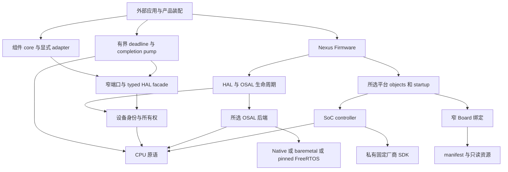

# Nexus 通用平台架构

Nexus 的边界是通用嵌入式平台，产品装配位于外部 [nexus-examples](https://github.com/X-Gen-Lab/nexus-examples) 或各产品仓库。本文描述当前软件合同和演进方向；实际运行与剩余条件见 [执行记录](../implementation/refactor-execution.md)，不继承历史 Product/固定保留分区的验收。

## 责任与依赖

| 层 | 当前拥有的责任 | 产品或后续扩展责任 |
|---|---|---|
| Arch | Native/Cortex-M4 异常查询、CPU-local saved mask、DMB/DSB/ISB | SMP、NMI/HardFault 可用并发保护、cache/MPU/TrustZone 未实现 |
| SoC/controller | 芯片时钟、IRQ/时间源、GPIO/UART/SPI、DMA 硬件终态、身份与全物理 Flash | 新外设、路由或 DMA 模式逐项实现/验证，不从系列名字推导支持 |
| Board | 晶振/引脚/AF、窄 controller 绑定、CS/安全初值、source manifest | 实物 PCB revision、电气、外接器件资格与产品 safe-output 政策 |
| HALCore/facade | opaque 设备目录、类别/能力、owner/generation、typed 动作与 lease | 产品设备选择、并发任务分工和错误恢复政策 |
| OSAL | Native/裸机/FreeRTOS 能力、任务/同步/时间、预算/寿命诊断 | 应用优先级、控制周期、worker/stack 配置与 scheduler 启动 |
| HAL runtime 适配 | finite deadline/wait、caller-owned completion dispatch | 应用显式 pump、callback 预算和设备终态转换；没有默认 worker |
| Runtime/Firmware | HAL→OSAL 串行启动/回滚；平台对象/startup/IRQ 装配 | main、组件顺序、任务、健康/恢复；不提供全 MCU 热重启 |
| 通用组件 | Log/Shell、Config/Storage、Modbus core、crypto/update 端口 | 命令表、domain/plant、客户协议、分区、trust/install/health 策略 |
| 外部应用/产品 | 板卡/后端/组件选择、device ownership、任务/loop、预算和产品政策 | 整机资格、现场升级、制造与支持责任 |

图中箭头表示实际责任方向。纯协议/算法不必经过 Runtime；产品将自己的端口绑定到明确 adapter。`PUBLIC`只传播使用公共接口所需头/配置，vendor SDK、controller 私有运行结构与内核实现头留在实现目标编译面。静态链接的实现依赖不等于公开 SDK 编译接口。

## 可维护的工程结构

`arch/`拥有 CPU 端口；`hal/`拥有 typed 契约/core/facade/runtime；`osal/`拥有操作系统后端；`soc/`拥有 controller、时钟、IRQ/时间源、芯片身份、全物理 Flash、私有实现头和 SDK 装配；`platforms/`仅拥有启动、平台生命周期与对象装配；`boards/`拥有参考 Board package；`runtime/`拥有中性的基础设施生命周期。`framework/`与`services/`只保留通用组件及窄适配，`tests/`拥有模型/fake/ARM 链接契约。

| 目录 | 维护范围与装配目标 |
|---|---|
| `soc/stm32f407/` | F407VE/VG/ZG 共用实现；`soc_stm32f407`，controllers、clock、interrupt、system、chips、sdk、linker、Flash/identity |
| `soc/gd32f470/` | F470ZG 实现；`soc_gd32f470`，controllers、clock、interrupt、sdk、linker、Flash/identity |
| `soc/native/` | 主机虚拟资源模型；`soc_native`，controllers、resources、private；不声明物理芯片或 MCU 实时能力 |
| `platforms/native/`、`platforms/stm32/`、`platforms/gd32f470/` | 对应生命周期 hook、启动与所选 SoC/Board 的最终对象装配 |

家族实现路径与精确芯片身份分开：F407VE/VG/ZG 仍在 effective configuration、Board manifest、布局和 ELF 身份中分别校验。统一目录不允许把 VG 的密度应用到 VE。三平台通过 `nexus_forward_component_objects()` 保留 SoC/Board OBJECTS、startup、注册对象与强 IRQ，SDK 仍留在 PRIVATE 编译面。未维护的 ESP32、nRF52、GD32F407 壳和其他 STM32 系列配置不作为可选平台。

外部仓库拥有 main、product.conf/layout.json、私有 Board、领域与业务流程。公开 examples 固定 SDK revision，产品可选择自己的 release 策略；任何平台缺陷应先修平台，再更新 external pin 并做应用回归。

## 设备对象与所有权

设备目录包含 constant descriptor。普通 consumer 通过`nx_device_discover()/nx_device_describe()`读取 opaque 身份和只读类别/能力，不初始化设备。`nx_device_open()`以 explicit owner 获取`nx_device_ref_t`；generation 防止成功 close/reopen 后旧副本作用于新设备。provider 使用独立`hal/provider/nx_device_provider.h`声明可变 state 与 registration。

controller、child device 与一次 operation 分开。SPI/I2C child 通过有界 slot/generation 持有 parent；Flash region 通过权限与 generation 限制范围，StorageHAL 进一步借用 region 而不夺取 parent。设备 close 遇到未关闭 child/region、活跃操作或借用返回 BUSY，保留所有权。SPI底层Board资源release失败保留ERROR/残余资源并可retry；task/已有mask拒绝在provider调用前发生，不改变incomingmask。

| 动作 | 成功/失败后的资源规则 |
|---|---|
| discover/query | 无硬件启动或隐式所有权取得 |
| open 失败 | output 无效；失败 cleanup 进入隔离，不能伪造可再次 open |
| close 失败/BUSY | ref 保持可重试，不清 pointer/状态 |
| UART submit | TX storage 借用到 poll settled 或契约允许的成功 cancel；零 ticket 违约须 recover |
| SPI/I2C cancel | 请求取消成功不等于 storage 归还；等待 terminal callback 返回或 poll settled |
| recover 失败 | 活跃/未知 lease 保持，不能为了超时释放 buffer |
| recover 成功 | 先证明硬件停止与 UNINITIALIZED，再使旧 ref 失效并重新 open |

Descriptor、provider instance、owned ref、operation ticket 和 callback context 具有不同寿命，不能互换。模块只在短 arch metadata 区改状态，厂商调用、等待和用户 callback 在区外。有限 slot 可复用，但寿命 ticket/token 不重定向，耗尽是公开失败。

## 时间、上下文与 dispatch

Arch saved PRIMASK 只恢复进入前 CPU-local 状态，FreeRTOS syscall 区继续使用端口 BASEPRI。Native 锁用于线程行为模型，不能模拟 ARM 抢占/延迟，也不是 POSIXsignal-safe 保护。阻塞 task API 拒绝 ISR 及已有异常 mask；FromISR 按后端能力与 syscall 优先级约束执行。

一次 finite 操作在 admission 前建立 budget，bus contention、排队、硬件开始和 wait 消费原 budget；32-bit 时钟使用已限定的 wrap-safe 区间。没有 weak increment-on-query 假时钟。硬件 Flash pulse 或 DMA 收尾不能被 C 函数硬抢占；timeout 若延后到 settlement 必须按端口合同与实测上界报告。

`Nexus::HALCompletion`使用 caller-owned slots/entries：先 arm 保留 terminal callback 容量，再交给 producer，settled result 由 post 进入有限 FIFO，owner 显式 dispatch。FULL 时 ticket/context 仍属于原操作，producer 保存结果并重试，不能丢通知或释放存储。重复/错误 queue/stale ticket/unsettled result 拒绝，callback 在 pump 任务且 metadata 锁外运行，返回后才归还 slot。

completion 模块不 poll/cancel/drain 或证明 provider settlement，不自动接线现有设备 callback，不创建 worker。callback 执行时长由外部应用限制；NMI/HardFault/SMP 和 Native POSIX signal producer 不支持。Native 有并发/有界 round/retry 模型，Cortex 编译不等于硬件 ISR 延迟测量。

## 通用启动

`nx_runtime_bootstrap()`从 OFFLINE 按 HAL→OSAL 获取 ownership，成功进入 READY，重复成功调用幂等。其他 owner 已初始化、ISR 或未结清 PARTIAL 拒绝；OSAL 失败尝试 rollback HAL，同时保存原始/回滚错误。

`nx_runtime_shutdown()`要求应用先结清 devices、组件、workers 与 OSAL objects，再按 OSAL→HAL 释放。HAL只读preflight失败保持READY，可恢复OSAL；实际cleanup失败后HAL进入PARTIAL并保留独占admission fence，此时不恢复依赖可能已停止时间源的OSAL。原owner仍可settle/close/recover，禁止newopen/construct/register/IRQ-DMA准入，真实cleanup重试成功才OFFLINE。baremetal与调度前idle MCU支持有界真实cleanup/reinit，运行或suspended MCU FreeRTOS kernel返回BUSY，不支持全kernel热重启。Runtime不决定watchdog、产品安全输出、健康、业务降级或reset；ST peripheral bank reset与窄Board安全初值重建不保证执行器电平连续性。直接SDK使用者须先停稳其资源。

`nx_platform_get_info()`无 alloc/lock/open/clock/scheduler 副作用，给出 Arch/platform/SoC/Board/backend、Board/layout 摘要、main SRAM/physicalFlash 与 MSP/libcheap。Native memory table 为空；MCU 表目前只枚举 main SRAM/internalFlash，并不是 CCM/全部 memory domains、DMA 地址或产品 partition 声明。后端具体能力/预算用`osal_get_backend_info()`查询。

## Board、芯片与 Flash layout

一个构建选择一个 maintained Board 或`NEXUS_BOARD_DIR`外部 package。manifest binds 每项 source 和 active 资源；只接受已有 SoC 以及 reviewed GPIO/UART/SPI 路由，校验 HSE、真实密度/main RAM、pin/AF/clock/IRQ/优先级/选定 DMA。应用公共头没有 mutablecontrollerinstance；Board 只传只读拓扑与有界 electrical 动作。

SoC Flash provider 始终可被 HAL 单独选择，不依赖 Storage。F407VE 为 512KiB/8sector，VG/ZG 为 1MiB/12sector，F470ZG 为 1MiB/256 个 4KiBpage；必须与有效配置和实际芯片 density 一致。STM32 物理 SRAM 包括 192KiB 域但当前普通 linker mainRAM 不超过 128KiB，CCM 不被自动声明可 DMA 访问/初始化。

`NEXUS_FLASH_LAYOUT_FILE`是消费方提供的单一 partition 输入。默认 entireFlash image、无 storage；外部 region 必须按物理 eraseblock 并通过越界/重叠/权限校验。生成 layout/header/linker 来自同 parse，ELF 绑定 Board/layout 各八个 SHAword。image 必须起于 physicalFlashbase；新 offset/Boot/A-B 需要真实 bootloader、VTOR 和完整 startup/installer 资格，不仅改 linker 地址。

## 组件与产品安全边界

| 通用组件 | 外部装配及限制 |
|---|---|
| LogCore / LogRuntime / LogUART | formatter 纯 core；OSAL runtime 显式；UART caller-owned queue 及 flush/settlement；应用决定 sink、worker 和丢失政策 |
| Shell / ShellUART | parser/editor/core 不拉 HAL；typed UART adapter 显式；commands 外部注册；core 仍单例/动态，未称 multi-session fully-static |
| ConfigCore / ConfigRAM / ConfigFlash | RAM 确为 volatile；Flash 依赖外部 Storage；core 仅 crypto 契约，不隐式绑定 OpenSSL/产品分区 |
| Storage / StorageHAL | dual-bank 原子完整快照与 regionloan；产品提供 region、clock、维护 window/unlock/预算；不提供通用 wear-leveling |
| ModbusRTU | 有界协议 core 与窄链路端口；收发器/DE/RE、电气与帧 timing 属于 Board/外部产品 |
| SecurityCore / CryptoOpenSSL | 默认 provider=NULL；Native 显式 binding；MCUcrypto/entropy/vault 未接入 |
| Update | 校验与 trial/confirm/recovery 状态 core；trust、protectedcounter、安装 slot/boot/health 端口由产品提供；不是 bootloader |

通用层不自行实现密码 primitive，不内置产品 key/trust 或制造秘密。持久化版本与源码 API 版本分开；不静默接受旧非认证 format。新服务只有在明确需求、端口/预算、故障与跨平台证据齐备后进入维护范围。

## 验证、交付和演进

一个 target/archive 存在、一个 Native 模型通过、一个 ARM ELF 可链接、一个实板资格通过、一个产品 promotion 是不同事实。平台保留独立 host contracts 及`nexus_contract_firmware`ARM fixture；外部 examples 测试自己的实际 startup/组件装配并固定 SDK SHA。

源码 SDK 准备固定 complete source/deps/license/export 摘要，移动后通过 find_package 在不同父工程真正重编译。development fixture 不能宣称 clean publishable；binarySDK、MPU、自动拓扑求解和 MCU I2C 不能由 source package 推导。

本阶段未接实板，HIL 工装可验证同 Board/layout/config 和真实 ELF/BIN、租约及受控 UARTchallenge；null station/budget 不是实测。后续 IRQ/AF/TC/DMA/Flashpowercut/长期 worstload 需要完整 runner 与实际 budget，产品确认后进入独立阶段。企业支持与 LTS 还需 namedprimary/backup、支持 window、回归 pool 和现场证据。
