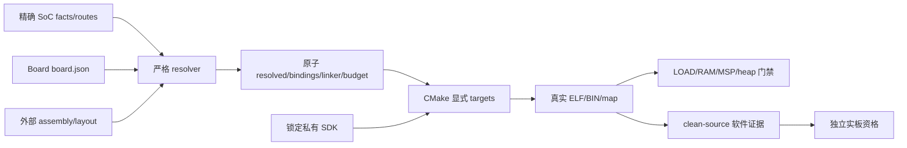

# 当前系统架构

## 目录与责任

| 层与目录 | 拥有的责任 | 依赖边界 |
|---|---|---|
| `core/` | 中性结果、绝对 monotonic deadline、caller-owned request 状态 | C11；无 Board、RTOS、SDK |
| `arch/` | Cortex-M4/Native 异常上下文、中断状态保存恢复、屏障、cycle snapshot | 公共 Nexus 类型；不管理外设 |
| `soc/stm32f407/`、`soc/gd32f470/` | 精确内存/clock/IRQ/startup、timebase、typed controller 实现 | 私有 SDK 与私有 provider storage |
| `boards/<board>/board.json` | 精确型号、已审 route、晶振声明、safe initial、来源与未知 PCB 项 | 只读资源包；不创建产品任务 |
| `io/` | 九类 I/O 的 typed 多态合同、共享操作表、DMA/stream/wake 机制 | 公共头不含厂商类型；Native 是行为模型 |
| `os/` | 可选 wait/wake、按对象静态 task/stack/TCB/queue 适配 | driver 不依赖 OS；不创建应用 worker |
| `components/` | 显式选入的 owner、BMP280、Modbus、Storage、Log 等通用机制 | 通过窄端口访问设备、时间与外部政策 |
| `tools/`、`cmake/` | 严格输入解析、单份生成结果、源码 SDK、ELF/资格/HIL 工具 | CMake 是代码依赖唯一权威 |
| 外部应用工程 | 产品 composition、任务、策略、布局、预算、恢复与业务 | pin 一个明确平台版本，拥有实际执行进展 |

SoC 每个 controller 是独立 translation unit。选入一个 UART 不会默认驻留所有
外设、RTOS 队列或最大对象池。启动与 system source 是显式 firmware 输入，不依靠
静态 archive 中未被引用的弱符号来拉入正确 reset/vector。强 provider IRQ 只随所选
实现进入镜像，未使用实现由 section GC 清除。

Board 不复制 SoC 驱动。GD32 的 I2C/PWM/ADC/EXTI route、STM32 的高级控制器 route
可以在明确标为软件测试夹具的外部 Board 包中编译／链接；这不意味着三块参考 PCB
已核对相同 connector 和电气。默认 Board 仅绑定已有来源的路线。

## 构建与配置

一个 assembly 选择 Board、clock profile、OS backend、控制器实例、有限 mode、
容量、IRQ 优先级、endpoint 和预算。生成器只生成静态硬件装配，不生成任务、业务
代码或软件依赖图。未知键、失效输入、非法模式、引脚／IRQ／timer 冲突、越界容量
都会拒绝；失败重配置使旧 bundle 失效，不静默使用上一次成功结果。

SoC/Board 事实采用 JSON，使用者编写 schema-2 TOML。严格 resolver 产生不可变
typed IR；各生成器消费同一结果。`resolved.json` 是该结果的序列化，不能作为手工
配置回填。迁移期 schema-1 JSON 夹具有显式入口，不与 TOML 混合叠加。

CMake 中 `Nexus::Platform` 导出配置、typed factory 和不可变接口；SDK headers 和
provider storage 只对实现与生成 binding TU 可见。公共消费路径没有厂商 SDK ABI。
外部 firmware 通过 `nexus_add_firmware()` 显式装入 startup/system/linker 和资源校验。

## 固定对象与执行

当前恢复 factory＋多态接口骨架，生成阶段完成实例构造。每类接口 face 只有
`const ops*` 和 `context*`；face 与操作表只读，provider 可变状态及按实例选择的
buffer 独立静态存储。方法接收自己的 context，不通过操作表地址推断实例。

生成 `nexus_factory.h` 和 assembly-local ID。`nx_factory_uart()` 等 typed 函数
只返回已存在对象：不申请堆、不启硬件、不查字符串、不加锁。非法 ID 返回 NULL；
取得对象与 `nx_platform_start()`、请求借用和停止分别执行。静态句柄不是可撤销
session，停机前仍必须结清调用者、IRQ、owner 与通知发布者。

SPI/I2C controller factory 返回真实控制器，device factory 返回 CS/address
端点。一个 controller 仲裁所有子端点；恢复属于 controller，不借用第一个端点
来冒充总线。不同 provider 的实例可在同一镜像中共享公共接口，各自保存操作表
与状态。Native 生成对象不再将多个名字绑定到一个全局模型。

公共函数做有界检查并调用共享表；provider 内部可以直接调用自己的实现，避免在
寄存器热路径反复多态分派。组件通过公共合同接入，应用角色、任务与恢复策略仍由
外部工程拥有。编译选中某实例不代表其硬件已经启动或请求已经完成。

生成器的私有对象按 port、endpoint、CS、buffer 和平台状态分开命名，避免合法
实例 ID 与内部辅助对象共用存储。设备字段按实际 transport 校验；I2C endpoint
只声明地址，不接受无效的 SPI mode、频率或通用 capacity。`devices` 当前生成
总线端点，`components` 选择代码库；器件和 owner 实例仍由外部应用显式构造。

| 路径 | 资源与责任 |
|---|---|
| GPIO 直接访问 | 授权 mask；set/reset 一次 BSRR/BOP；toggle 要求单一 writer |
| UART 直接访问 | 调用者 request/payload；一个 execution owner；真正 TC 决定 wire 完成 |
| SPI/I2C/Flash/ADC polling | 明确 CPU-active polling；有限模式；只报告有效完成前缀 |
| UART/SPI finite DMA | 精确域与通道；零隐式复制；内存和线上独立排空；失败保留借用 |
| UART RX blocks | IRQ／IDLE；调用者精确块数组；不可变 consumer loan；可见 loss |
| ADC trigger blocks | 精确 timer/DMA；每块停机；显式 service 稳定／校准与 rearm；块间间隙 |
| 多 producer owner | 外部按容量提供 slot/storage；唯一 admission；slot/epoch 防止旧取消命中新请求 |
| OS wait/wake | sequence/predicate 防 lost wake；通知是提示，client 不 service hardware |
| shutdown | 拒绝 producer→保持 executor drain→结清 borrow/通知发布者→join→逆序释放接口→停 clock |

UART `REJECTED` 不借用 request 或 buffer；`ACCEPTED` 借用到 acquire-observed
`SETTLED`。provider 先 detach，再 release-publish，之后不能读取 request。取消与
超时不能提前释放借用；无法证明 drain 的情况进入 `QUARANTINED`，保留执行／恢复
责任。TC IRQ 观察时判绝对期限，后到 service 不覆盖较早的完成事实。

STM32 取消保留到实际 TC drain；GD32 可用受控 USART reset 终止 wire interval，
未观察 TC 时保守 count=0，并产生 RX loss。两者都不把写入 DR/DATA 的数量当作
完整发送字节。错误-only RX 和 loss marker 带 `NO_BYTE`，不能消费旧寄存器数据。

## 性能与空间

默认 C11 路径无 heap、运行时 registry、字符串查找、隐藏 worker、mandatory OS lock 或
闲置 DMA/copy pool。RX/EXTI queue、OS object、owner slot 和组件 workspace 按
选择的实例配置分配。IRQ 只搬运有界事实，批量读取采用短临界区，ring 热路径不做
可避免的动态除法。

资源工具计算真实 ELF 的 Flash LOAD/footprint、每个物理 RAM 域、MSP、heap 和
未使用 provider 的 GC。O2/Os/O3 与 LTO 的选择依据相同 workload 的实测，不凭
源码行数推断效率。原生测试耗时、汇编数量和真实 MCU cycles/latency 分开；当前
无实板，不能承诺“最低 cycles”或已完成物理时序预算。

`tools/measurement/interfaces.py` 从实际 ELF 审计保留的 face 与操作表。非 LTO
ARM face 为 8 bytes Flash／0 bytes RAM，表按 provider 共享；独立状态另外核算。
简单 LTO workload 可能消除整个 face／表，这不是任意应用都可继承的保证。

## 测试与新版本资格

主机新增合同使用固定版本 GoogleTest/GoogleMock，固件仍是 C11；测试框架、C++
runtime 和依赖 archive 不进入 MCU 镜像。保留已有生产 TU 的 C 寄存器/故障回归，
新增 mock 只替换硬件交互，不替换被测 owner、dispatch 或生成器。

TDD 按 Red→Green→Refactor 实施，新增行为先保留失败证据。commit hook 实际执行
测试并验证全量发现的用例、未过滤的新 XML 和返回码；机械门禁只能证明当前执行，
不能证明所有开发者的历史编辑顺序。代码格式与反斜线 Doxygen 沿用既有规则。

本轮 factory/TOML/多态迁移是新源码，不能继承此前候选的资格。开发日志位于外部
实施证据目录；最终 clean-source、SDK、离线双构建和新候选须按新 HEAD 重新执行。
三板实物尚未接入，物理结果保持 `not_executed`。
