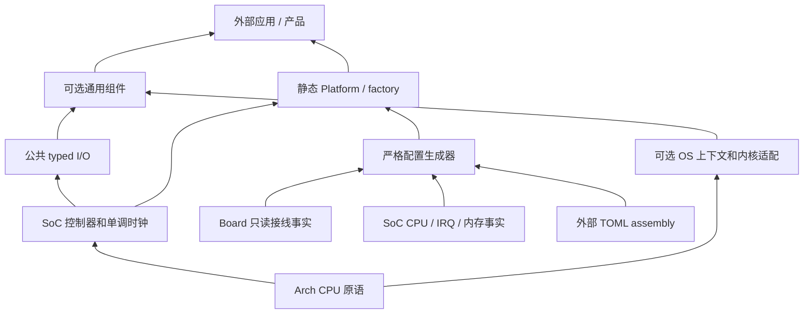

# Cortex-M 架构接入与验证边界

Arch 只拥有 CPU 局部机制：中断保存恢复、当前掩码、异常号、特权、屏障和可选
周期快照。实现按编译期目标选择，不建立运行时 CPU 对象、注册表、锁池或 worker。
设备实例仍由 TOML → 不可变 IR → 静态 typed factory 装配，使用共享多态方法表。

## 分层与依赖



Arch 不依赖 CMSIS、厂商 SDK、I/O 或内核。SoC 保留实际 IRQ 编号、NVIC 资源、
DMA 可达区域、外设排空和时钟；Board 保留电气路线。OS 拥有 kernel port、syscall
ceiling、静态任务／通知／队列及合法调用上下文。产品拥有 MPU／安全策略、任务、
缓冲布局和恢复责任。GD32 私有 CPU 辅助调用复用 Arch，不再另写 PRIMASK、IPSR
和屏障指令；外设 readback 和 drain 仍由 SoC 证明。

`arch/cortex_m/private/compiler.h` 是私有指令／寄存器边界，生产路径内联为 CPU
指令。测试只替换该硬件边界，执行真实 `nx_arch_cortex_m.c`；模型不执行 ARM CPU。
ABI、FPU 和目标选择仍由精确 SoC 事实及 CMake 统一设置。

## 精确支持层级

| 内核 | 原语实现和编译门禁 | 整平台的剩余条件 |
|---|---|---|
| M0／M0+ | ARMv6-M；PRIMASK、IPSR、CONTROL、屏障；不读 BASEPRI／FAULTMASK／DWT | 当前 Core／OS 要求无隐藏 helper 的原子操作；尚无受审 RMW 后端、SoC 和内核 port |
| M3 | ARMv7-M；增加 BASEPRI／FAULTMASK；DWT 由显式事实允许 | 未接入具体芯片、启动、驱动和内核 port |
| M4 | ARMv7E-M；同一原语实现；当前 F407／F470 声明 DWT | 当前完整软件平台仍固定 M4F、hard-float、short-enums 和 GCC/ARM_CM4F；三板 HIL 未执行 |
| M7 | ARMv7E-M 原语可编译 | cache line 所有权、DMA 可达区域、启动、驱动和 kernel port 须独立接入 |
| M23 | ARMv8-M Baseline；不读 BASEPRI／FAULTMASK；DWT 禁用 | 安全状态、SoC 和内核 port 须独立接入；其独占 RMW 能力不能按 M0 推断 |
| M33 | ARMv8-M Mainline；当前安全状态的掩码／特权查询 | Secure／NonSecure 链接、异常、共享资源和 kernel port 未接入 |
| M55／M85 | 未维护，拒绝选择 | 不复用 CM4F port 来声称 FPU／MVE／安全上下文支持 |

标准平台配置仍只接受已维护的 Native 和 Cortex-M4F ABI。新增芯片必须明确登记
provider、SoC facts、startup／linker、驱动、OS port、SDK 和验证范围；CPU 原语
源码可以编译，不代表这些条件已经完成。

锁定 GCC 的原子 probe 区分 acquire load、release store 和 fetch-add。M0／M0+
的 RMW 会引用 `__atomic_fetch_add_4`；当前平台不静默链接 libatomic，也不把
`volatile` 当作同步替代。M23 的 probe 为内联独占操作，不能与 M0 合并分类。
无 helper、lock-free 或 O(1) 均不证明无重试、固定 cycles 或最坏中断延迟。

## CPU 与调用合同

- `nx_arch_irq_save/restore` 只改变 PRIMASK，保留输入状态；token 同 CPU／线程、
  严格逆序、恰好恢复一次。当前实现保留 DSB／ISB，不为减少指令而删除必要排序。
- `nx_arch_irq_masks` 返回 PRIMASK／BASEPRI／FAULTMASK 的查询快照；不存在的
  寄存器为零。它不是 restore token，不授权解除别人的屏蔽或跨安全域互斥。
- `nx_arch_exception_number` 返回 IPSR 身份，零为 Thread mode；不是 SoC IRQ ID，
  也不证明可以调用内核。Handler mode 的特权不能由被中断线程的 nPRIV 推断。
- PRIMASK 不能保护 NMI／HardFault、其他 CPU 或另一个安全世界。共享元数据访问
  仅限受合同允许的特权 Thread／可配置 IRQ；非特权线程需要明确的 OS gateway。
- DMB／DSB／ISB 语义分别保留；它们不代替 cache clean／invalidate、DMA idle、
  外设状态 readback 或取消后的排空证明。
- DWT 只在显式允许且当前有特权时读取，未启用／不存在时返回 false、输出不变。
  不启用、不复位其他使用者的计数器；频率和回绕限制使它不能作为 deadline 时钟。

Native 使用真实递归线程互斥与 C11 fence；掩码是线程局部模型，异常号为零、
特权为 true。错序、重复和未配对 restore 在 Debug／Release 都终止进程。
Native 不模型化 NVIC、硬件异常、信号安全、特权切换或物理时间。

## FreeRTOS 启动与通知

正常 task API 要求特权 Thread，PRIMASK／FAULTMASK 为零；调度器运行或暂停时，
BASEPRI 也必须为零。拒绝在变更对象和进入有副作用的内核 API 前发生。

锁定 CM4F port 在调度器启动前保留 critical nesting；首次静态对象创建可能留下
与 syscall ceiling 相等的 BASEPRI。因此仅在 `taskSCHEDULER_NOT_STARTED` 时允许
这个精确值，继续创建静态对象、发布通知及执行零等待队列操作。该数值判断不能
证明屏蔽来自谁，调用者仍须遵守启动合同；其他掩码值拒绝，适配层不自行清除
BASEPRI。等待和 join 另要求调度器运行。

IRQ wake 在发布 sequence 前验证特权、输入掩码、外部异常范围、实际 NVIC priority
和 PRIGROUP。当前 IRQ 范围及 syscall 规则属于已维护 CM4F port，不向其他 CPU
默认继承。GD32 SPI DMA 在短临界区锁存完成事实与 wake 指针，恢复输入状态后
再通知；通知对象由应用保持有效，直到全部 IRQ 发布者已排空。

应用 task entry 必须恢复手动屏蔽和调度器状态，并在特权 Thread mode 返回。
通知仅为提示，request／sequence 谓词仍是完成依据；超时不能撤回 buffer 借用。

## 配置和自动门禁

SoC `cpu.dwt_cyccnt`、`irq.priority_bits` 是受审事实，provider 校验其与真实实现
一致性。冻结的 `InterruptProfileIR` 派生逻辑优先级范围、维护的 kernel port 和
syscall ceiling。TOML 不增加芯片能力覆盖项；`[abi]` 仍只检查三项 ABI 声明。
同一 bundle 生成 C header 和 CMake selection，没有第二套 Kconfig 或 cache 真源。

commit hooks 执行格式／注释、配置测试和全部 GoogleTest／GoogleMock；测试不能
过滤、跳过或以旧 XML 代替执行。CI 增加七个 CPU 的真实编译门禁，保留命令、返回码、
对象、汇编、反汇编、宏和哈希，并拒绝隐藏运行时依赖、错误寄存器或不完整接口。

```sh
python scripts/ci/tdd_gate.py --all --preset native-debug
python -B -m unittest discover -s scripts/ci -p 'test_*.py'
python scripts/ci/arch_compile.py --compiler arm-none-eabi-gcc \
    --output build/arch-compiler
```

原语模型、编译门禁、三板两后端的 ARM 链接和真实 HIL 分别建立证据。原有 clean
软件候选不继承到此次修改；源码 SDK 和外部示例必须针对新 HEAD 重新验证。当前
没有实板接入，cycles、IRQ latency、FPU context、cache／MPU、TrustZone 和物理
波形保持未验收状态。最坏临界区和非 LTO 调用成本须由实际镜像及后续实板测量收敛。
