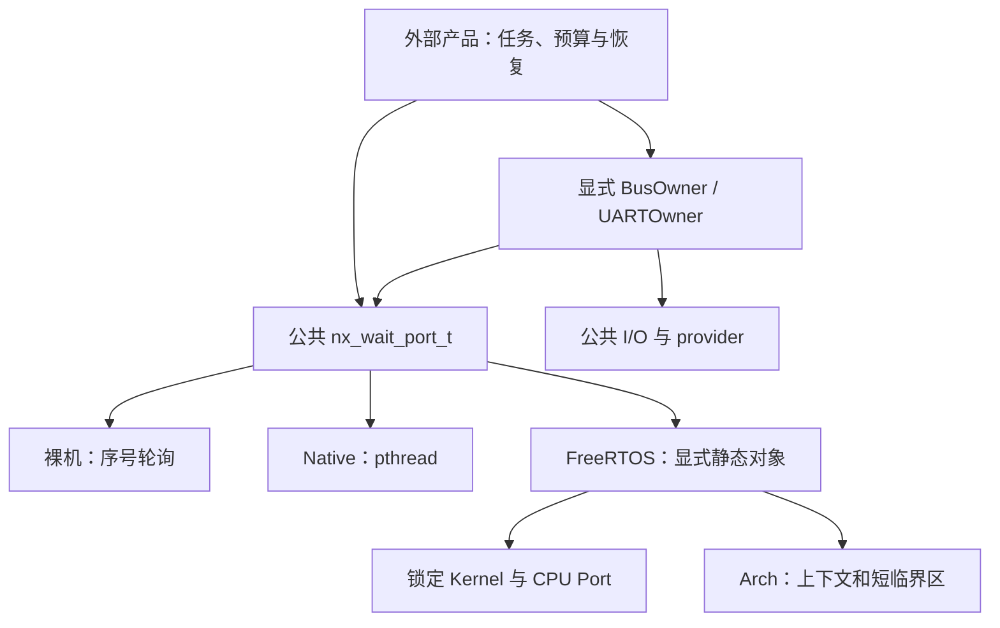

# OS 执行与生命周期合同

OS 提供有界等待、显式任务和同步存储，设备接口不依赖 scheduler。默认固件是 C11、
静态装配、零平台堆；Native 的 pthread 库内部 bookkeeping 不构成 MCU 零堆证据。
产品的任务角色、优先级、栈、队列容量、启动、停止、安全输出和恢复策略由外部工程拥有。

## 分层与依赖

- `Core` 保持无 OS/Arch 依赖。发布的 acquire/release 语义独立于内核。
- `Arch` 拥有 CPU-local IRQ 掩码、原子操作和浅睡眠原语，不拥有 Tick、任务或设备。
- `OS` 选择后端并检验其真实能力。公共 Wait 合同不包含任务创建、设备 service 或派发。
- `SoC` 拥有时钟、控制器、实际 IRQ 和可用计时器；Board 拥有实际引脚、电气与外部器件。
- `Product` 创建 owner/producer/coordinator，提供 timer/trace/fail-stop port，并启动 scheduler。
  `nx_platform_start()` 不替产品启动 scheduler。

公共 Wait 是跨后端合同；任务、队列和内核专属能力仍显式使用后端类型，不伪装成所有
RTOS 都提供同样的能力。生成的 typed factory 返回既有设备 face，不创建 OS 对象。

## 等待、时钟与完成

`nx_wait_until()` 使用 `ready → arm → ready → wait → ready`。后端必须把序号观察与
进入等待作为不会丢失已锁存 wake 的操作。wake 只是提示；业务 predicate 是结果的
唯一权威，通知序号不转移 payload 所有权。单 port 只有一个 waiter，允许后端合同内
多个 publisher；从 arm 到 recheck 之间必须少于 2^32 次 wake。

所有 deadline 是对应后端时钟域中的绝对单调微秒。Native 使用 `CLOCK_MONOTONIC`，
FreeRTOS 使用 `nx_time_now_us()`，裸机使用初始化时提供的时钟。不得在活请求期间
切换时钟域。`NX_DEADLINE_NEVER` 真正表示无限等待，不把 UINT64_MAX 转成有限
`timespec`。微秒表达不保证微秒调度精度；阻塞误差还包括 Tick 量化和调度延迟。

有限 notify deadline 在检查 hint 时仍必须检查过期，持续无关 wake 不能续期。公共
helper 在后端错误后保留一次最终 `ready` 检查：已观察到真实完成可以胜出。
裸机未就绪返回 `BUSY`，调用方继续显式调度。队列立即可用的操作采用 try 语义；
只有需要阻塞时才消耗 deadline，失败不改调用方输出。

等待不推进 UART/SPI service。共享控制器的生产者不能在 `ready` 内 service；其唯一
execution owner 在取消、停止和排空期间仍须运行。timeout/cancel 请求不等于最终
settlement，不释放 request、operation、DMA buffer 或 notification storage。

## 中断政策与上下文

CPU/SoC facts 包含实际 IRQ 数、实现优先级位数和分组能力。OS runtime policy 明确
区分无内核、PRIMASK 内核和 BASEPRI 内核，不能仅凭 ceiling=0 推导内核不存在。
Mainline 调用内核 ISR API 前验证实际 publisher IRQ、priority width、分组和 syscall
ceiling；Baseline 按 PRIMASK port 合同检查实际 configurable IRQ。

NMI、HardFault 和内核专属异常不进入这些 kernel wake API。Task API 要求当前世界
privileged Thread mode，运行时手工掩码已恢复、scheduler 未被挂起；启动阶段只允许
所选 Port 的规范 bootstrap mask。数值相同不证明掩码所有权。拒绝应发生在修改对象、
发布引用、创建内核对象之前。

只使用 CPU-local mask 不保护 SMP、DMA 对元数据写入或另一个安全世界的 publisher。
IRQ sink 和 context 必须一直存在到实际 provider 停止并证明 publisher quiescent。

## 静态存储与任务

每个任务显式提供 TCB、栈和 context。创建前按当前 Port 的初始 frame 和对齐要求
校验实际栈容量；启动最低容量不能替代任务运行栈预算、异常嵌套 MSP 预算和 FP/MVE
context 预算。Native 栈须满足 pthread 平台下限并加上应用预算，不能继承成 MCU 成本。

首次 scheduler 启动采用 cold privileged Thread/MSP 合同：`CONTROL.nPRIV=0`、
`SPSEL=0`、`FPCA=0`。启动前不得留下 active FP context 或把 main 切换到 PSP；调用方
不能仅清掉标志来丢弃仍活跃的 FP 状态。MPU bootstrap guard 绑定真实 protected startup
指令、基本 exception frame 与正确 EXC_RETURN，一次性 lease 在 restore 前消耗，重复
raw START SVC 不能再次取得启动权限。任务开始后的 FP/MVE 使用由对应 Port 管理，
不是禁用应用浮点能力；实际 context retention 仍需要硬件验收。

可 join 任务返回后由 wrapper 发布完成并挂起；外部单 joiner 执行删除后才能重用
TCB/栈/context。join 超时保留全部存储。Native 同样只有一个外部 lifecycle owner，
禁止绕过 adapter 对所属线程执行 `pthread_cancel`、detach 或另外一次 join。

永久任务使用独立显式 API，entry 不得返回，control/stack/context 保留到 reset；它
没有 completion semaphore、join 或 destroy。适用于产品确实具有永久生命周期的任务。

direct task notification 是显式 opt-in：调用方指定已存在的 receiver 和独占 notification
index，只有该 receiver 等待。停止并 join publisher 后才能解绑；receiver handle 和
storage 一直存在到所有保存的 port 都不再可用。平台不隐式占用应用 notification 槽。

## 队列与关闭

raw queue 保持原有最小存储和原生阻塞路径。绝对 deadline 入口复用同一时钟域，并
避免连续操作把相对等待预算重复放大。较大数据优先排队稳定 slot/handle，而非在
内核临界区复制整个 payload；slot 本身仍有明确借用和回收规则。

可关闭队列使用单独 opt-in 类型和精确最大并发 waiter 数。每个并发阻塞操作持有独立
调用方 waiter 存储；close 停止 admission，锁存并唤醒已注册 waiter。关闭后旧 item
可继续 drain，不能继续 send。destroy 需要 closed、drained、users/publishers quiescent。
不得用 periodic polling 冒充立即关闭唤醒，也不得让 raw queue 默默承担这项成本。

FreeRTOS closable registry 仅供 task 使用，以 scheduler suspend/resume guard 保护
admission、waiter 注册/退出和 close 广播。内核 give 可能触发 yield，不能假设一个
IRQ critical token 能跨越这个 yield 保持链表不变。maximum_waiters 预算 close 的
调度暂停时间；单 item 复制与 latch give 的 IRQ 屏蔽时间另行测量，不能混为一个成本。

## 配置与成本

平台 schema-2 和独立 runtime schema-1 TOML 的可选 `[os]` 只用于 FreeRTOS。
`tools/configure/kernel.py` 是唯一政策解析源，生成不可变 `KernelProfileIR`。默认
`standard` 延续 1 kHz/八级优先级/Idle 128 words/16-byte name；`minimal` 缩短
name 与优先级列表并关闭未用同步能力；`diagnostic` 开 trace；`lowpower` 显式开
custom tickless。生成的实际能力为准，不能用 profile 名推导芯片能力。

可覆写字段为 `tick_source`、`tick_hz`、`max_priorities`、`syscall_priority`、
`idle_stack_words`、`max_task_name_len`、`notification_slots`、`mutexes`、
`counting_semaphores`、`task_notifications`、`trace`、`runtime_stats`、`tickless`。
安全 profile 另有 `memory_protection`、`system_call_stack_words`、`security_model`、
`secure_idle_stack_bytes`。默认 MPU 关闭、single-world；MPU 系统调用栈默认 128 words，
64–65536 偶数 words。split 的 Secure Idle 默认 128 bytes，64–65536 且 8-byte 对齐；
single 不接受作者显式设置此字段。CPU 的 `mpu_regions` 是物理事实，未声明为 unknown，
不能由运行时政策凭空生成 MPU。受维护安全组合见下节，不由参数校验成功推导支持。
SysTick 使用真实 core clock，要求频率整除且 reload 在 24-bit 合法范围；外部 Tick
必须实现强 `nx_freertos_external_tick_setup(uint32_t)`。runtime stats 必须实现
counter start/now；缺失 hook 使链接失败，不提供伪时钟或永远为零的统计。

成本报告分开计算 Wait face、notify、raw/closable queue、每个 waiter、joinable/
permanent TCB、调用方栈、Idle 栈和内核全局对象。保持现有 four-pointer Wait ABI；
共享 ops 表是否值得采用由实际 linked image 和实例数决定。构建时间报告只比较
RAM/Flash/instruction，CPU cycle/latency 必须实测，不能从反汇编字节数推导。

## 产品停止顺序

1. coordinator 关闭 admission；owner stop 请求所有已接受操作取消。
2. owner 保持 service/drain；producer/observer 仅观察 acquire `SETTLED`。
3. coordinator join producer；成功后 request 和 bytes 的业务 borrow 已解除。
4. coordinator 请求 owner 停止并 join；同时确认 owner idle 包含 publication 已退出。
5. 停止硬件 RX/IRQ publisher 并 detach wake；join 其他可能的发布者。
6. 销毁 notification/queue/guard。Native/裸机随后可执行 platform stop；正在运行的
   FreeRTOS 保留 platform 时钟和 Tick，coordinator 发布状态后挂起。产品通过显式
   reset 或完整 scheduler-stop port 才能关闭内核基础设施，不能从 I/O idle 推导内核停止。

失败保留 storage，并由产品选择恢复。`QUARANTINED` 是仍有引用的状态，不是允许
释放的终态。一次 destroy 返回 BUSY 只是防护，不替代未来 publisher 已停止的证明。
外部 [UARTOwner 示例](https://github.com/X-Gen-Lab/nexus-examples/tree/codex/next-generation-platform/apps/uart_owner_runtime)
实现单 coordinator 的单调停止 milestones；失败后只重试失败阶段，不重复已成功 join。

## 低功耗、诊断与安全边界

Arch 的序号复查与浅睡眠保存恢复 incoming PRIMASK；WFI 前 DSB，明确拒绝默认深睡眠。
应用负责唤醒 timer 和持续时钟。FreeRTOS tickless 使用 caller-owned timer port：精确
Tick phase、暂停/恢复、绝对 alarm、连续 clock 与异常 overshoot 都有独立合同。未绑定
port 时维持普通 Tick，不猜低功耗设备或 Board 唤醒引脚。

诊断 ring 由调用方提供 capacity；写满不覆盖旧事件，lost counter 饱和。内核 trace
默认 weak no-op，无默认大 buffer；产品覆盖 sink 并负责消费。异常 hook 是有界平台
扩展点，安全输出、watchdog/reset、事件持久化和释放策略归产品。

显式 MPU profile 使用真实 restricted-task kernel port、专用 linker regions 和窄 SVC
gateway。调用方在 privileged RAM 提供 TCB/context/syscall stack，在 user RAM 提供
实际任务栈；受保护任务至少 64 words，运行峰值另行预算。只允许普通 RAM 的 RO/RW
且 XN 数据授权，拒绝 MMIO、privileged RAM、越界、重叠或非法 context。默认普通代码、
数据和 provider 均 privileged；只有显式 user text/data 可进入用户区。

公开 user 服务只有无指针的 delay/tick-read，经真实 MPU veneer/SVC；没有泛用用户
对象池、I/O handle、任意指针系统调用或隐式升权。受维护软件组合为 M3、M4 integer/
FP、M23、M33 integer/FP、M55 integer-MVE、M85 float-MVE 及明确 16-region 事实。
Native、M0/M0+、M7 kernel MPU 和 MPU+split 当前 fail closed。基础 Arch/普通 OS 对
这些 CPU 的支持仍独立存在。用户任务不是可 join wrapper，必须永久运行；单 privileged
owner 在所有外部用户 quiescent 后显式删除另一任务，自删拒绝。没有隐藏 reaper。

显式 split 由两个独立 Runtime 图像组成：Secure 侧是明确 Secure CPU facts、baremetal
runtime 与 `Nexus::SecureContext`；Nonsecure 侧选择匹配 CPU facts 和 split FreeRTOS。
匹配 ISA/FP/MVE/float ABI，Secure link 导出七个真实 SG veneers 与 CMSE import object，
NS link 消费该 import 并使用实际 CM23/33/55/85 的 TrustZone-aware non_secure ports，
不能给 NTZ port 设置宏来冒充跨世界 context save/load。

每个获准 NS task，包括内核 Idle，均由调用方提供 NS TCB/stack 和独立 Secure
metadata/stack。Secure startup 先 prepare，可信 immutable task→context selector 只
返回已准备身份；未知身份拒绝。Secure 栈须 8-byte 对齐，实际 allocation 包括
8-byte seal，64-byte port minimum 不包含 seal，也不代替业务栈预算。split 需要消费者
提供 Idle callback 和匹配 Secure Idle 存储；政策只控制 request budget，不提供默认池。

租约身份包含可信 task 与单调 epoch；free 保留 metadata/epoch 历史，join 与 observers
quiescent 后才能 rebind。已 load 的 context 不能 free。真实 PSP/PSPLIM assembly 处理
save/load，保留 Secure/NS incoming PRIMASK；有界完整性检查发现 seal、stack bounds 或
context 破坏后，保留 lease 并进入不返回的 Secure fail-stop，不释放或隐式恢复。
默认保持双域掩码并持续 spin，没有完成时间界；产品负责明确的安全记录/reset 策略。
NMI/HardFault 不访问这些共享 metadata。NS SVC/PendSV kernel 是受信任边界：普通 NS
Thread 不能伪装 Handler 调用，但机制不防御恶意 privileged NS kernel 伪造自身 task 参数。

31 个实际 Secure/NS 配对变体、62 个 ELF 已验证现有 CPU authority 的 M23/M33/M55/M85
FP/MVE/DSP/float ABI 组合的软件链接、veneer 和无 heap/pool。它们使用明确 synthetic
link regions/TCB identities，没有实际 SAU/IDAU、向量、启动、IRQ target、安全转移或
Board 接线。产品/SoC SDK 仍须实现这些真实硬件合同，实板 acceptance 未执行。
默认 single-world、MPU-only 与 split-only 为独立模式；MPU+split 当前明确拒绝。
v8-M 的 authored `security="single"` 表示 Arch security state 0，不能推导成
Nonsecure。该无跨世界配置与显式 `secure` 都采用所锁 Port 的 traditional FD 初始
task return/F9 MSP bootstrap encoding；只有显式 `nonsecure` 使用 BC/B8 encoding。
生成的 `NEXUS_CPU_SECURE_ONLY` 在前两者为 1，只选择 Port return tuple；single 没有
`-mcmse`，不会授予 Secure、SAU 或跨世界访问能力。显式 secure 是 state 1 并使用 CMSE；
nonsecure 是 state 2，其内存 attribution 由实际 Secure startup 实现。v6/v7 保持原有
非跨世界 tuple，不继承 v8 的 security 参数意义。
详细 Secure lifecycle 见 [Secure companion](../../os/freertos/secure/README.md)，
实际实现、受维护矩阵与物理条件见 [OS 台账](os-execution.csv)。
其他 RTOS 的实际接入流程和可执行 admission probe 见
[后端接入合同](os-backend-integration.md)，探针通过不会自动注册或宣称新内核支持。

## 自动化与实际证据

行为变更先记录真实 GoogleTest/GoogleMock RED，再实现 GREEN，最后重构。mock
外部硬件、CPU/内核边界或产品调度动作，不 mock 实现本身。等待竞态以 barrier、
可控时钟和显式调度构造，不能依赖 sleep 长短来证明同步。

配置和 evidence 工具使用 Python unittest；hook 和 CI 执行实际发现的完整 suite，
拒绝零测试、过滤、skip-only、陈旧 JUnit 与缺工具。真实 POSIX scheduler 验证 kernel
集成；ARM 编译/link/ELF 报告验证 ABI 和资源，不证明 MCU 时序或 context 电气行为。

`tools/hil/os_acceptance.py` 提供 OS49–55 的 unbound 计划与严格物理记录验证。验证
重建 admission，绑定实际 ELF/config/CPU ABI/station/workload/instrument，检查完整
register bank、MSP/task peaks、逐样本 deadline、无损低功耗事件和实际安全输出。
工具不运行探针、串口、供电或 Flash；没有设备时所有物理项保持 `not_executed`。

## 内核升级与新后端接入检查表

内核升级先在独立分支锁定 commit/tree 和所有实际使用 Port；不要只升级版本字符串。
审核配置宏、TCB/queue ABI、初始 frame、ISR priority gate、yield/critical 行为和任务返回
wrapper。M7 integer overlay 重新确认上游文件 SHA、预期替换次数、incoming PRIMASK
恢复及 errata barrier；原始 vendor 文件保持可核对。FP/MVE 保存与 coprocessor 初始化
需要编译宏、真实 ASM/disassembly 和最终硬件 context-switch 记录共同确认。

升级通过全部 GoogleMock/context tests、真实 POSIX lifecycle、九核链接、profile
正负路径和 formal installed SDK 后，重新记录成本与当前 source identity。旧 clean
candidate、旧 ELF 和旧物理报告都不能自动授予新内核资格。产品负责批准其实际任务
预算、timing/HIL、恢复策略和发行范围。

新 RTOS/backend 必须逐项提供：

- 明确 startup/running/suspended/task/IRQ 上下文、scheduler 启动责任和中断政策。
- 同域单调时钟、有限及无限 deadline、arm/recheck/wait race 和单 waiter 合同。
- 每类对象的精确存储、对齐、初始化失败零副作用、关闭与 destroy 条件。
- returning/permanent 任务生命周期、单 joiner、超时后引用保留和存储复用证明。
- producer/owner stop 与 request drain 能继续进展，不用强制删除任务解除 borrow。
- CPU Port/ABI/context save、实际源依赖、最小资源报告和 missing-hook 链接拒绝。
- 真实 backend execution 与同一 GoogleTest 合同；新 kernel 不通过只有 mock 的验证。
- 正确标注 Native/model、ARM link 和 physical station 的不同资格，禁止推测新板接线。

## 错误与恢复责任

| 结果/状态 | 调用方责任 |
|---|---|
| `BUSY` | 保持 storage；非阻塞调用方继续显式 service/pump 或按应用政策重试 |
| `TIMEOUT` | 只结束本次等待预算；不能释放尚未 SETTLED 的 operation/bytes |
| `CONTEXT` | 先恢复合法任务/IRQ/掩码/scheduler 上下文，不在 guard 内重试 kernel |
| `STATE` | 检查对象生命周期、close、stale ticket、receiver/index 和唯一所有者 |
| `QUARANTINED` | 保留全部 borrow，owner 继续 recovery/drain，产品决定安全输出/reset |
| `UNSUPPORTED` | 在配置/接入阶段选择真实能力；不静默启用替代 worker 或改变模式 |

平台不把这些结果自动映射成 retry、重启、写 Flash 或恢复安全输出。生产策略必须
使用产品自己的预算、告警和状态机，并保留实际失败路径的原始证据。
