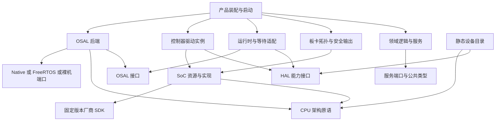

# Nexus 平台架构重构设计

日期：2026-10-08。审查基线：`affaa86f485886d4bf72fb40e511030de5407ba0`，位于 `codex/industrial-platform-modernization`，尚未合入 `main`。适用范围：约 10 人的工业控制与设备联网团队，STM32/GD32，FreeRTOS/裸机，3–6 个月交付窗口。

本文区分现有实现、目标设计和实施退出条件。原有 [目标架构](target-architecture.md) 提供产品背景；本文收敛到 HAL/OSAL、Arch/SoC/Board/Product 与构建目标的具体边界。配套阅读：[主流平台比较](platform-comparison.md)、[HAL/OSAL 详细设计](hal-osal-design.md)、[架构决策](architecture-decisions.md)。这些设计没有自动赋予硬件支持、产品资格或企业发布资格。

## 1. 决策与成功标准

保留 C11、CMake、Kconfig、CTest、维护中的 FreeRTOS，以及平台无关的存储/协议/工业服务核心。Nexus 定位为可组合的 MCU 产品平台，不建设新 RTOS，不重写密码库，不要求业务依赖厂商 SDK。首批重构优先形成能验证的编译边界，再调整有缺陷的运行时模型。

“优秀”用结果衡量：一个板级变更不修改领域服务；一个产品变更不复制整套 BSP；一个外设实例有明确所有者；超时不会提前归还硬件仍在使用的内存；最小产品不安装无关工具；构建与现场诊断能定位同一组源码、配置和工件。性能指标由产品预算与实测决定，不预设优于其他平台。

首期选择一份有效配置对应一个平台、板卡、OSAL 后端及资源配置。多个产品/后端使用独立构建目录。单次 CMake 配置内同时建立多个不同 Nexus 配置、SMP、通用热插拔和动态插件框架均不属于首期范围。

## 2. 当前结构及问题归属

以下箭头表示当前 CMake 依赖，省略无关的单个源码文件：

```text
hal_interface / osal_interface -> nexus_build_options
hal -> hal_interface + osal
osal -> Native Threads | baremetal | FreeRTOS kernel/config
platform_native OBJECT -> hal + osal
platform_stm32 OBJECT -> hal + osal + vendor SDK + storage
  + startup/system/clock/IRQ
  + GPIO/UART/SPI controller implementations
  + F407 Flash + MB997 identity/SPI wiring
application helper -> selected platform + hal + osal + explicit services
industrial_controller -> protocols + industrial (Native model)
```

可核对的源码入口：

| 现状 | 源码 | 架构后果 |
| --- | --- | --- |
| HAL 实现公开依赖 OSAL | `hal/CMakeLists.txt` | 设备核心、互斥封装、等待适配与运行时实现混在一个库中 |
| CPU 中断屏蔽在 HAL 内实现 | `hal/src/nx_mutex.c` | Arch 责任未形成独立模块；不能直接与 RTOS 临界区合并 |
| 查找后自动初始化并缓存指针 | `hal/src/nx_device.c`, `hal/include/hal/nx_factory.h` | 发现、资源取得和初始化失败被压缩为同一个返回值 |
| 通用同步转换自带弱计时器 | `hal/src/nx_adapter.c` | 轮询次数被当作时间；超时不能证明异步 TX 已停止 |
| SDK 的头与宏公开传播 | `platforms/stm32/CMakeLists.txt` | 普通应用可以隐式使用 SDK，平台可移植性难以检查 |
| Board SPI 使用 controller 内部结构 | `boards/stm32f4discovery/spi.c` | 拓扑、DMA 运行状态和 IRQ 生命周期没有分开 |
| 多个 UART 描述符统一指向 USART1 | `platforms/stm32/src/hal/uart/stm32_uart_device.c` | 逻辑实例没有真实资源绑定，多实例无法成立 |
| 框架启动与应用手工启动并存 | `framework/init/src/nx_startup.c`, `applications/blinky/main.c` | 初始化错误与调度器启动责任不统一 |
| 根目录与输出目录使用宿主工程根变量 | `cmake/modules`, `osal/CMakeLists.txt`, `framework/init/CMakeLists.txt` | 作为外部产品子工程消费时路径和作用域错误 |
| 部分有效选项不改变目标图 | `hal/Kconfig`, `services/CMakeLists.txt` | 配置关闭、目标创建和依赖安装不是同一个语义 |

表中描述审查基线。首批已移除没有生产/测试调用者的 `nx_adapter.c/.h`，同时移除弱伪时钟、无停止契约的同步转换和内联阻塞的伪异步入口；未增加成功占位替代。其历史源码引用见 HAL/OSAL 设计的固定提交链接，新的类型化操作与同步等待封装仍需实施。

已有良好边界也必须保留：公共 HAL/OSAL 头没有直接导入厂商 SDK；服务核心通过调用者提供的端口访问设备；有效配置的三个输出来自同一次解析；未维护的 STM32 外设和 GD32 明确拒绝；SPI 已有设备/事务隔离与取消故障模型。

## 3. 目标依赖图



箭头不表示服务必须经过所有层才能调用硬件。产品装配将服务端口绑定到驱动或适配器；纯算法只依赖自己的端口。运行时回调允许依赖倒置，但必须使用已声明的端口，不能让 SoC 包含某个板卡的实现头。

| 层 | 拥有的内容 | 禁止承担的内容 |
| --- | --- | --- |
| 公共类型/接口 | 固定宽度类型、错误、能力、句柄与协议端口 | SDK、全局设备初始化、日志、内存分配策略 |
| Arch | 异常上下文、saved IRQ mask、屏障；有硬件时的 cache/MPU 原语 | 晶振、LED 引脚、Flash 产品分区、RTOS 任务策略 |
| SoC | 控制器、时钟树约束、DMA 路由、IRQ 向量、内存区域、芯片 Flash 几何 | PCB 接线、控制算法、产品安全状态 |
| Board | PCB revision、晶振/电源、引脚与外部器件、资源映射、初始安全电平 | 持有 controller 私有运行结构、复制协议核心、决定升级政策 |
| HAL 核心 | 设备目录、类型/能力检查、资源取得与状态 | 强制选择内核、伪装不存在的能力 |
| OSAL | 任务、同步、时间及后端能力语义 | 引脚、DMA 完成条件、协议策略 |
| 运行时适配 | 有界队列、等待、deadline、延后完成派发 | 用返回 timeout 假装已经停止 DMA |
| Product | 选择 Board、后端、器件、服务、任务、资源预算和恢复政策 | 将 SDK 类型传播到可复用业务模块 |

公共接口和实现 target 分开。`PUBLIC` 只用于调用者编译所必需的接口；SDK、驱动内部头和内核实现优先 `PRIVATE`。静态库需要的下游链接依赖可以传播，不能因此公开其编译头与宏。调试/bring-up 应用可以显式依赖 SDK，须标明用途。

## 4. 设备、资源和生命周期

设备模型采用四种不同对象：

1. **Descriptor**：编译期只读信息，包含类型、能力、控制器标识及资源描述；发现不会初始化硬件。
2. **Instance**：驱动持有的可变状态，包括 IRQ/DMA handle、忙状态、故障和资源租约；应用不能访问其结构。
3. **Handle**：调用者持有的类型化引用，包含 owner/generation；关闭或重新初始化后旧引用失效。
4. **Operation**：一次传输或请求的状态，包含身份、deadline、缓冲区租约和终态；重复、晚到完成不能作用于后续请求。

用显式 `discover/open/close` 替代通用 factory 隐式初始化。`discover` 返回描述和状态；`open` 返回明确错误与类型化句柄。必须区分不存在、不支持、资源忙、初始化失败和故障隔离。SPI 当前 generation 模型作为迁移基础，不创建另一套互不兼容的寿命规则。

控制路径采用调用者存储或固定容量池。池耗尽直接返回资源错误，不能降级为无界堆。资源容量从有效配置生成；产品测试必须验证耗尽、重复释放、旧句柄、并发首次打开以及失败重试。

设备生命周期和 operation 生命周期分开：

```text
device:  UNINITIALIZED -> READY -> STOPPING -> UNINITIALIZED
                               -> FAULTED -> recovery policy
operation: IDLE -> ACCEPTED -> ACTIVE -> SETTLING -> TERMINAL
```

`close/suspend` 不能在硬件仍访问缓冲区时释放资源。停止失败保持 `FAULTED/SETTLING` 和内存租约；由产品决定受控恢复或复位，不能返回成功后继续操作。生命周期细则与拟议 API 见 [HAL/OSAL 设计](hal-osal-design.md)。

## 5. CPU、IRQ、DMA 和时间

必须区分三种同步机制：保存恢复 CPU IRQ mask、RTOS syscall-safe critical region、任务互斥锁。Cortex-M PRIMASK 屏蔽语义与 FreeRTOS BASEPRI/syscall mask 不同；把它们统一到一个 `enter_critical` 会改变高优先级中断行为。Native 的锁模拟只能验证互斥与嵌套，不能证明 MCU 中断延迟。

ISR 资源描述同时登记向量、优先级、所有者及是否调用内核。调用 FreeRTOS ISR API 的中断必须满足所选端口的 syscall-safe 范围；高优先级快速 ISR 只写有界事件，不调用任务态 API。共享向量由一个分发器管理，不允许两个驱动各自覆盖全局 callback。

DMA 状态由 controller 驱动拥有，Board 只声明路由。描述资源至少包括 DMA 控制器/stream/channel、IRQ、可访问内存和 cache 要求。完成、取消和错误共同经过 settlement；内存交还、callback 终态、物理完成可能是不同时间点。

UART 必须区分“发送内存不再被 DMA 使用”与“最后 stop bit 离开线路”。RS485 释放 DE 需要后者。RX 首期用驱动持有的有界 staging/ring，在采集完成后发布；记录时间、错误与溢出，不能用消费时间替代所有字节的实际到达时间。时间戳精度和采集方案必须满足选定 baudrate 的帧间隔预算并实测。

有限等待在入口建立一次 deadline，抢锁、排队、启动、等待共享预算。时间源提供者显式选择，禁止 weak increment-on-query 的伪时钟。裸机返回它实际支持的行为；不通过自旋假装有调度、优先级继承或任务等待。

CCM、SRAM、Flash 是不同 bank。当前 F407 linker 接受 CCM，但所选 startup 未完成其初始化，现有镜像 CCM 为空。启用非空 CCM 前要实现初始化或明确拒绝；DMA 可访问性仍须独立检查。

## 6. 板卡与产品装配

首期采用类型化静态 C 资源表及现有板卡元数据，不先建设新的通用描述语言或强制代码生成器。Kconfig 选择软件能力，Board 描述物理拓扑，Product 定义策略；同一引脚和 DMA 路由只保留一个权威描述。

板卡对产品导出语义引用，例如 console、status LED、sensor bus、RS485、safe output。公共描述使用 Nexus 类型；厂商 HAL handle 留在内部。板级代码不能取得 `stm32_spi_impl_t` 这样的可变实现对象。驱动接收经验证的资源配置；与板级电源/片选交互通过窄端口完成。

静态资源检查按参考组合逐项落实，不一次承诺所有 MCU 的 pinmux 验证数据库：重复 pin、DMA stream 独占冲突、IRQ 优先级/所有权、内存区间与分区、能力未绑定。板卡 revision 改变必须形成独立身份。规模增长后评估复用 Devicetree 工具与 bindings，不能同时维护两份物理拓扑。

产品装配是唯一运行启动入口：安全输出 -> 时钟/Board -> OSAL -> 设备 -> 服务 -> 任务 -> 调度器。任何失败均有记录及可测试的安全状态；调度器有唯一启动者。控制任务与通信/存储/诊断分离预算，通过有界消息与一致快照通信。Flash 擦写暂停和日志压力是实测输入，不能用软件分层承诺“绝不中断控制”。

现有 Native `industrial_controller` 是模型，不是 MCU 产品。STM32 参考产品需补 UART/RS485、采集/定时端口、安全输出和物理 watchdog；GD32 在精确型号、板卡与 SDK 明确后复用同一产品契约，独立验证硬件差异。

## 7. 简洁的构建模型

保留三个用户入口：preset 选择主机/工具链与输出目录；显式配置片段选择能力和资源；应用 target 声明源文件与依赖。唯一 Kconfig 解析生成有效配置，CMake 消费它，不另建 Python 构建调度器。

构建组织原则：

- Nexus 的 source/build 根取自身目录，不能以外部产品的 `CMAKE_SOURCE_DIR/CMAKE_BINARY_DIR` 定位内部文件。
- 作为子工程时默认不创建 Nexus 测试和示例，不改父工程其他 target 的输出路径。
- 应用 helper 在父工程也能调用：配置与平台信息保存到 target properties，从 target 读取，不依赖子目录普通变量的作用域。
- 提供命名空间接口，区分契约与实现。公开 aliases 支持源码子工程消费；不把它们宣称为已完成的 installed binary SDK。
- 一个 platform assembly 显式连接 controller、SoC、Board 对象和真实 startup/linker。注册段或强 callback 不能因 static archive 的按需抽取而丢失；`KEEP` 不能保证未抽取的 archive member 入镜像。
- 单个组件 CMake 仅声明源、公开接口、私有依赖和所属能力。避免每个组件重写配置解析、全局 flag、SDK 寻路和工件生成。
- Kconfig 中每个可编辑符号必须改变有效行为，或仅作为只读派生信息。删除无效 `STM32_STACK_SIZE/HEAP_SIZE`，统一到真正使用的 APP 预算；HAL 关闭语义另行明确。
- 按实际选择查找提供者依赖；Native 安全提供者使用 OpenSSL，最小产品不应仅因仓库存在安全模块就被迫安装它。

目标树应可检查 `PUBLIC/PRIVATE/INTERFACE` 三类依赖。compile database 用于验证公共产品 TU 没有 SDK include/define，显式 bring-up TU 则允许。外部消费测试必须配置、编译、链接并运行真实小产品，还要验证父工程输出与编译选项没有受污染。

后续独立增加 install/export、组件 capability 裁剪和资源门禁。不要把 add_subdirectory、全功能包安装和多配置 SDK 混为一个验收项。

## 8. 大型团队协作

模块有明确维护责任与主备 reviewer；真实成员账号尚未登记，岗位元数据不能冒充已生效的 CODEOWNERS。公共接口/生命周期/分区变更走 ADR 和跨模块 review；板级接线变更走 Board revision 和对应 HIL；纯产品算法变更不要求改 HAL。

CI 首期优先保证输入完整：SDK gitlink、示例、Arch、SoC、Board、配置、产品和构建工具变化都能触发相关必需验证。当前是整体矩阵，不宣称已经支持自动 affected-product 推导。产品增多后再增加可审查的 product dependency map，并以未知输入跑完整矩阵作为规则；不要先建设复杂调度服务。

每个 PR 给出影响的契约/组合、实际执行、未执行的硬件条件以及对应 backlog ID。验收包引用同一 BuildIdentity，记录 HEAD、实际测试提交、source tree、配置、工具链、依赖、linker/分区与 ELF/map 摘要。PR merge 构建身份与分支 HEAD 可以不同；同 source tree 不等于可以改写工件中的提交身份。

候选固件一次构建，主机测试、实验室、审核、签名逐步增加证据。真实实验站和执行适配器须有受控身份。绝对路径适合工作区复验，可搬运交付包使用内容身份与相对路径；两种验证职责分开。

## 9. 迁移顺序与退出条件

| 工作包 | 对应 backlog | 退出条件 |
| --- | --- | --- |
| A：源码 SDK 与目标编译边界 | BAS-001/002/004、CI-001 | root 与子工程均可消费；平台真实 startup/linker 保留；SDK 私有，显式 bring-up 例外；输入触发回归通过 |
| B：设备/操作/Arch 契约 | HAL-001/002/004/005、OS-001/002 | typed discovery/open/close；过期句柄与晚 callback 拒绝；架构原语独立，RTOS 语义不变；旧转换接口退出 |
| C：STM32 UART 和统一启动 | BSP-002、COM-001、APP-001 | 多实例实际绑定；RX/error/TC/取消；错误启动进入安全状态；主机故障与板卡回归各自执行 |
| D：可裁剪产品和预算 | BAS-002、MEM-001、HIL-002 | 最小配置不引入无关依赖；有效符号和 target 对应；各内存 bank/分区门禁；最坏资源与时序实测 |
| E：工业参考产品与 GD32 | BSP-003/004、APP-001、HIL-001/003 | 两平台独立硬件验收，共用领域代码；受信 HIL；存储/控制/通信联合故障验证 |

每个工作包拆成可以独立 review、验证和提交的改动；公共接口变化连同调用者一起提交。按依赖顺序同步 GitHub，不在主分支直接覆盖全部平台。物理硬件输入、MCU crypto、bootloader 与制造资格继续使用既有受阻/待验收状态。

首批实现记录与实际验证见 [架构与构建基础重构](../implementation/architecture-foundation.md)。该记录是完成范围的依据；本文的目标图不能作为已实现能力证明。
