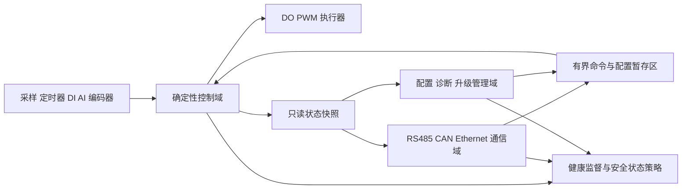
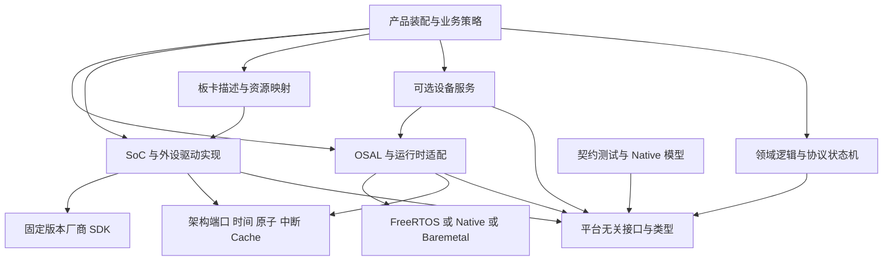
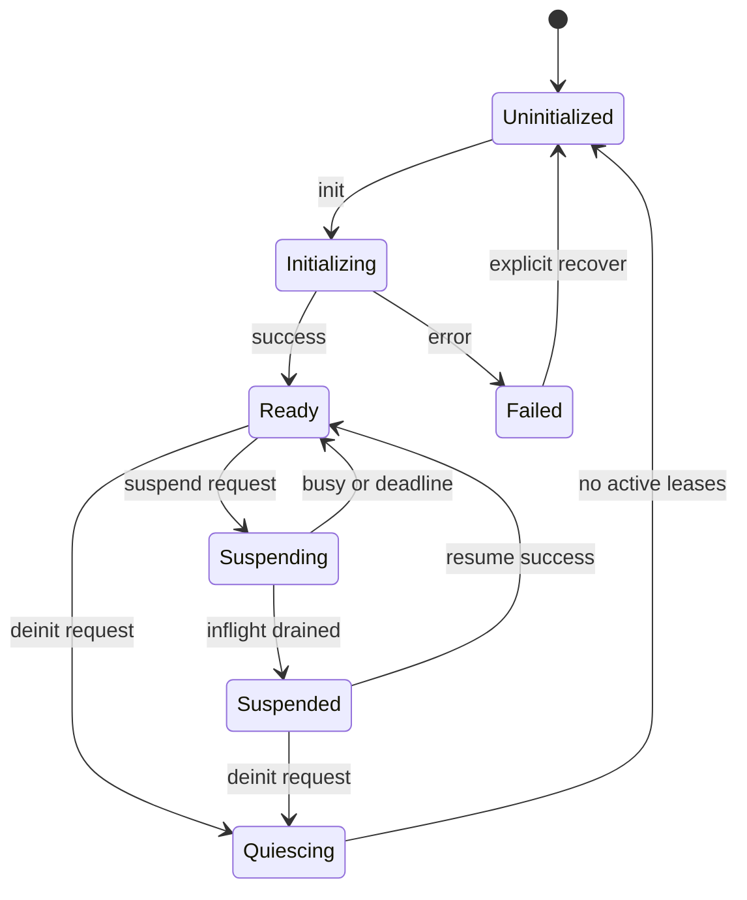

# Nexus 目标架构与增量迁移设计

本文是维护方案和待评审的设计草案，不表示所述能力已经实现。分析基线为 `7a203266082ad1f655b6686713b2b7950ba31ec6`（2026-02-10，2026-10-08 核实仍是远端 main）。本次基于固定提交源码审查；未进行 ARM 编译、真实板卡运行或实时性能测量。

详细重构方案见 [平台架构 v2](platform-architecture-v2.md)、[主流平台比较](platform-comparison.md) 和 [HAL/OSAL 设计](hal-osal-design.md)。本文保留工业产品背景与长期目标；实际构建边界、迁移工作包和完成范围以详细设计及实施记录为准。

## 1. 架构目标与取舍

Nexus 应定位为可裁剪的 MCU 软件平台：提供可验证的硬件与运行环境契约、可复用的设备服务以及产品交付基础。用户已明确优先场景为工业控制与设备联网。企业价值是同一产品族能更换板卡、复用业务逻辑、控制固件版本、验证时序和追溯现场问题。

现有 C 接口、Native 模拟、HAL/OSAL 分离和 Config/Log/Shell 模块值得保留。演进应先修复构建与接口漂移，再以一个完整产品切片验证架构，避免同时重写内核、构建系统和全部驱动。用户已明确约 10 人团队、STM32/GD32 等平台及 3–6 个月周期：STM32 先完成参考闭环，GD32 从第一阶段并行准备，并沿用相同接口契约和 HIL 证据标准形成第二通道。首发系列/板卡已确定为 F407ZG 启明高配 V3.1、F407VE 天空星青春版与 F470ZG 梁山派，见[本轮交付](../implementation/platform-delivery.md)；调试器、Flash 分区和外设接线需产品决策，不能把芯片型号当作已验证板卡。

团队容量按一个共享架构与测试基线、两条受控平台通道规划，不并行铺开所有协议与全部芯片系列。3 个月目标为 STM32 产品切片的受控试点，6 个月目标为 STM32/GD32 双平台企业候选；均以板卡、HIL、时序/资源预算和异常恢复验收通过为条件。GD32 不按 STM32 的替换型号或 SDK 别名处理：单独验证 startup/vector、clock tree、Flash 擦写/分区、DMA 路由与可访问内存、IRQ 优先级、SDK 错误语义及勘误；可复用上层契约和产品逻辑，不继承另一芯片的硬件验证结果。

核心目标：

1. 依赖可检查：业务不包含厂商 SDK，接口头不隐式拉入 OSAL 或板级配置，产品装配明确选择实现。
2. 行为可预测：每个 API 写清调用上下文、线程安全、缓冲所有权、超时、取消、实时成本和内存策略。
3. 支持可证明：编译成功、主机契约测试、仿真、硬件测试、生产验证分别记账，能力状态由证据驱动。
4. 配置可重现：一次构建由源码、依赖版本、板卡修订、配置和工具链唯一描述，源码目录不保存构建输出。
5. 产品可长期维护：API、持久化格式、Bootloader/应用协议、设备身份和升级策略各自有版本与迁移计划。

暂不作为核心路线：自研 RTOS、同时补齐所有 MCU 系列、强制所有产品采用统一事件总线、自研密码学、把企业审批流程放进 MCU 运行时。Linux 网关和云端系统通过通信协议衔接，待有实际需求再评估 POSIX 端口；不先假设与 MCU 共用全部 HAL。

## 2. 现状中的架构证据

以下判断针对基线提交。源码路径链接固定到该提交，未来修复后应更新状态与验证记录。

| 证据 | 对产品的影响 | 演进动作 |
| --- | --- | --- |
| 根 `CMakeLists.txt` 默认 `.config`、`nexus_config.h` 位于源码根；Kconfig 可以覆盖 preset 平台 | Native/ARM 多构建目录互相污染，构建身份不清晰 | 输出移入 binary dir；明确配置优先级与冲突报错 |
| build-matrix/release workflow 引用不存在的 `cross-arm-release` preset；README 部分命令也与 preset 不一致 | ARM 构建入口失效，文档无法成为可重复操作指南 | 将 workflow、README、preset 引用完整性纳入 P0 自动检查 |
| `hal/CMakeLists.txt` 的实现库依赖 `osal`，接口库独立存在 | 目前依赖方向有良好基础，但 HAL 运行时服务与基础接口耦合 | 保留 `hal_interface`；分离纯 HAL 核心与可选同步适配 |
| `nx_device_init()` 通过 `initialized` 缓存 API，没有 once/并发协议 | 多任务首次获取设备可能重复初始化；错误码信息弱 | 启动期显式初始化为默认；延迟初始化单独提供安全协议 |
| `nx_mutex.c` 在 thread-safe 分支仅按 GCC/Clang 判断执行 ARM PRIMASK 汇编 | Native 编译器可能进入 ARM 汇编；编译器被当作 CPU 架构 | 中断与原子操作归属 arch port；Native 使用主机同步实现 |
| `nx_adapter.c` 默认 weak tick 每次调用递增，yield 为 no-op；sync→async TX 直接调用阻塞 send | 默认超时与真实时间无关，名为 async 的操作可能阻塞 | 正式时间端口不可静默模拟；阻塞适配需明确语义或 worker |
| SPI getter 写共享 `impl->current_config` 并返回同一接口，丢弃 callback/user_data | 获取第二个设备会改变第一个设备参数；不能证明隔离 | 总线实例与设备句柄分离；配置在事务开始时应用 |
| SPI DMA init 仅返回成功并假设外部配置；同步 timeout 分支未停止 DMA | DMA 能力声明不成立；超时返回后可能继续访问调用者内存 | 不支持时明确返回错误；引入传输/取消/回收协议 |
| SPI OSAL 分支使用 `osal_sem_wait/post`，而当前接口是 take/give；create 参数顺序漂移 | 配置路径可能编译失败，说明平台接口缺少持续契约编译 | 将每个声明为支持的配置纳入编译；小步修复接口漂移 |
| SPI lifecycle 初始化仍调用三项 `NX_INIT_LIFECYCLE`，当前公开 lifecycle 为五项 | 实现与接口版本失配 | 生命周期逐项实现，并通过驱动契约套件验证 |
| STM32 统一驱动源码主要为 GPIO/UART/SPI；RT-Thread、Zephyr 目录缺少实现文件 | 厂商库、Kconfig 选项和 Nexus 可用能力不能等同 | 平台能力矩阵限制公开支持范围，未实现配置拒绝生成 |
| `nx_mem.c` 默认动态模式；pool bitmap/statistics 无同步；动态 free 无块大小计账 | 静态内存配置不等于全系统无堆；统计可能误导容量判断 | 内存策略按 profile 强制；生命周期和统计规则独立验证 |

源码入口：

- [根构建](https://github.com/X-Gen-Lab/nexus/blob/7a203266082ad1f655b6686713b2b7950ba31ec6/CMakeLists.txt)、[HAL 构建](https://github.com/X-Gen-Lab/nexus/blob/7a203266082ad1f655b6686713b2b7950ba31ec6/hal/CMakeLists.txt)、[OSAL 构建](https://github.com/X-Gen-Lab/nexus/blob/7a203266082ad1f655b6686713b2b7950ba31ec6/osal/CMakeLists.txt)。
- [设备注册](https://github.com/X-Gen-Lab/nexus/blob/7a203266082ad1f655b6686713b2b7950ba31ec6/hal/src/nx_device.c)、[临界区/原子实现](https://github.com/X-Gen-Lab/nexus/blob/7a203266082ad1f655b6686713b2b7950ba31ec6/hal/src/nx_mutex.c)、[适配器](https://github.com/X-Gen-Lab/nexus/blob/7a203266082ad1f655b6686713b2b7950ba31ec6/hal/src/nx_adapter.c)、[内存实现](https://github.com/X-Gen-Lab/nexus/blob/7a203266082ad1f655b6686713b2b7950ba31ec6/hal/src/nx_mem.c)。
- [SPI 设备](https://github.com/X-Gen-Lab/nexus/blob/7a203266082ad1f655b6686713b2b7950ba31ec6/platforms/stm32/src/hal/spi/stm32_spi_device.c)、[SPI 同步](https://github.com/X-Gen-Lab/nexus/blob/7a203266082ad1f655b6686713b2b7950ba31ec6/platforms/stm32/src/hal/spi/stm32_spi_sync.c)、[SPI DMA](https://github.com/X-Gen-Lab/nexus/blob/7a203266082ad1f655b6686713b2b7950ba31ec6/platforms/stm32/src/hal/spi/stm32_spi_dma.c)、[SPI lifecycle](https://github.com/X-Gen-Lab/nexus/blob/7a203266082ad1f655b6686713b2b7950ba31ec6/platforms/stm32/src/hal/spi/stm32_spi_lifecycle.c)、[信号量公开接口](https://github.com/X-Gen-Lab/nexus/blob/7a203266082ad1f655b6686713b2b7950ba31ec6/osal/include/osal/osal_sem.h)。

上述是源代码证据与风险推导，不把未经硬件验证的后果写成已经发生的现场故障。

## 工业控制与设备联网：首个产品架构

这部分依据用户已明确的工业控制与设备联网、约 10 人、STM32/GD32 和 3–6 个月条件调整架构顺序。具体设备类型、控制周期和产品输出安全状态仍未给出，系列/板卡已由用户确认。先建立预算与验收方法，不能凭平台名称承诺某个控制周期或工业可靠性等级。

### 控制域、通信域与管理域



在单 MCU 上先实施任务、队列、内存和中断预算隔离；这不等于硬件故障隔离。需要内存保护或功能安全时，再按具体芯片与产品要求采用 MPU、独立控制 MCU、安全回路或双处理器架构。紧急停机是否必须独立于通用固件，由系统危险分析与产品设计确定，不能由网络服务或 Shell 代替。

| 域 | 运行模型 | 允许跨域动作 | 失败时的处理 |
| --- | --- | --- | --- |
| 确定性控制 | 固定周期/有界 ISR；高优先级；静态资源 | 读取完整命令快照，发布状态快照 | deadline miss、传感器故障与输出故障进入产品定义的安全/降级状态 |
| 通信 | 较低优先级，限额 buffer 与队列，按连接/来源限速 | 发布命令请求，读取状态；不能直接修改控制状态 | backpressure、拒绝新请求、降速/重连；不能拖延控制周期 |
| 管理 | 配置事务、日志、升级与制造命令 | 提交配置候选、申请维护状态 | 存储失败或升级失败可诊断且保持旧有效状态 |
| 健康监督 | 独立监督 task，按关键任务进展判断 | 汇总进展、调用产品故障策略、统一喂狗 | 控制超时立即产品处理，监督失效由硬件 watchdog 兜底 |

跨域约束：

1. 网络命令先解析、校验授权/范围/版本并进入有界 command mailbox；控制在周期边界应用完整快照，不持网络锁，也不等待网络应答。
2. 参数更新分为候选、校验、应用、持久化。涉及控制稳定性的参数由控制域确认；连接中断不留下半份参数。
3. 遥测采用 double-buffer、序号快照或明确的短临界区，不让通信持有控制锁做长时间序列化。
4. 网络 IRQ、协议任务和日志上传有 CPU/IRQ/buffer 限额；包洪泛、重连、广播和诊断访问都纳入负载测试。
5. 分开控制时间与墙上时间。NTP/PTP 或网络校时不能倒退控制的 monotonic deadline；精度要求由时钟测量决定。
6. 共享 SPI/DMA/Flash 的最长占用段写入预算。网络芯片与控制传感器共用总线时，分段、限额或硬件分总线，不能只调任务优先级。

### 工业协议与联网的分期

优先级随第一款产品真实接口调整，以下是减少并行复杂度的默认建议：

| 顺序 | 交付范围 | 必须验证的硬件/协议边界 |
| --- | --- | --- |
| I1 | 稳定 GPIO/Timer/ADC 等实际控制 I/O，以及 UART console | 精确输入输出时序、滤波/去抖、控制 deadline、异常安全状态；当前缺失驱动按产品需求补齐 |
| I2 | UART + RS485 transport + Modbus RTU 参考服务 | DE 切换依据 UART 最后 stop bit 完成而非 DMA complete；帧间隔、CRC、错误帧、半双工冲突、通信断开 |
| I3 | CAN 参考 transport 和产品选定协议 | 硬件滤波、队列优先级、总线错误/bus-off/恢复、过载、协议 ID 与节点管理；先明确经典 CAN 或 CAN FD |
| I4 | Ethernet + 成熟 TCP/IP 栈适配 + 选定联网协议 | 板卡 PHY/外部控制器、DMA/cache、有限 socket、内存 quota、连接风暴与 CPU 预算；按需加入 Modbus TCP、MQTT 或 TLS |
| I5 | 可追溯更新下载、验证和受控安装 | 镜像签名/板卡与版本匹配、断电恢复、rollback、Bootloader/分区、制造与现场诊断 |

不要把 GPIO/UART/SPI 已有框架等同于 Timer/ADC/CAN/Ethernet 已可用。每个新增 transport 先以 Native 协议测试和恶意/畸形输入测试验证解析，再通过参考板 HIL。Modbus RTU、Modbus TCP 的数据模型可复用，时序与连接语义分别实现；不把 TCP 直接模拟成串口接口。

工业 I/O 配置建议显式区分物理测量、工程量、质量标记、采样时间戳以及 freshness。通信成功不代表数据可用于控制；超时、传感器饱和、断线和采样溢出应形成可查询质量状态。Modbus 寄存器映射、CAN 数据包和内部结构之间使用显式编码，不传送 raw struct；字节序、量纲、版本和保留字段写入协议文档。

### Brownout、Watchdog 与持久化

- 产品明确上电/复位/通信丢失/控制故障时的输出状态，并验证从 reset 到业务 ready 的整个窗口；启动中不能短暂误驱动执行器。
- BOR/PVD 阈值按板卡供电和外设要求设定，brownout 事件可触发安全动作。不能假设 PVD 后仍有足够能量完成 Flash 写入；持久化本身要能承受随时断电。
- 配置采用有版本、CRC/认证与提交标记的双槽或日志式记录；写坏候选不损坏旧有效记录。磨损、容量、擦除时间和写寿命基于真实 Flash 测量。
- Watchdog 由监督任务依据关键任务 progress sequence、deadline 和资源健康统一喂狗；网络断开与网络任务失效分别判断，策略由产品定义。
- 崩溃记录可放 retention/noinit 或受控持久化区域，包含 reset cause、build ID、故障上下文；它的损坏不得妨碍启动。完整日志不能占用控制资源无限写 Flash。

### “不中断实时控制”的边界

联网、遥测、诊断和更新下载应在资源预算内与控制并行，验收时测量最大网络压力下的控制 jitter，而不只测平均 CPU 占用。更新安装和擦写内部 Flash 需要单独处理：例如首发候选 STM32F407 的单 Bank Flash 在擦写期间可能阻塞同 Bank 指令/数据访问，不能默认后台升级仍满足实时 deadline。

默认方案为“运行中下载到独立存储并校验 → 产品批准的维护窗口 → 输出进入规定状态 → Bootloader 安装/校验/启动确认”。如果产品要求安装时也持续控制，需要选择经证明的双 Bank/外部存储/RAM 执行方案，或独立控制处理器，并验证全部代码、ISR、常量与 DMA 路径。平台不把下载不中断偷换成擦写/切换不中断。

首个产品切片的验收应包含：控制周期正常负载与通信风暴对比、RS485/CAN 断线与恢复、配置写入时断电、brownout/reset 输出状态、监督任务失效、下载/安装/回滚异常。选择芯片与板卡前先把这些需求转成 timing/memory/power budget。

## 3. 目标层次与依赖



箭头表示代码或装配依赖，不能理解为强制运行时调用链。产品 composition root 将接口与实现连接，纯领域代码只依赖稳定接口与自己定义的端口。高频控制循环可在隔离模块中直接使用经测量的 SoC 快速路径，但必须声明平台依赖，不能把厂商类型传播到所有业务代码。

建议逻辑模块与 CMake target：

| 模块/target | 允许依赖 | 职责与边界 |
| --- | --- | --- |
| `nexus::core` | C 标准的受控子集 | 状态、固定宽度类型、span/长度约定、版本、编译器属性；无硬件、堆、日志和任务创建 |
| `nexus::hal_api` | core | 设备/总线/事务接口；公开头不包含厂商 SDK |
| `nexus::osal_api` | core | 任务、同步、时间等可移植语义；公开能力可查询 |
| `nexus::arch_port` | core、架构必要头 | 时间、IRQ mask、内存屏障、cache 操作；按 arch + host 选择 |
| `nexus::hal_core` | hal_api、core、arch_port | 静态设备目录、资源状态；不必须链接 RTOS |
| `nexus::hal_sync` | hal_api、osal_api | 等待、超时、任务间总线序列化等可选运行时适配 |
| `nexus::osal_<backend>` | osal_api、arch_port、选定内核 | 后端实现；每次链接只有一个 backend |
| `nexus::soc_<chip>` | hal_api、arch_port、vendor target | 外设寄存器/SDK 实现、芯片资源约束 |
| `nexus::board_<id>` | soc、受控外设组件 | 板卡 pinmux、时钟、DMA、IRQ、外部器件、Flash 区域、版本 |
| `nexus::service_<name>` | core、HAL/OSAL 接口、声明的服务 | Config/Log/Shell 等独立可选服务，禁止自动启用大批关联服务 |
| 产品 executable | 所选模块 | 产品策略、启动顺序、配置、健康监测、通信/升级策略 |

第一阶段保留已有 `hal`、`osal`、`log_framework` 等 target 名称，以 alias/薄适配建立新依赖边界。目录重组在行为稳定后进行；目录名不是架构正确性的证明。CI 检查公开头包含、target 依赖以及禁用服务时能否链接，防止新命名下仍保留环形耦合。

## 4. Arch、SoC、Board、Product 四种变化轴

### 4.1 各层负责什么

- **Arch**：Cortex-M 异常、中断屏蔽、屏障、cache/MPU、启动 ABI。只处理架构语义，不决定 LED 引脚、晶振频率或 UART 接线。
- **SoC**：STM32F407 等芯片的时钟树能力、内存范围、DMA request/stream 路由、IRQ 映射、pin alternate function、SDK 适配。芯片型号和封装都参与验证。
- **Board**：实际 PCB 修订、外部晶振、电源域、外部 Flash/传感器/收发器、连接器、pinmux、调试器与烧录方法。把 UART 连接到产品 console 是板卡映射，不写死到公共 UART factory。
- **Product**：选用哪些器件、任务和服务、存储分区、启动/安全/升级策略、业务功能、制造配置、现场参数 schema。产品 A 与产品 B 可复用同一板卡，也可为同一产品切换板卡。

板卡差异不得由应用中的 `#ifdef STM32...` 拼接解决。提供 `board_console`、`board_status_led`、`board_sensor_bus` 等符号绑定；业务只知道这些用途，装配文件解析成设备引用。GPIO 标识需表达控制器/端口及 pin，SPI `cs_pin` 这种单字节标识不足以代表跨端口真实资源，需通过新的设备描述/板级句柄解决。

### 4.2 渐进目录建议

以下为目标布局草案。先在现有目录内部建立明确模块，再搬移。

```text
core/                       公共类型、版本、状态与端口契约
hal/                        API、纯设备核心、可选同步适配
osal/                       API 与 Native/FreeRTOS/Baremetal 后端
arch/                       cortex_m、native；时间/IRQ/cache/原子实现
soc/stm32/stm32f4/           芯片资源、SDK 驱动、IRQ/DMA 路由
boards/<board_id>/<rev>/     manifest、pinmux、时钟、设备、分区、HIL 描述
framework/                  独立 Config/Log/Shell/Init 等服务
components/                 传感器、存储芯片、协议适配等可复用模块
products/<product_id>/       产品装配、配置、schema、任务预算与版本
applications/               教学和参考应用
tests/contracts/            驱动/OSAL/服务的可复用契约套件
tests/integration/          Native 产品切片、错误与并发场景
tests/hil/                  板卡 smoke、时序、电源和故障注入
tools/                      配置、包、烧录、测试和证据生成
cmake/                      target 定义、toolchain、preset 支撑
docs/adr/                   已接受/拒绝/取代的架构决策
build/<preset>/             生成配置、头文件、链接产物与证据
```

Vendor SDK 继续锁定版本，独立 target 和 license 清单管理。不要在初次迁移时复制数十个 MCU 家族，先将正在验证的驱动从平台巨型 target 拆出。`platforms/stm32` 可作为兼容入口，逐步转发到 SoC + board。

### 4.3 板卡描述与资源检查

首期先使用类型化静态 C 资源描述及现有板卡元数据，暂不新增强制代码生成器或通用描述语言。板卡元数据记录 schema version、板卡 ID/revision、精确 MCU/封装、晶振和来源，物理资源映射只保留一个权威输入。Kconfig 负责可选软件能力；板卡描述负责物理拓扑；产品描述负责选择与策略。规模增长后评估复用维护中的 Devicetree 工具，不能让 manifest、C 与 DTS 各自维护同一拓扑。

生成时检查：

1. pin 是否在封装存在，复用功能是否合法，同一 pin 是否冲突。
2. DMA request/stream/channel 与外设匹配，多个独占用户是否冲突。
3. IRQ 优先级是否符合所选内核 syscall 规则，多个向量所有者是否冲突。
4. 时钟与总线频率是否满足设备范围，电源域与低功耗恢复要求是否成立。
5. Flash/RAM 分区不重叠，DMA buffer 位于可访问 RAM，stack/heap 预算不越界。
6. 未实现的 capability 不允许仅因 Kconfig 选中而生成“支持”。

生成文件落在构建目录，并记录输入摘要。量产板卡变化需要新 revision；不能覆写旧 revision 让同一构建身份代表两种接线。

## 5. 公共接口契约与兼容

### 5.1 为每个 API 增加契约页

每个操作必须说明：输入合法性、返回码、调用上下文、线程安全/可重入、锁顺序、缓冲所有权、是否分配内存、超时与取消、完成回调上下文、低功耗行为和可选能力。Doxygen 只写“thread safe”不够，应写“同一实例的多个 send 被序列化；callback 中不得调用阻塞 send；get_state 为快照”。

保持 C11 为公共基线，C++ 通过 `extern "C"` 或独立 wrapper 接入。接口参数用固定宽度字段表达协议和配置；内存长度继续用 `size_t`。不把未经规定的 enum 大小、struct 内存布局或函数指针对象直接序列化。`-fshort-enums`、packing、float ABI 等工具链选项属于构建身份；不能宣称跨工具链二进制兼容。

兼容分成四类：

| 兼容对象 | 默认承诺 | 管理方法 |
| --- | --- | --- |
| 应用源码 | 同一 major 内的已稳定 API | 编译契约样例、弃用周期、迁移指南 |
| 预编译库/驱动 | 仅明确工具链/CPU/ABI profile 内 | ABI 指纹、布局检查；未声明时要求一起重编译 |
| 持久化配置 | 明确的 schema/version 兼容范围 | 升级/降级迁移、双份/日志式提交、断电测试 |
| Bootloader/应用与设备通信协议 | 独立于源码版本 | 协议协商、版本窗口、黄金数据包与兼容测试 |

### 5.2 不原地扩大旧 vtable

现有 HAL 公开了带函数指针的结构体，直接插入成员会影响源码、聚合初始化与二进制布局。对关键不兼容能力使用 `*_v2` 接口或不透明 handle + 访问函数；旧 factory 保留薄兼容层。扩展结构使用 `struct_size`/`api_version` 前缀只适用于新接口，不能给旧结构追补前缀后宣称无破坏。

新增能力优先通过独立扩展查询和 capability 描述获得，不迫使所有驱动填一排无效函数指针。返回 unsupported 应有明确状态码并与 absent/unavailable/busy 区分。不能为了兼容把未实现初始化返回成功；无法安全模拟旧语义的路径要拒绝并给迁移说明。

1.0 发布只冻结经过验证的 API 子集；experimental 子集单独标注，不以整仓所有头文件均稳定为门槛。兼容政策建议至少跨两个稳定 minor 提示弃用，具体 LTS 年限由产品生命周期和维护资源决定。

## 6. 生命周期、设备目录与资源所有权

### 6.1 分开四个动作

`find` 查静态描述，`init` 初始化物理设备，`acquire` 获取使用权/会话，`release` 释放使用权。单次 I/O 的状态不是设备整个生命周期状态。factory 获取接口和 lifecycle `init` 目前存在两套初始化含义，需要先写兼容行为再调整。

建议默认：启动阶段完成必需设备初始化，之后静态目录只读；失败返回精确状态及诊断记录。按需初始化作为可选功能，只在支持的上下文执行，采用 `UNINIT → INITING → READY/FAILED` once 协议。等待初始化使用正常同步原语，ISR 不初始化；不在全局关中断区域调用 SDK、分配内存或等待时钟稳定。

设备状态与传输状态分开：



这里的状态机是目标，不代表已有 `nx_device_state_t` 可以直接替换。旧 `RUNNING/SUSPENDED` 等映射需要兼容层，并记录状态变化失败如何回滚。

### 6.2 生命周期硬规则

- `deinit/suspend` 有在途传输时要拒绝、等待或明确取消；不释放仍被 DMA/ISR 引用的对象。
- 永久设备描述放只读区，运行状态放可写区；设备目录无重复名字，顺序可确定。
- `release` 不等于立即 free，只有用户引用、在途传输、回调和 IRQ 都退场才能回收。
- ISR 回调查找必须有注册所有权，不应对任意厂商 handle 用 `container_of` 假定它属于 Nexus。尤其产品混用 CubeMX 对象时要明确边界。
- 设备失败与错误恢复属于管理路径；关键外设故障是否重试、停机或复位由产品策略决定。
- 启动顺序不仅是整数 init level；先建立少量显式依赖，检测 cycle，并记录每步耗时与错误。链接段保留 `KEEP`/LTO/静态库抽取测试，Native 的手工目录具有相同可见顺序。

## 7. 总线事务、异步传输与超时

### 7.1 SPI/I2C 采用总线 + 设备 + 事务

物理 bus 实例拥有总线锁、队列和控制器；device handle 拥有 CS/address、mode、speed 等不可变配置；transaction 拥有本次缓冲与完成状态。

SPI 一个完整事务必须把“取锁 → 应用设备参数 → CS assert → 多段 TX/RX → CS deassert → 释放锁”做成不可交叉序列。读寄存器所需 command+payload 多段不能被其他器件插队。CS 资源由板卡映射，不从共享 `current_config` 临时全局改写。I2C repeated-start、错误后 bus recovery 与 clock stretching 同样是事务契约。

首发实现限定队列容量和每设备最多在途数；优先采用固定对象池。不要默认 FIFO 就满足高优先级控制任务：最大传输长度、不可抢占段时长、优先级继承/队列策略应由产品预算验证。长块 Flash 写与控制传感器共享 SPI 时，需要切分事务或分总线。

### 7.2 异步成功只表示接受

新接口的建议语义如下，具体 C 签名在 ADR 接受后实现：

| 行为 | 规定 |
| --- | --- |
| submit 成功 | 请求已接受，后续恰好一次 terminal completion |
| submit 失败 | 请求未接管，缓冲仍归调用者，之后不回调 |
| 完成状态 | success/error/cancelled，加实际传输长度、原因和 operation ID |
| Buffer | 复制或借用必须显式；借用期间 TX 不可修改，RX 不可读写 |
| cancel | 取消请求与取消完成分开；终态归还 buffer 所有权 |
| reuse | 句柄/请求带 generation，迟到 IRQ 不能完成新的请求 |
| callback | 默认 worker/task 上下文；原始 ISR hook 作为明确 opt-in 能力 |
| queue full | 返回可区分的容量错误；不能无限分配内存 |

`sync_to_async` 仅靠改变函数指针类型无法把阻塞操作变成异步。应保留明确的 polling 适配，或使用受控 worker + 有界队列；不能用 async 名称掩盖长时间阻塞。

### 7.3 超时包含排队与抢锁

为同步操作计算一次单调时钟 deadline，排队、锁等待、硬件传输共用剩余时间。零超时明确表示不等待；无限等待显式标记；禁止将 `UINT32_MAX` 毫秒误认为普通有限等待。驱动禁止内部再使用 `WAIT_FOREVER` 抢锁而破坏上层 deadline。

同步 API 返回后必须保证驱动不再访问调用者缓冲。若超时触发 DMA cancel，需完成硬件停止、IRQ 退场、状态隔离及 buffer 回收才可返回。清理可能具有额外的有界耗时：契约要同时公开运行 deadline 和最大清理时间；不承诺超时数字就是硬件严格最坏返回时长。若某控制器无法证明取消清理有界，只能暴露异步 lease/pending 模型，或者禁用该同步 DMA 路径。

超时与完成同时发生时只允许一个终态。完成信号必须绑定 operation ID，旧信号不得让下一次传输提前成功。错误 ISR 需要保存错误，再唤醒等待者；唤醒不等于传输成功。

适配器不能以每次查询递增的 weak tick 作为正式时钟。测试时通过专用 mock 注入时钟；产品未提供时钟端口应在构建或初始化时失败。32 位 tick 使用明确的 wrap-safe 算法和可比较区间，长时 deadline/运行时间可使用 64 位；Native 使用 monotonic clock，RTC 只用于墙上时间。

## 8. 并发、中断和实时内存

### 8.1 三种同步机制不能混用

1. **任务 mutex**：保护可睡眠的共享状态，明确递归与优先级继承能力；ISR 禁止调用。
2. **短临界区/IRQ mask**：保护当前核与 ISR 共享的小状态；保存并恢复 mask，规定嵌套和最大时间；不持锁调用阻塞函数。
3. **原子发布**：对跨线程或核可见状态使用正式原子/屏障契约。`volatile` 不能代替线程同步。

编译器类型不是架构选择。Cortex-M 使用架构端口及选定 RTOS 的规则；Native 使用 C11 原子或相应系统同步；MSVC 等端口可以使用平台原子。不能把 `HAL_THREAD_SAFE=off` 等同于允许 task/ISR 发生数据竞争：关闭任务串行化仍需保持 DMA 完成、中断状态和发布顺序安全。

首发只声明单核 MCU 支持；SMP 不以关本核中断实现互斥，未提供多核内存模型与锁就拒绝 SMP capability。锁顺序建议为“产品会话/服务锁 → 总线 mutex → 短状态临界区”；ISR 只接触短状态和有界事件，不获取服务或总线 mutex。任何偏离必须写进驱动契约并做并发测试。

### 8.2 ISR 分类与延后处理

| ISR 类别 | 允许动作 | 约束 |
| --- | --- | --- |
| 控制/采样的高优先级 ISR | 最小寄存器操作、时间戳、有界 ring 写入 | 不能调用内核；最大持续时间由产品定义 |
| 内核感知 ISR | 允许的 `*_from_isr` 通知、队列写入 | 满足 FreeRTOS syscall priority，正确触发调度 |
| 管理与服务处理 | 解析、日志格式化、存储、错误恢复 | 在 worker/task 执行，预算独立 |

统一端口明确 SysTick、PendSV、SVC、HAL timebase 的所有者。FreeRTOS tick 与厂商 HAL 不能各自无协调地接管 SysTick。向量、SDK callbacks 和自定义中断需注册到受控 dispatcher，硬件主路径仍保留直接 dispatch。

完成事件队列不能丢失导致永久 lease 泄漏。容量按最大在途请求设计，完成状态先写在请求对象中，再发可合并通知；队列溢出有可恢复扫描或立即降级策略。一般遥测日志允许丢弃且计数，安全控制事件需独立保证。

### 8.3 静态与动态内存 profile

| Profile | 适用 | 内存策略 |
| --- | --- | --- |
| `minimal` | 小 MCU、Baremetal、固定器件 | 静态设备与固定缓冲，无运行时堆；不要求 task API 仿真成 RTOS |
| `realtime` | FreeRTOS 控制/采集 | 启动期创建对象或静态创建；实时路径固定池；服务队列有界 |
| `connected` | 联网与升级 | 允许受控分配，按模块限额；控制路径仍隔离 |
| `native-validation` | 主机验证 | 与产品相同容量限制，可注入失败；主机无限内存不能掩盖板上约束 |

静态 profile 要提供 OSAL task/queue/mutex 的 static-create 路径，或在受控启动池分配；仅设置 `nx_mem` 静态模式不会自动禁止 FreeRTOS wrapper、C 库和服务堆分配。通过链接符号和运行分配监控验证 profile，而不靠配置项名称。

pool 必须检查对齐、块大小、容量与整数溢出，double-free 不再影响统计，pool 初始化不能运行时切换并释放旧对象。共享 bitmap 需合适的同步，硬实时池优先 free-list 等固定时间结构。动态统计需要保存块大小或由 allocator 提供可信统计；不能将累计分配量标为当前占用。

stack high watermark 是观测值，不是最坏栈证明。记录最坏 ISR 嵌套、格式化、密码库等路径；使用编译器 stack usage 与硬件压力测试，预算留有依据的余量。

## 9. DMA、Cache 与低功耗

### 9.1 DMA buffer 是资源，不只是地址

新契约要描述可访问内存区域、方向、长度/对齐、cache 属性、scatter/gather/circular 能力以及最大传输长度。`uint8_t*` 可以表达 CPU 地址，却不能证明某 DMA 控制器能访问该地址。Cortex-M7/H7 的 DTCM、不同 SRAM domain 和 cache line 必须按精确芯片及 DMA 控制器验证；F407 的通过不能外推成 H7 已支持。

建议新增 map/unmap 或等价的 board/arch DMA memory adapter：

- TX 发布前清理需要的 cache，操作开始后应用不修改借用区域。
- RX 使用专门对齐且隔离的 buffer，避免 invalidate 丢失邻近脏数据；按架构规则在移交前/完成后处理 cache。
- 采用 DMA buffer pool、non-cacheable 区域或 bounce buffer 时公开容量、复制成本和策略。
- 必要的 memory barrier 位于所有权移交点；仅使用 `volatile` 不保证 DMA 一致性。
- 不同 driver 不各自复制不一致的 cache 代码；可测的公共端口承接共性，SoC adapter 承接特例。

DMA 通道资源从板卡配置确定性保留或通过受控 manager acquire；初始化校验 SDK handle 已 link 到正确通道。无法配置的 DMA capability 返回 unsupported/invalid configuration。驱动 HIL 必须覆盖 DMA error、timeout、late IRQ、cancel、重复运行和边界长度。

### 9.2 低功耗是跨资源事务

设备 suspend 前检查总线在途、唤醒源和电源域引用。sleep manager 协调时间补偿、时钟恢复、pin 状态、DMA 停止以及 OSAL tickless。不得单独关闭 GPIO/UART 时钟而忽略仍在使用的外部器件或共享总线。

先实现参考板的一个明确 sleep 状态及唤醒路径，验证 resume 后首个 I/O、配置保留、时钟精度与掉电计时。低功耗产品需要测量实际电流曲线，不能用 API 返回成功代替能耗证据。

## 10. 可选服务与产品运行模型

Config/Log/Shell/Init 保留模块化路线，每个服务必须声明容量、线程、依赖与失败策略。默认 core/driver 不启动额外 worker；产品装配选择是否需要。

| 服务 | 平台提供 | 产品负责 | 首轮边界 |
| --- | --- | --- | --- |
| Log/Trace | 有界记录、级别、结构化事件、可换 sink、丢失统计 | 保留策略、敏感数据策略、远程采集 | ISR 只记定长事件；格式化和传输移到任务 |
| Config/Storage | schema、事务、后端接口、损坏检测与迁移机制 | 出厂默认、用户参数、升级迁移窗口 | RAM 后端明确易失；真实 Flash 后端先通过断电验证 |
| Shell/Diagnostics | 命令注册、错误报告和诊断接口 | 生产权限、命令开放、制造/运维模式 | 刷写密钥/擦除操作不默认公开；Shell 不应强制依赖 Log |
| Health/Watchdog | task heartbeat、deadline 事件、故障上下文 | 安全动作和复位政策 | 不让任一任务随意喂狗掩盖其他任务失效 |
| Update adapter | 镜像/版本/分区契约，成熟 Bootloader 适配 | 签名信任、回滚策略、发布渠道 | 先适配成熟组件；不中途自研完整升级体系 |
| Protocol component | 有界解析、transport 抽象、版本协商 | 工业/私有协议、业务状态机 | 按首个产品引入，不预置所有协议 |

业务运行模型允许三类共存：周期控制 task、事件驱动服务 task、Baremetal run-to-completion 状态机。OSAL 必须诚实表达能力：Baremetal 不提供抢占/优先级继承，就拒绝需要这些能力的 profile；Native 通用线程也不被当成能证明 MCU 最坏延迟的实时内核。

一个采集设备参考切片可包含：定时采样 → 固定 ring buffer → 算法处理 → 协议上传，以及参数存储、诊断和升级。数据面与管理面队列分开；存储擦除、日志上传不能阻塞采样或控制。用切片验证平台边界，比独立 Blinky 更能暴露企业产品的问题。

## 11. 配置、构建和能力矩阵

### 11.1 配置只有一个最终结果

建议构建输入次序为“板卡默认 → 产品默认 → profile → 显式用户 fragment”，最终生成 resolved config。toolchain、CPU、board ID 等身份字段不能被后续 fragment 静默改写；preset 与 resolved config 冲突立即失败。用户 override 允许的范围写清，避免 preset/CMake/Kconfig 三套各自 FORCE。

根源码 `.config` 不继续作为所有 preset 的共享工作状态。构建目录保存 `.config`、生成头、配置摘要、板卡数据和 dependency/toolchain manifest。`menuconfig` 修改当前 build 的配置，不写公共根配置；发布保存生成结果与输入 fragments。

逐步把全局 compiler flags 改为 target 属性，对 vendor target、平台 target、产品 target 分别定义严格程度。显式 source list 优于大范围 glob：新增 driver 不应自动编译到所有平台。保留便利的 source discovery 只用于受控目录，并有确定顺序/配置依赖验证。

每个 ELF 的构建身份至少包括 commit、dirty 状态、依赖 SHA、toolchain 版本和摘要、board/revision、product/profile、resolved config 摘要、linker script/partition 摘要。固件可输出 compact build ID，完整材料归档在发布包。

### 11.2 能力状态模型

| 状态 | 含义 | 可对外声明 |
| --- | --- | --- |
| `planned` | 只有需求/占位 | 规划项，不可选择成生产支持 |
| `implemented` | 有实际实现与接口编译 | 实验实现 |
| `host-verified` | 通过契约/故障测试 | 主机模型行为已验证 |
| `hil-verified` | 指定板卡/工具链/配置通过 HIL | 仅对该组合有效 |
| `production-qualified` | 产品要求、可靠性和制造验证通过 | 对明确的产品/发布资格范围有效 |
| `unsupported` | 未实现或被禁止 | 构建/初始化明确拒绝 |

这些标签是证据类别，不是所有模块严格相同的流水线。Native 模型永远不自动晋升成物理驱动的 HIL；host-verified 与 hil-verified 证据需分别保留。每个矩阵条目记录测试包、配置、板卡序列号/修订、仪器、日期、commit 和限制。

首发矩阵目标草案：

| 组合 | 初期范围 | 要求补齐的证据 | 扩展前置条件 |
| --- | --- | --- | --- |
| Native + native OSAL | 接口、服务、协议和错误模拟 | GCC/Clang 契约、并发检查、容量故障 | 与板卡容量约束一致 |
| 参考 STM32F407 + Baremetal | GPIO、UART console、最小启动 | ARM 编译、LED/UART HIL、tick 与 IRQ | 不仿装 RTOS 保证 |
| 同板 + FreeRTOS | UART、SPI 事务、任务与同步 | 调度/tick、ISR、DMA取消、预算 | 接口漂移修复且 Native 相同契约通过 |
| 参考带 cache MCU | DMA/cache/多内存域 | H7/M7 专项 HIL | F407 版本稳定后再投入 |
| GD32 + 选定 OSAL | 从第一阶段准备启动/时钟/资源与 SDK 端口，逐步迁入相同产品切片 | 与 STM32 相同契约/HIL；额外验证 Flash、DMA、IRQ、SDK/勘误差异 | 明确具体系列/板卡；6 个月双平台候选以两条通道各自验收为条件 |
| RT-Thread/Zephyr adapter | 待需求决定 | 实际实现、语义差异与一致性测试 | 首个产品有明确收益和 owner |

README 的支持表由矩阵生成。整个 `stm32` target、某厂商 submodule 或芯片 Kconfig 存在，均不构成对应外设已支持的证据。

## 12. 测试设计与架构适配成本

建立一套可复用 contract suite，Native 实现、硬件适配和第三方 port 都运行同一核心规范；硬件专属行为增加专门测试。

| 层次 | 要验证的失效模式 | 工具/证据 |
| --- | --- | --- |
| 公开头与编译契约 | standalone include、C/C++、禁用服务、ABI 属性 | 最小 translation unit、不同编译器构建 |
| HAL/OSAL 契约 | 参数错误、容量、状态、生命周期、资源失败 | Native fake + 实际 backend |
| 并发与取消 | 双首次 init、双 submit、释放中回调、timeout/complete race | 可控时钟/事件、线程 sanitizer、故障注入 |
| 平台链接 | 注册段、weak override、LTO/gc-sections、重复 callbacks | ELF/map/nm 检查，ARM 链接 |
| HIL | 时序、IRQ 优先级、DMA/cache、总线波形、reset/sleep | 示波器/逻辑分析仪、debug probe、串口 test protocol |
| 产品切片 | 存储断电、升级回滚、长时间运行、负载饱和 | 电源控制、可靠性测试、现场诊断模拟 |

不把每一层都写成重复实现测试。关键是行为边界：timeout 后内存不再被硬件访问、晚到完成不污染下次请求、第二设备不改变第一设备参数、异常时 error 不被误报 success。

性能指标要在参考板实测后确定基线：ISR 最大持续时间、禁中断最大时间、控制周期 jitter、bus 最长不可抢占段、任务栈高水位、pool/queue 峰值、Flash/RAM、boot 时间、睡眠电流。建议每个产品写独立 resource/timing budget，初始数值待测，不能以“函数指针开销很小”替代最坏路径证明。热点优化在测量后选择 direct path、批处理或队列策略。

## 13. 增量实施路线与退出条件

下表按用户的约 10 人团队与 3–6 个月窗口规划；实际工期依板卡、HIL 和资源投入调整。STM32 先闭环，GD32 并行准备后复用稳定契约，不等待全部 STM32 能力补齐。3 个月受控试点、6 个月双平台企业候选是条件式目标，阶段以证据退出，不能仅靠日历进入下一阶段。

| 阶段 | 工作包 | 交付与退出条件 |
| --- | --- | --- |
| P0：0–2 周 | 配置隔离、支持声明清理、Native critical/tick、未实现选项拒绝；明确两平台板卡并建立 GD32 差异清单 | 干净源码下两个 preset 不污染；可重复 Native build/test；支持范围一致；两通道资源/HIL 需求明确 |
| P1：2–6 周 | HAL/OSAL 编译契约、SPI OSAL/lifecycle 漂移、UART/SPI 状态与错误；GD32 startup/clock/UART 端口并行准备 | STM32 关键组合可编译链接；危险路径禁用或有验证修复；GD32 初始启动/时钟/串口证据，不能套用 STM32 结果 |
| P2：6–12 周 | bus/device/transaction v2、静态 profile、板卡资源描述、STM32 控制/联网切片；GD32 接入相同契约与 HIL | 条件式 3 个月受控试点：STM32 多设备隔离、取消、晚 IRQ、无堆实时路径与控制预算通过；GD32 核心端口与差异测试可执行 |
| P3：3–6 月 | 双平台产品切片、真实配置存储、watchdog、日志/诊断、按需求分期联网与成熟升级组件适配 | 条件式 6 个月企业候选：STM32/GD32 各自契约/HIL、控制与联网负载预算、断电/升级恢复通过；发布与制造材料可追溯 |
| 后续：6 月以后 | 扩展到第二板卡/更多必要能力、受控 API 冻结、按维护容量建立 LTS | 稳定子集 1.0、兼容证据与维护责任明确；不把全部芯片/协议覆盖塞入当前 6 个月窗口 |

P0/P1 具体拆 PR 的建议：

1. 构建输出与配置身份：只解决路径/优先级，不同时拆 driver。
2. Cortex-M/Native critical port：保留旧入口，单独验证线程/ISR 语义；正确性不能靠关闭 thread safety。
3. 可选择配置的 fail-fast：缺文件/缺实现/不支持 DMA 直接失败，更新支持表。
4. SPI OSAL 参数、名字与 lifecycle 对齐：先恢复编译，不借此宣称完整 DMA 可用。
5. SPI transaction v2：独立 ADR、契约测试、Native 实现，再迁 STM32。
6. DMA cancel/error/lease：与总线改造保持可审查的边界，但必须在启用同步 DMA 前共同满足内存安全退出条件。

已部署产品继续固定版本与配置；新接口先供参考产品验证，再迁旧产品。修复持久化格式、密钥和 Bootloader 等内容时需要产品级迁移方案，不能通过框架 API 改动自动覆盖现场。

## 14. 关键 ADR 草案

以下为 proposed，尚未接受或实现。正式 ADR 应记录 owner、证据、讨论、取代关系和验收链接。

### ADR-A01：保留 C11 公共 API，基础契约与运行时适配分离

- **问题**：HAL 实现整体依赖 OSAL，底层接口与等待逻辑边界混合。
- **决策建议**：公开 API/core 不依赖 RTOS；同步/等待进入可选 runtime adapter；不把全部操作改成统一大 vtable。
- **收益**：Baremetal 裁剪更真实，Native port 更易验证，热点可保留直接路径。
- **代价**：增加少量 target，错误转换与同步封装需统一。
- **验收**：不链接 OSAL 也能构建最小 GPIO 产品；完整产品链接无循环依赖；公开头可独立编译。

### ADR-A02：板卡拓扑与软件功能分别管理

- **问题**：Kconfig 既描述 MCU 软件功能，又膨胀到大量逐 pin 配置，产品绑定不清楚。
- **决策建议**：板卡 manifest + 受控静态 C 生成，Kconfig 留作软件选择，product 是装配入口；初期不强制 Devicetree。
- **收益**：PCB 修订可追溯，冲突在构建发现，减少业务条件编译。
- **代价**：schema/generator 需维护；要避免声明和驱动实现各自维护两份资源真相。
- **验收**：同产品切换两 board 只改装配配置；pin/DMA/IRQ/partition 冲突都能给出具体诊断。

### ADR-A03：新异步 API 使用显式请求与 buffer lease

- **问题**：当前 async 接口缺少统一完成状态、取消与所有权，sync timeout 可能留下在途 DMA。
- **决策建议**：submit 成功后恰好一次终态，借用 buffer 直到终态；同步封装等待取消回收，公开清理界限。
- **收益**：统一错误/取消/回收，解决晚 IRQ 与缓冲生命周期。
- **代价**：request 对象和 bounded completion dispatch；旧调用者需迁移。
- **验收**：timeout/complete/cancel race、提交失败、释放中回调、重用 generation 测试通过；HIL 证明终态之后无 DMA 访问。

### ADR-A04：总线实例、设备配置与事务相互独立

- **问题**：SPI getter 返回共享对象并改写 `current_config`，不具备设备隔离。
- **决策建议**：每设备不可变配置；多段事务在一次总线所有权内完成；sync/async 共用同一序列化与错误路径。
- **收益**：外部 Flash 与传感器可靠共享 SPI，I2C repeated-start 有清楚边界。
- **代价**：固定 handle/request pool、队列策略、交易长度预算。
- **验收**：两设备不同 speed/mode/CS 并发，波形与配置无串扰；timeout 只终结对应事务。

### ADR-A05：内存 profile 是可验证行为，不是优化开关

- **问题**：`nx_mem`、FreeRTOS allocator、适配器池各自管理，static 标识无法证明无运行分配。
- **决策建议**：minimal/realtime/connected profile，静态 OSAL 创建和有界池；分配政策写入 module contract。
- **收益**：容量失败可预测，实时路径可分析，Native 与硬件容量一致。
- **代价**：静态创建 API 与 allocator 注入，资源预算维护。
- **验收**：realtime profile 调度启动后零通用堆调用；容量耗尽结果确定且可恢复；pool/statistics 并发一致。

### ADR-A06：支持矩阵与证据绑定，未实现能力 fail-fast

- **问题**：占位平台、vendor SDK、Kconfig 选项被读成平台支持。
- **决策建议**：精确 board+RTOS+toolchain+feature 矩阵；证据类别分别记录；文档自动生成。
- **收益**：产品立项不再依赖模糊支持表，新增 port 有统一入口标准。
- **代价**：HIL 资产与测试维护，不再能只补目录就宣称支持。
- **验收**：矩阵缺失实现导致构建拒绝；release 每个 qualified 条目能追到测试材料。

### ADR-A07：源码兼容、库 ABI、存储 schema 与线协议独立版本化

- **问题**：统一“版本号”不能覆盖 enum/packing、Flash 数据与 Bootloader 兼容范围。
- **决策建议**：稳定 API 子集 SemVer；受限 ABI profile；数据/升级协议独立 schema/version；新 vtable 使用版本扩展而不修改旧布局。
- **收益**：长期升级风险显式，企业产品可锁定并逐步迁移。
- **代价**：多套兼容测试与迁移材料，维护期间需保留旧协议/接口。
- **验收**：旧稳定样例继续编译；持久化跨版本升级/降级有测试；不支持的 ABI 组合明确拒绝。

## 15. 维护者的架构审查清单

每次合并新增平台/外设能力，回答七个具体问题：

1. 哪个产品或参考切片需要它，现有接口为何不足？
2. 哪个 target/层拥有这段代码，是否引入厂商类型或依赖循环？
3. task、ISR、DMA、callback 各自能做什么，buffer 在何时归还？
4. 内存和队列的上界是什么，容量耗尽或超时如何恢复？
5. 精确支持的 board/RTOS/toolchain 组合是什么，限制如何暴露？
6. 哪些契约/硬件证据支持该能力，是否覆盖异常和并发？
7. 会破坏哪个源码、ABI、存储或协议版本，迁移和回滚怎么做？

能回答这些问题，再考虑扩展第二芯片、额外服务或性能优化。架构质量最终用产品复用、故障可恢复、实时预算和可重复交付衡量。
